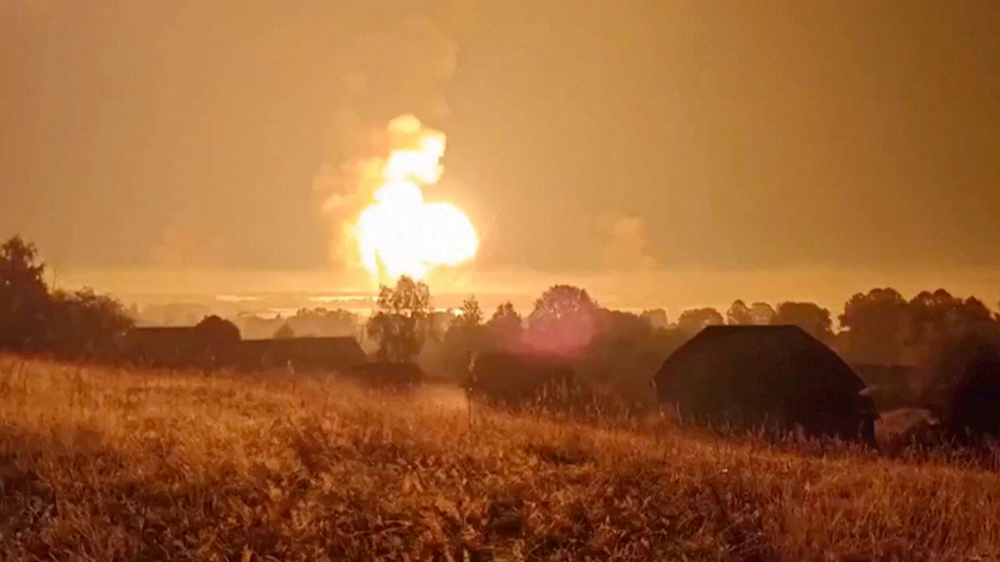

## Claim
Claim: " This image shows a Russian ammunition depot in Toropets, Tver Oblast, before and after it was hit by a, possible nuclear, strike from the North Atlantic Treaty Organization (NATO)."

## Actions
```
reverse_search()
```

## Evidence
### Evidence from `reverse_search`
The image 

## Elaboration
The provided image shows a location before and after an event that caused significant damage, including fire and smoke. The claim suggests this is a Russian ammunition depot in Toropets, Tver Oblast, hit by a possible nuclear strike from NATO.

The evidence does not provide any information about the location being a Russian ammunition depot, nor does it mention the involvement of NATO or a nuclear strike. The evidence only shows the image.

The claim is not supported by the evidence. Additional information is needed to verify the location, the cause of the damage, and the entities involved.


## Actions
```
image_search("Russian ammunition depot Toropets Tver Oblast")
image_search("satellite image Toropets Tver Oblast damage")
```

## Evidence
### Evidence from `image_search`
CNN published an image of a Russian weapons depot (). The BBC News website contains an image of an explosion over a landscape (). The Washington Post published an article with a satellite image showing a location with significant smoke ().


### Evidence from `image_search`
NBC News published satellite images of a Russian arms depot (). NV.ua shows a satellite image of a damaged Russian ammunition depot in Tver Oblast, dated 22/09/2024 ().


## Elaboration
The evidence now includes images of a Russian weapons depot and a damaged ammunition depot in Tver Oblast. The image from NV.ua () shows a damaged depot, which could be the same location as in the original claim. However, the evidence still does not support the claim that the damage was caused by a NATO strike or a nuclear weapon.


## Actions
```
image_search("Toropets Tver Oblast ammunition depot before after")
```

## Evidence
### Evidence from `image_search`
Newsweek ([https://www.newsweek.com/russias-haphazard-ammunition-depots-considerable-vulnerability-isw-1959027](https://www.newsweek.com/russias-haphazard-ammunition-depots-considerable-vulnerability-isw-1959027)) published an image showing a Russian ammunition depot before and after an event (

## Elaboration
The Newsweek article provides an image of a Russian ammunition depot before and after an event, which aligns with the format of the original claim's image. However, the evidence still does not confirm the cause of the damage or the involvement of NATO or a nuclear strike. The claim is therefore still unverified.


## Final Judgement
The claim presents an image of a location before and after an event, suggesting it is a Russian ammunition depot in Toropets, Tver Oblast, hit by a possible nuclear strike from NATO. While the evidence confirms the existence of a Russian ammunition depot and images of damage, it does not provide any information about the cause of the damage, the involvement of NATO, or the use of nuclear weapons. Therefore, the claim is not supported by the evidence. `false`

### Verdict: FALSE

### Justification
The claim is unsubstantiated. While the images show a location before and after an event, and evidence confirms the existence of a Russian ammunition depot in the area, there is no evidence to support the claim that the damage was caused by a NATO strike or a nuclear weapon. The Newsweek article ([https://www.newsweek.com/russias-haphazard-ammunition-depots-considerable-vulnerability-isw-1959027](https://www.newsweek.com/russias-haphazard-ammunition-depots-considerable-vulnerability-isw-1959027)) provides an image of a Russian ammunition depot before and after an event, but does not confirm the cause of the damage.
