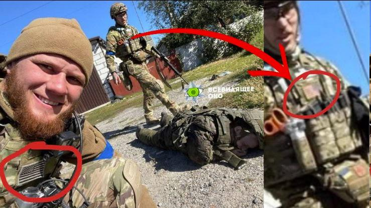

## Claim
Claim: " This image shows American mercenaries participating in Ukraine's incursion into Russia's Kursk Oblast in August 2024."

## Actions
```
reverse_search()
image_search("American mercenaries Ukraine Kursk Oblast")
```

## Evidence
### Evidence from `reverse_search`
The image in the claim () appears in articles discussing the Russian retreat from Balakleya in the Kharkiv region in September 2022. The articles are from [Apostrophe.ua](https://apostrophe.ua/news/society/2022-09-08/rasplata-za-ilovaysk-okkupantyi-ponesli-ogromnyie-poteri-pri-begstve-iz-balaklei-video/278880), [Charter97.org](https://charter97.org/ru/news/2022/9/9/514837/) and [cripo.com.ua](https://cripo.com.ua/vojna-s-rf/rossyjskye-vojska-begut-pod-natyskom-vsu-mnenye-ekspertov-y-rossyjskyh-voennyh/). The articles do not mention American mercenaries or the Kursk Oblast.


### Evidence from `image_search`
The BBC published an image of Ukrainian soldiers (). The Telegraph published an article on August 14, 2024, about Ukraine seizing land in the border region, mentioning Ukrainian servicemen near the Russian border (). Al Jazeera discusses the recapture of Kursk by Russian forces ().

The sources are: [https://www.bbc.com/news/articles/c984g10e22lo](https://www.bbc.com/news/articles/c984g10e22lo), [https://www.ukrainianphotographers.com/en/news-articles/foreign-mercenaries-in-the-kursk-region](https://www.ukrainianphotographers.com/en/news-articles/foreign-mercenaries-in-the-kursk-region), and [https://www.aljazeera.com/news/2025/3/13/russian-forces-recapture-kursk-raising-questions-about-us-ukraine-cutoff](https://www.aljazeera.com/news/2025/3/13/russian-forces-recapture-kursk-raising-questions-about-us-ukraine-cutoff).


## Elaboration
The image in the claim (

## Final Judgement
The image in the claim is from September 2022 and shows soldiers in the Kharkiv region, not the Kursk Oblast in August 2024. The image search results show that the claim is not supported by the evidence.

`false`

### Verdict: FALSE

### Justification
The image in the claim (