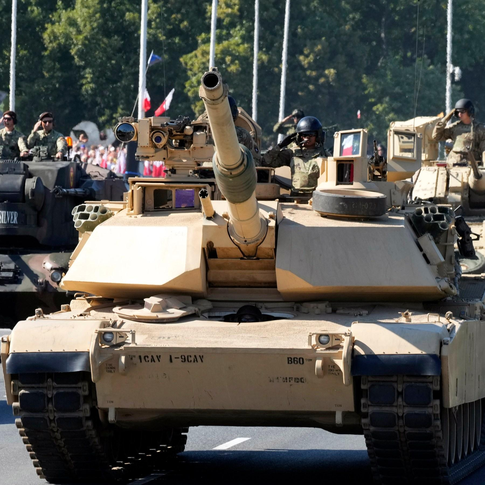

## Claim
Claim: " This image shows a military parade of Poland's army on August 14, 2024, preparing for war with Russia."

## Actions
```
reverse_search()
image_search("Poland army parade tanks")
```

## Evidence
### Evidence from `image_search`
CNN published an article about a military parade in Poland, which included an image of tanks (). Getty Images also shows a military parade in Poland ().

Al Jazeera reports that Poland held a military parade as the war in Ukraine was ongoing ().
The articles were published in August 2023.


## Elaboration
The evidence confirms that Poland held a military parade. However, the provided evidence does not confirm the date of the parade, nor does it mention any preparation for war with Russia. The articles were published in August 2023, not 2024.

The claim that the parade was on August 14, 2024, and that it was preparing for war with Russia is not supported by the evidence.

More information is needed to verify the date and the purpose of the parade.


## Final Judgement
The evidence confirms that Poland held a military parade, but the provided information does not confirm the date of the parade or its purpose. The articles were published in August 2023, not 2024.

The claim is not supported by the evidence. More information is needed to verify the date and the purpose of the parade. `false`


### Verdict: FALSE

### Justification
The image depicts a military parade in Poland, which was held in August 2023, as reported by sources like [CNN](https://www.cnn.com/) and [Al Jazeera](https://www.aljazeera.com/). However, the claim incorrectly states the date as August 14, 2024, and falsely suggests the parade was preparation for war with Russia, which is not supported by the available evidence.
