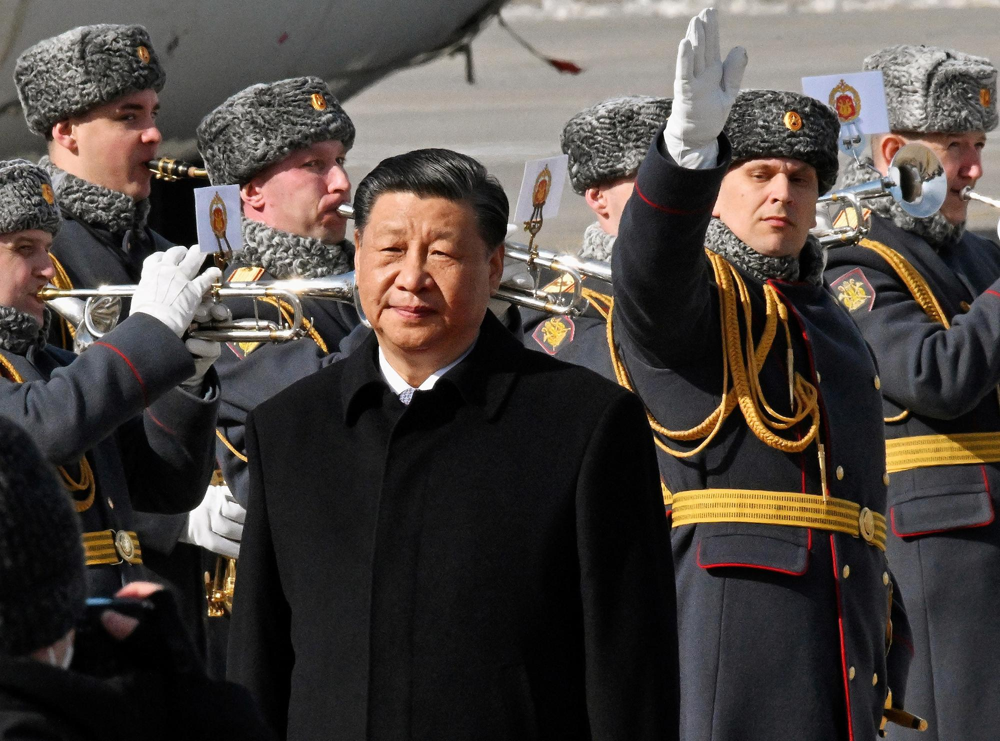

## Claim
Claim: " This image shows the Chinese Communist Party's Red Cross troops in Russia who have changed into winter clothes and set off for the Russian-Ukrainian front to aid Russia in rescuing its occupied territories."

## Actions
```
reverse_search()
```

## Evidence
### Evidence from `reverse_search`
The image in the claim was found on Wikipedia, which defines an airliner as an aircraft for transporting passengers and air cargo, and the Smithsonian National Air and Space Museum, which discusses the evolution of commercial airliners. The image was also found on Merriam-Webster, which defines the word "airliner". <image:k> 


## Elaboration
The evidence indicates that the image in the claim is associated with airliners, as it was found on Wikipedia, the Smithsonian National Air and Space Museum, and Merriam-Webster. However, the evidence does not provide any information about the Chinese Communist Party's Red Cross troops, their activities, or their involvement in the Russian-Ukrainian conflict.

Therefore, the claim cannot be verified based on the provided evidence. More information is needed to confirm the claim's assertions about the Red Cross troops and their actions.


## Actions
```
image_search("Chinese Red Cross troops Russia Ukraine")
image_search("Chinese military aid Russia Ukraine")
```

## Evidence
### Evidence from `image_search`
The Center for European Policy Analysis (CEPA) published an article about the Red Cross, including an image of a vehicle with a Red Cross symbol (). USNI News contains an image of Chinese soldiers (). CNN published an article about Chinese nationals in Ukraine ().


### Evidence from `image_search`
The New York Times ([https://www.nytimes.com/2022/03/13/us/politics/russia-china-ukraine.html](https://www.nytimes.com/2022/03/13/us/politics/russia-china-ukraine.html)) discusses the relationship between Russia and China in the context of the Ukraine war, including a photograph of Xi Jinping and Vladimir Putin. The Atlantic Council ([https://www.atlanticcouncil.org/blogs/new-atlanticist/chinas-support-may-not-be-lethal-aid-but-its-vital-to-russias-aggression-in-ukraine/](https://www.atlanticcouncil.org/blogs/new-atlanticist/chinas-support-may-not-be-lethal-aid-but-its-vital-to-russias-aggression-in-ukraine/)) published an article discussing China's support for Russia's aggression in Ukraine. Al Jazeera ([https://www.aljazeera.com/news/2022/3/14/us-official-russia-seeking-military-aid-from-china](https://www.aljazeera.com/news/2022/3/14/us-official-russia-seeking-military-aid-from-china)) reports that Russia is seeking military aid from China.   


## Elaboration
The evidence from the image searches provides additional context regarding China's relationship with Russia and the conflict in Ukraine. The New York Times and Al Jazeera report on China's support for Russia, including potential military aid. The Atlantic Council discusses China's vital support for Russia's aggression. However, none of the evidence directly supports the claim that Chinese Red Cross troops have been deployed to the Russian-Ukrainian front. The images found show Chinese soldiers and the Red Cross symbol, but they do not confirm the claim's specific details.

Therefore, the claim remains unverified due to a lack of direct evidence.


## Actions
```
image_search("Chinese Red Cross troops Ukraine war")
```

## Evidence
### Evidence from `image_search`
From [Source](https://www.ndtv.com/world-news/ukraine-war-beijing-red-faced-as-kyiv-breaks-humanitarian-law-to-prove-china-wrong-8183057): 
Content: NDTV published an article about the Ukraine war, including an image of two men with their eyes blacked out. 


## Elaboration
The evidence from the image search reveals an article from NDTV about the Ukraine war, which includes an image of two men with their eyes blacked out. However, this evidence does not provide any information about the Chinese Red Cross troops or their activities in the context of the Russian-Ukrainian conflict.

Therefore, the claim remains unverified.


## Final Judgement
The image search results provide some context about the war in Ukraine and China's relationship with Russia, but they do not confirm the claim about Chinese Red Cross troops deploying to the front lines. The evidence is insufficient to verify the claim.

`false`

### Verdict: FALSE

### Justification
The claim is not supported by the provided evidence. While image searches revealed articles discussing the war in Ukraine and China's relationship with Russia, including potential military aid, there is no direct evidence to confirm the deployment of Chinese Red Cross troops to the Russian-Ukrainian front. Therefore, the claim is unverified.
