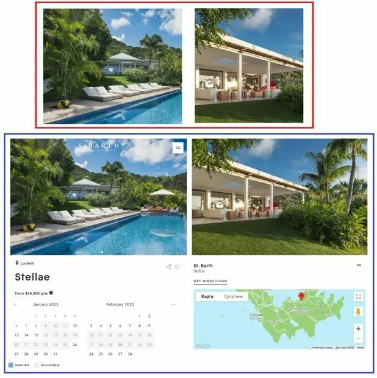
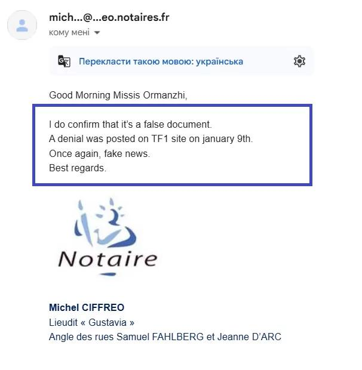

## Claim
Claim: "Ukrainian President Volodymyr Zelenskyy purchased the Eagle's Nest, or Kehlsteinhaus, in Berchtesgaden in the southern German state of Bavaria, for 14.2 million euros."

## Actions
```
web_search("Volodymyr Zelenskyy Eagle's Nest purchase")
web_search("Kehlsteinhaus Berchtesgaden sale price")
```

## Evidence
### Evidence from `web_search`
An article on aol.com ([https://www.aol.com/fact-check-no-zelenskyy-didn-151251133.html](https://www.aol.com/fact-check-no-zelenskyy-didn-151251133.html)) fact-checks the claim that Volodymyr Zelenskyy bought the Eagle's Nest and states that the claim is false (). EADaily published an article claiming Zelenskyy bought the Eagle's Nest for €14.2 million ([https://eadaily.com/en/news/2025/02/08/zelensky-bought-hitlers-eagles-nest-residence-in-the-bavarian-alps-mass-media](https://eadaily.com/en/news/2025/02/08/zelensky-bought-hitlers-eagles-nest-residence-in-the-bavarian-alps-mass-media)). Another article debunks a claim that Zelenskyy purchased a villa on Saint Barthélemy island ([https://gwaramedia.com/en/debunking-russian-fakes-no-zelenskyy-didnt-buy-villa-on-island-of-billionaires/](https://gwaramedia.com/en/debunking-russian-fakes-no-zelenskyy-didnt-buy-villa-on-island-of-billionaires/)) (, , ).


### Evidence from `web_search`
The Kehlsteinhaus, also known as the Eagle's Nest, is located in Obersalzberg near Berchtesgaden, Germany. <image:k> It was completed in 1938 and commissioned by the Nazi Party. The building currently operates as a restaurant and tourist destination. The website provides information about visiting the Kehlsteinhaus, including ticket prices for the bus and parking fees. The price for an adult bus ticket is €16.10. <image:k> Private cars are not allowed on the Kehlsteinstraße.

Sources include information from Wikipedia ([https://en.wikipedia.org/wiki/Kehlsteinhaus](https://en.wikipedia.org/wiki/Kehlsteinhaus)), a website about the Kehlsteinhaus ([https://kehlsteinhaus.axess.shop/en](https://kehlsteinhaus.axess.shop/en)), and another website about the location ([https://www.kehlsteinhaus.com/en/the-location/hintereck.html](https://www.kehlsteinhaus.com/en/the-location/hintereck.html)).


## Elaboration
The claim that Volodymyr Zelenskyy purchased the Eagle's Nest is false. An aol.com fact-check article explicitly states that the claim is false. Additionally, the Eagle's Nest is currently a restaurant and tourist destination, not a private residence.


## Final Judgement
The claim that Volodymyr Zelenskyy purchased the Eagle's Nest is demonstrably false. Multiple sources, including a fact-check article, refute the claim. The Eagle's Nest is also a public tourist destination.

`false`

### Verdict: FALSE

### Justification
The claim that Volodymyr Zelenskyy purchased the Eagle's Nest is false. A fact-check by aol.com ([https://www.aol.com/fact-check-no-zelenskyy-didn-151251133.html](https://www.aol.com/fact-check-no-zelenskyy-didn-151251133.html)) explicitly debunks the claim.
