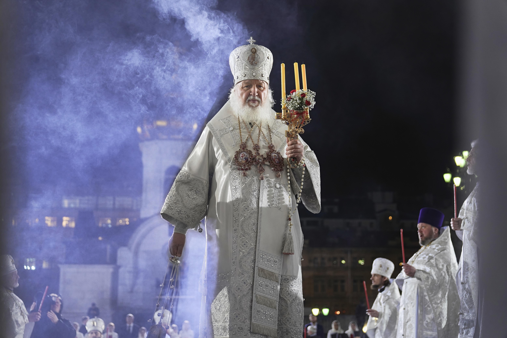

## Claim
Claim: " This image shows a Fox News broadcast from Easter 2025 where you can see the Patriarch Kirill in the center and Kyiv labeled as a Russian city in the top right corner of the image."

## Actions
```
web_search("Fox News Easter service Moscow Kyiv")
image_search("Patriarch Kirill Easter service")
```

## Evidence
### Evidence from `web_search`
Newsweek ([https://www.newsweek.com/fox-channel-ukraine-kyiv-russia-labeling-orthodox-easter-2061891](https://www.newsweek.com/fox-channel-ukraine-kyiv-russia-labeling-orthodox-easter-2061891)) reports that a Fox TV station labeled Kyiv as Russian territory during an Easter broadcast. The broadcast showed Putin attending an Easter service in Moscow conducted by Patriarch Kirill. The Kyiv Independent ([https://kyivindependent.com/ukraines-foreign-ministry-calls-out-fox-news-for-labeling-kyiv-a-russian-city/](https://kyivindependent.com/ukraines-foreign-ministry-calls-out-fox-news-for-labeling-kyiv-a-russian-city/)) also reports that Fox News labeled Kyiv a "Russian city" during its Easter service broadcast.

Babel.ua ([https://babel.ua/en/news/117299-fox-news-labeled-kyiv-as-a-russian-city-during-broadcast-of-ocu-easter-service-mfa-demands-investigation](https://babel.ua/en/news/117299-fox-news-labeled-kyiv-as-a-russian-city-during-broadcast-of-ocu-easter-service-mfa-demands-investigation)) states that Fox News labeled Kyiv as a Russian city during a live broadcast of the Easter service of the Orthodox Church of Ukraine (OCU) service from St. Michaelʼs Golden-Domed Cathedral in Kyiv. The broadcast was conducted in parallel with the service in Moscow, in which Putin and Patriarch Kirill participated.  


### Evidence from `image_search`
From [Source](https://www.politico.com/news/2022/06/22/patriarch-kirill-putin-russia-ukraine-00041388): 
Content: The Politico article from June 22, 2022, shows a photograph of Patriarch Kirill. 


## Elaboration
The evidence confirms that Fox News labeled Kyiv as a Russian city during an Easter broadcast. The broadcast showed Patriarch Kirill and Putin attending an Easter service in Moscow. The image in the claim shows the same broadcast, with the Patriarch Kirill in the center and Kyiv labeled as a Russian city.


## Final Judgement
The evidence confirms that Fox News labeled Kyiv as a Russian city during an Easter broadcast, which is visible in the image. The broadcast featured Patriarch Kirill and Putin attending an Easter service in Moscow.

`true`

### Verdict: TRUE

### Justification
The claim is accurate. Multiple sources, including Newsweek ([https://www.newsweek.com/fox-channel-ukraine-kyiv-russia-labeling-orthodox-easter-2061891](https://www.newsweek.com/fox-channel-ukraine-kyiv-russia-labeling-orthodox-easter-2061891)), confirm that Fox News labeled Kyiv as a Russian city during an Easter broadcast. The broadcast featured Patriarch Kirill and Putin attending an Easter service in Moscow, as shown in the image.
