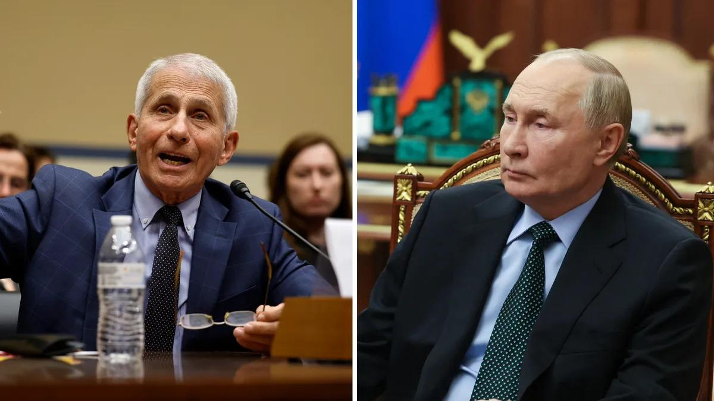

## Claim
Claim: "In January 2025, Russian President Vladimir Putin was seeking to have Dr. Anthony Fauci in the U.S. extradited to Russia in exchange for ending the war in Ukraine."

## Actions
```
web_search("Vladimir Putin Anthony Fauci extradition Ukraine war")
```

## Evidence
### Evidence from `web_search`
The claim that Vladimir Putin sought to extradite Dr. Anthony Fauci in January 2025 is false. A fact-check from Snopes, available on Yahoo News ([https://www.yahoo.com/news/fact-check-no-evidence-vladimir-224900291.html](https://www.yahoo.com/news/fact-check-no-evidence-vladimir-224900291.html)), rated the claim as "False" and noted that the claim originated from social media posts. , 

AOL News ([https://www.aol.com/news/fact-check-putin-demanding-dr-194705273.html](https://www.aol.com/news/fact-check-putin-demanding-dr-194705273.html)) also debunked the claim, citing its origin from a fake news website. Boatos.org ([https://www.boatos.org/english/did-putin-request-the-extradition-of-bill-gates-and-anthony-fauci-to-end-the-war-in-ukraine.html](https://www.boatos.org/english/did-putin-request-the-extradition-of-bill-gates-and-anthony-fauci-to-end-the-war-in-ukraine.html)) stated that there is no official record of Putin making any extradition request involving Anthony Fauci.


## Elaboration
The claim is false. Multiple sources, including Snopes ([https://www.yahoo.com/news/fact-check-no-evidence-vladimir-224900291.html](https://www.yahoo.com/news/fact-check-no-evidence-vladimir-224900291.html)) and AOL News ([https://www.aol.com/news/fact-check-putin-demanding-dr-194705273.html](https://www.aol.com/news/fact-check-putin-demanding-dr-194705273.html)), have debunked the claim, citing its origin from social media posts and fake news websites. Boatos.org ([https://www.boatos.org/english/did-putin-request-the-extradition-of-bill-gates-and-anthony-fauci-to-end-the-war-in-ukraine.html](https://www.boatos.org/english/did-putin-request-the-extradition-of-bill-gates-and-anthony-fauci-to-end-the-war-in-ukraine.html)) also confirms the absence of any official record of such a request.


## Final Judgement
The fact-check reveals that the claim is false. Multiple sources, including Snopes and AOL News, have debunked the claim, citing its origin from social media and fake news. There is no official record of Putin making any extradition request involving Anthony Fauci.

`false`

### Verdict: FALSE

### Justification
The claim is false. Fact-checks from sources like Snopes ([https://www.yahoo.com/news/fact-check-no-evidence-vladimir-224900291.html](https://www.yahoo.com/news/fact-check-no-evidence-vladimir-224900291.html)) and AOL News ([https://www.aol.com/news/fact-check-putin-demanding-dr-194705273.html](https://www.aol.com/news/fact-check-putin-demanding-dr-194705273.html)) have debunked the claim, pointing to its origin in social media and fake news. Additionally, Boatos.org confirms the absence of any official record of such a request.
