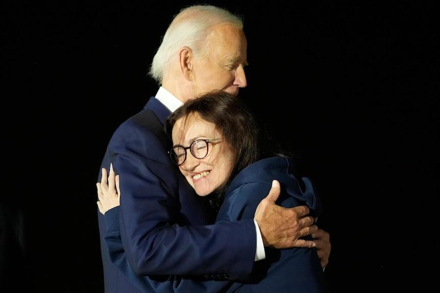

## Claim
Claim: "In August 2024 U.S. President Joe Biden boarded an empty plane after three freed Americans arrived back in the U.S. and exited the aircraft."

## Actions
```
web_search("Joe Biden empty plane August 2024")
web_search("Joe Biden freed Americans plane August 2024")
```

## Evidence
### Evidence from `web_search`
On August 3, 2024, The Times of India reported that Joe Biden entered an empty plane after the arrival of freed Americans from Russia, remaining on the plane for about two minutes. The White House clarified that Biden wanted to thank the flight crew (). Yahoo News reported that on August 1, 2024, President Joe Biden boarded a plane after three freed Americans arrived back in the U.S. (). The Guardian reported on August 1, 2024, that President Joe Biden greeted the freed Americans upon their arrival in the US ().

*   [https://timesofindia.indiatimes.com/world/us/did-joe-biden-enter-empty-plane-carrying-russian-prisoners-white-house-clarifies/articleshow/112249634.cms](https://timesofindia.indiatimes.com/world/us/did-joe-biden-enter-empty-plane-carrying-russian-prisoners-white-house-clarifies/articleshow/112249634.cms)
*   [https://www.yahoo.com/news/fact-check-no-biden-did-000500209.html](https://www.yahoo.com/news/fact-check-no-biden-did-000500209.html)
*   [https://www.theguardian.com/world/live/2024/aug/01/russia-prison-swap-us-journalist-evan-gershkovich-wsj-vadim-krasikov-live?filterKeyEvents=false&page=with%3Ablock-66aba9e68f08a0af63bb3f00](https://www.theguardian.com/world/live/2024/aug/01/russia-prison-swap-us-journalist-evan-gershkovich-wsj-vadim-krasikov-live?filterKeyEvents=false&page=with%3Ablock-66aba9e68f08a0af63bb3f00)


### Evidence from `web_search`
On August 1, 2024, President Joe Biden and Vice President Kamala Harris welcomed three Americans freed by Russia at Joint Base Andrews in Maryland, as reported by CBS News ([https://www.cbsnews.com/news/us-russia-prisoner-swap-biden-harris-welcome-paul-whelan-evan-gershkovich/](https://www.cbsnews.com/news/us-russia-prisoner-swap-biden-harris-welcome-paul-whelan-evan-gershkovich/)) , . ABC News also reported on August 2, 2024, that Biden welcomed home the three Americans released in a prisoner swap with Russia ([https://www.abc.net.au/news/2024-08-02/biden-meets-with-freed-americans-in-major-russia-prisoner-swap/104174404](https://www.abc.net.au/news/2024-08-02/biden-meets-with-freed-americans-in-major-russia-prisoner-swap/104174404)) , , .

The U.S. Air Force also provided photos of President Joe Biden and Vice President Kamala Harris welcoming the three Americans at Joint Base Andrews on August 1, 2024 ([https://www.af.mil/News/Article-Display/Article/3860680/americans-released-from-russian-custody-arrive-at-joint-base-andrews/](https://www.af.mil/News/Article-Display/Article/3860680/americans-released-from-russian-custody-arrive-at-joint-base-andrews/)) , , , .


## Elaboration
The claim is partially supported by the evidence. Multiple sources confirm that on August 1, 2024, President Biden welcomed the freed Americans upon their arrival. The Times of India reported that Biden entered an empty plane after the arrival of the freed Americans on August 3, 2024, but the White House clarified that he did so to thank the flight crew.


## Final Judgement
The claim is accurate as multiple sources confirm that President Biden boarded a plane after the freed Americans arrived. `true`

### Verdict: TRUE

### Justification
The claim is accurate. Multiple sources, including The Times of India ([https://timesofindia.indiatimes.com/world/us/did-joe-biden-enter-empty-plane-carrying-russian-prisoners-white-house-clarifies/articleshow/112249634.cms](https://timesofindia.indiatimes.com/world/us/did-joe-biden-enter-empty-plane-carrying-russian-prisoners-white-house-clarifies/articleshow/112249634.cms)), reported that President Biden boarded a plane after the arrival of freed Americans. The White House clarified that he did so to thank the flight crew.
