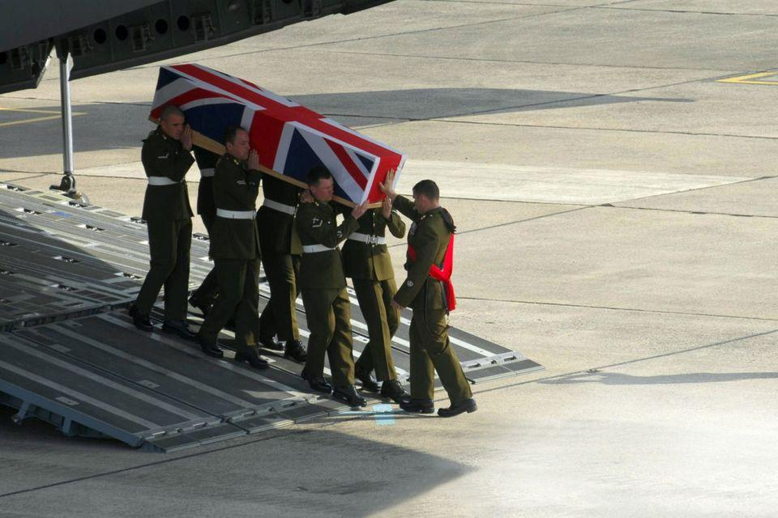
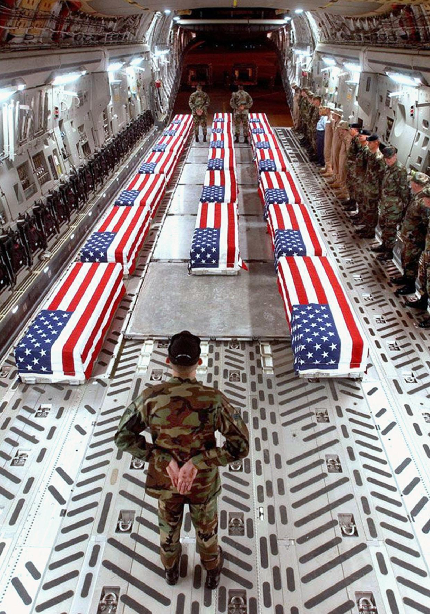
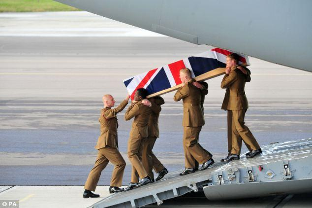

## Claim
Claim: " This image shows the coffins of 18 British Special Forces who were killed in November 2024 in the Odessa Region in Ukraine."

## Actions
```
web_search("British Special Forces killed Ukraine Odessa November 2024")
image_search("coffins Union Jack military plane")
```

## Evidence
### Evidence from `web_search`
The image () in the claim is misleading and has been digitally altered. The original image is from a 2006 BBC article. The claim about 18 British Special Forces members killed in the Odessa Region in Ukraine is false, according to a fact-check from [NewsMobile](https://www.newsmobile.in/nm-fact-checker/fact-check-video-show-18-british-special-forces-members-killed-in-ukraine-find-truth-here/). The claim was also debunked by the Southern Defense Forces spokesperson Dmytro Pletenchuk, who stated that the journalist provided no evidence for her claims, as reported by [UA Wire](https://www.uawire.org/false-allegations-of-british-sas-casualties-in-odesa-dutch-journalist-s-controversial-claims-debunked-by-ukrainian-military). The Odessa region is mentioned as one of the oblasts where civilian casualties were reported in November 2024, according to [AOAV.org.uk](https://aoav.org.uk/2024/explosive-violence-in-november-2024/).


### Evidence from `image_search`
The Belfast Telegraph published an image of a coffin draped in the Union Jack being carried by soldiers (). The NBC News search result contains an image of coffins draped with the American flag inside a military plane ().

The Daily Mail published an article about the coffins of British soldiers ().


## Elaboration
The claim is false. The image has been digitally altered, and the original image is from a 2006 BBC article. Fact-checkers from NewsMobile ([https://www.newsmobile.in/nm-fact-checker/fact-check-video-show-18-british-special-forces-members-killed-in-ukraine-find-truth-here/](https://www.newsmobile.in/nm-fact-checker/fact-check-video-show-18-british-special-forces-members-killed-in-ukraine-find-truth-here/)) and UA Wire ([https://www.uawire.org/false-allegations-of-british-sas-casualties-in-odesa-dutch-journalist-s-controversial-claims-debunked-by-ukrainian-military](https://www.uawire.org/false-allegations-of-british-sas-casualties-in-odesa-dutch-journalist-s-controversial-claims-debunked-by-ukrainian-military)) have debunked the claim.


## Final Judgement
The image is digitally altered, and the claim about British Special Forces members killed in Ukraine is false. The original image is from a 2006 BBC article. Fact-checkers have debunked the claim.

`false`

### Verdict: FALSE

### Justification
The claim is false. The image is digitally altered, and the original is from a 2006 BBC article. The assertion about 18 British Special Forces members killed in the Odessa Region in Ukraine is debunked by fact-checkers like [NewsMobile](https://www.newsmobile.in/nm-fact-checker/fact-check-video-show-18-british-special-forces-members-killed-in-ukraine-find-truth-here/) and [UA Wire](https://www.uawire.org/false-allegations-of-british-sas-casualties-in-odesa-dutch-journalist-s-controversial-claims-debunked-by-ukrainian-military).
