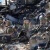

## Claim
Claim: "During the January 2025 wildfires, eight mansions belonging to Ukrainian military officials burned down in Los Angeles, California."

## Actions
```
web_search("January 2025 wildfires Los Angeles Ukrainian military officials mansions")
```

## Evidence
### Evidence from `web_search`
Pro-Kremlin social media accounts spread a baseless narrative that mansions belonging to Ukrainian military officials burned down in the Los Angeles wildfires (, ). This claim was debunked by fact-checkers and described as "Russian propaganda" by the Ukrainian National Security and Defense Council's Center for Countering Disinformation. The story originated on a pro-Russian Telegram channel, and there is zero evidence to support the claim.

NPR ([https://www.npr.org/2025/01/16/nx-s1-5259842/los-angeles-california-fires-russia-ukraine](https://www.npr.org/2025/01/16/nx-s1-5259842/los-angeles-california-fires-russia-ukraine)) and Houston Public Media ([https://www.houstonpublicmedia.org/npr/2025/01/16/nx-s1-5259842/russia-tried-to-use-the-l-a-wildfires-to-spread-anti-ukraine-propaganda/](https://www.houstonpublicmedia.org/npr/2025/01/16/nx-s1-5259842/russia-tried-to-use-the-l-a-wildfires-to-spread-anti-ukraine-propaganda/)) reported on the claim. Forbes ([https://www.forbes.com/sites/petersuciu/2025/01/13/satire-or-disinformation-ukrainian-generals-lost-homes-in-la-fires/](https://www.forbes.com/sites/petersuciu/2025/01/13/satire-or-disinformation-ukrainian-generals-lost-homes-in-la-fires/)) discussed the claim, mentioning Valerii Zaluzhnyi as one of the individuals named in the claims.


## Elaboration
The claim is false. The evidence indicates that the narrative about mansions belonging to Ukrainian military officials burning down in the Los Angeles wildfires is baseless and originated from pro-Kremlin sources. Fact-checkers debunked the claim, and it was described as "Russian propaganda" by the Ukrainian National Security and Defense Council's Center for Countering Disinformation.


## Final Judgement
The search results reveal that the claim about Ukrainian military officials' mansions burning down in the Los Angeles wildfires is a false narrative. This story originated from pro-Kremlin sources and has been debunked by fact-checkers and Ukrainian authorities as propaganda.

The most appropriate decision option is `false`.


### Verdict: FALSE

### Justification
The claim is false. The narrative originated from pro-Kremlin sources and was debunked by fact-checkers as "Russian propaganda" ([https://www.npr.org/2025/01/16/nx-s1-5259842/los-angeles-california-fires-russia-ukraine](https://www.npr.org/2025/01/16/nx-s1-5259842/los-angeles-california-fires-russia-ukraine), [https://www.houstonpublicmedia.org/npr/2025/01/16/nx-s1-5259842/russia-tried-to-use-the-l-a-wildfires-to-spread-anti-ukraine-propaganda/](https://www.houstonpublicmedia.org/npr/2025/01/16/nx-s1-5259842/russia-tried-to-use-the-l-a-wildfires-to-spread-anti-ukraine-propaganda/)).
