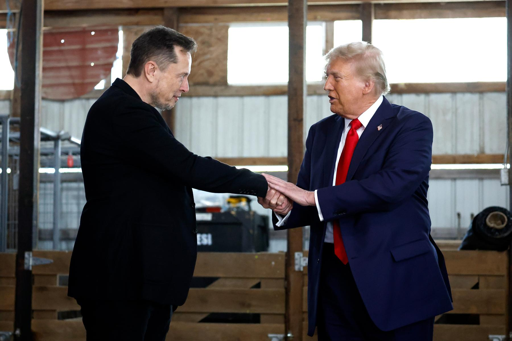
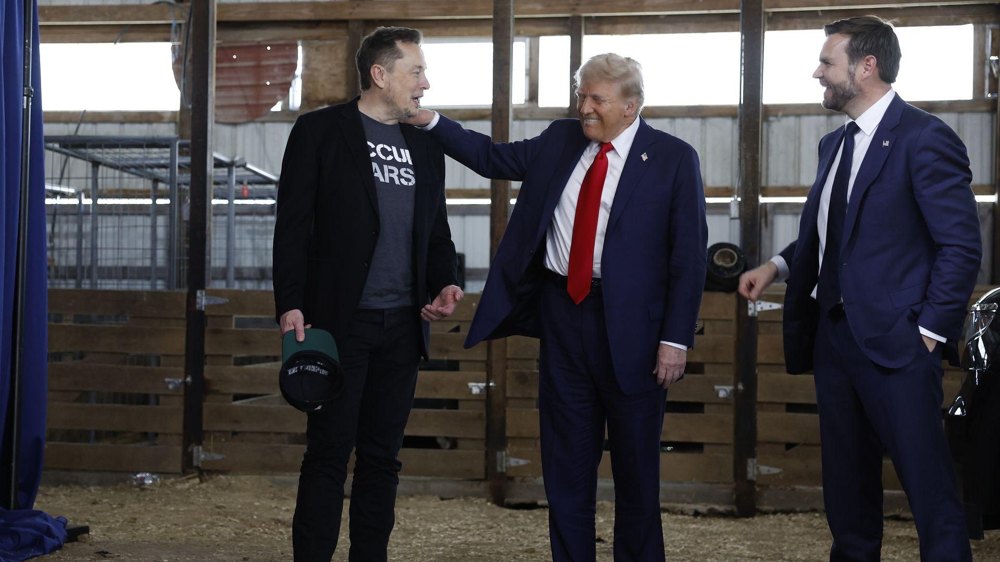

## Claim
Claim: " This image shows a screenshot of an authentic X post from Elon Musk on November 6, 2025 saying 'The last dollar for Zelenskiy'."

## Actions
```
web_search("Elon Musk Zelenskiy last dollar")
image_search("Elon Musk Trump dollar Zelenskiy")
```

## Evidence
### Evidence from `web_search`
The AOL article fact-checks the claim that Elon Musk posted "The last dollar for Zelenskiy" and states that the claim is false, with no evidence of Musk posting this. The image of the tweet is fabricated and was spread on social media . The Politico.eu article discusses Elon Musk's meme mocking Ukrainian President Volodymyr Zelenskyy's calls for Western aid.

The StopFake.org article refutes a fake story about Ukraine stopping the use of Starlink and insulting Elon Musk, mentioning a previous debunked fake about Elon Musk publishing a mocking post with the last dollar for Zelensky.


### Evidence from `image_search`
Rolling Stone published an article about Elon Musk and Donald Trump.  Axios published an article on November 8, 2024, with a photograph of Elon Musk and Donald Trump. 

The search results include articles from [https://www.arabnews.com/node/2578597/world](https://www.arabnews.com/node/2578597/world), [https://www.rollingstone.com/politics/politics-news/elon-musk-trump-phone-calls-world-leaders-1235158569/](https://www.rollingstone.com/politics/politics-news/elon-musk-trump-phone-calls-world-leaders-1235158569/), and [https://www.axios.com/2024/11/08/musk-trump-zelensky-ukraine-call](https://www.axios.com/2024/11/08/musk-trump-zelensky-ukraine-call).


## Elaboration
The claim is false. The evidence indicates that the image of the tweet is fabricated. Multiple sources, including AOL and StopFake.org, debunked the claim that Elon Musk posted "The last dollar for Zelenskiy."


## Final Judgement
The fact-check reveals that the image of the tweet is fabricated and that Elon Musk did not post the message "The last dollar for Zelenskiy." Several sources confirm the image is fake and the claim is false.

`false`

### Verdict: FALSE

### Justification
The claim is false. Fact-checking reveals that the image of the tweet is fabricated, and Elon Musk did not post the message "The last dollar for Zelenskiy," as confirmed by sources like [AOL](https://www.aol.com/) and [StopFake.org](https://www.stopfake.org/).
