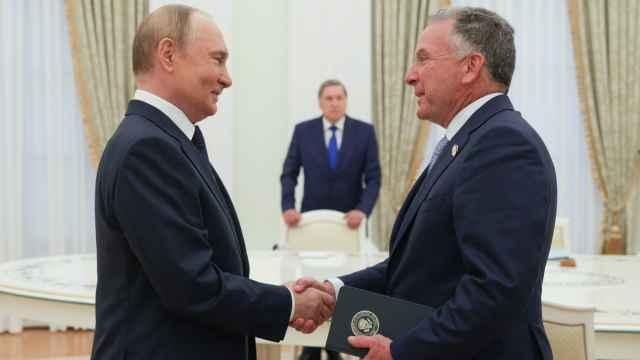

## Claim
Claim: "French President Emmanuel Macron called Russian President Vladimir Putin a 'butcher' during his press conference with Donald Trump on Monday, Feb. 24, 2025."

## Actions
```
web_search("Emmanuel Macron Vladimir Putin butcher February 24 2025")
web_search("Emmanuel Macron Donald Trump press conference February 24 2025")
```

## Evidence
### Evidence from `web_search`
France 24 ([Source](https://www.france24.com/en/live-news/20220327-macron-warns-against-escalation-after-biden-brands-putin-butcher)) reported that Emmanuel Macron warned against escalating the situation in Ukraine after Joe Biden called Vladimir Putin a "butcher" <image:i>. The Moscow Times ([Source](https://www.themoscowtimes.com/2022/03/27/macron-warns-against-escalation-after-biden-brands-putin-butcher-a77097)) also reported on Macron's warning after Biden's comment.

Yahoo News UK ([Source](https://uk.news.yahoo.com/macron-didn-t-call-putin-113000978.html)) states that Macron did not call Putin a "butcher" during a press conference with Donald Trump on February 24, 2025. Instead, Macron was referring to the killings of Ukrainian civilians in Bucha in 2022. The press conference took place at the White House . The Moscow Times also published articles about Trump , , .


### Evidence from `web_search`
On February 24, 2025, Emmanuel Macron and Donald Trump held a press conference at the White House, as reported by [Roll Call](https://rollcall.com/factbase/trump/transcript/donald-trump-press-conference-emmanuel-macron-france-february-24-2025) and [PBS News](https://www.pbs.org/newshour/world/watch-macron-corrects-trump-after-he-says-european-support-for-ukraine-was-a-loan). Reuters also published an article about the meeting, stating that Macron said Russia was the aggressor, and Trump expressed a desire for a ceasefire .

The transcript from Roll Call does not contain the word "butcher" or any direct quotes about Vladimir Putin.


## Elaboration
The claim is false. According to Yahoo News UK ([Source](https://uk.news.yahoo.com/macron-didn-t-call-putin-113000978.html)), Macron did not call Putin a "butcher" during the press conference with Trump on February 24, 2025.

The press conference did take place on the specified date at the White House, as confirmed by Roll Call ([Source](https://rollcall.com/factbase/trump/transcript/donald-trump-press-conference-emmanuel-macron-france-february-24-2025)) and PBS News ([Source](https://www.pbs.org/newshour/world/watch-macron-corrects-trump-after-he-says-european-support-for-ukraine-was-a-loan)). However, the transcript from Roll Call does not contain the word "butcher."


## Final Judgement
The evidence indicates that Emmanuel Macron did not call Vladimir Putin a "butcher" during the press conference with Donald Trump on February 24, 2025. While the press conference did occur on that date, the available transcripts and reports do not support the claim.

`false`

### Verdict: FALSE

### Justification
The claim is false. While a press conference between Emmanuel Macron and Donald Trump did occur on February 24, 2025, at the White House, as reported by [Roll Call](https://rollcall.com/factbase/trump/transcript/donald-trump-press-conference-emmanuel-macron-france-february-24-2025) and [PBS News](https://www.pbs.org/newshour/world/watch-macron-corrects-trump-after-he-says-european-support-for-ukraine-was-a-loan), Macron did not call Putin a "butcher" during the conference, according to [Yahoo News UK](https://uk.news.yahoo.com/macron-didn-t-call-putin-113000978.html).
