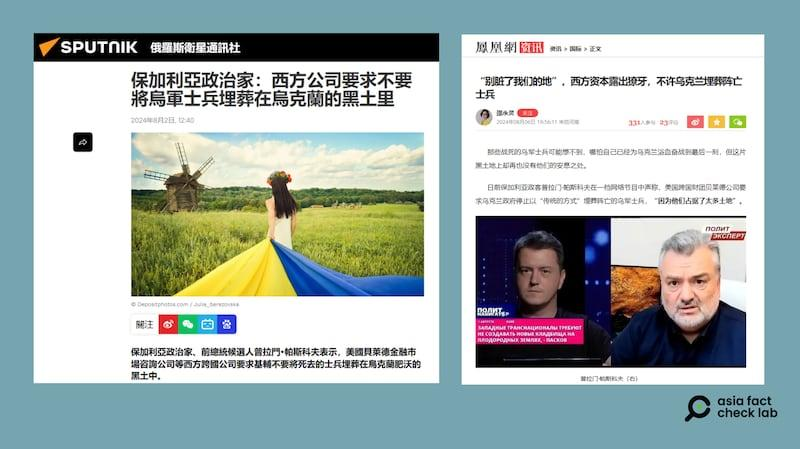

## Claim
Claim: "BlackRock has asked that Ukrainian soldiers not be buried on the land it owns in Ukraine."

## Actions
```
web_search("BlackRock Ukraine land burial soldiers")
```

## Evidence
### Evidence from `web_search`
The Asia Fact Check Lab ([https://www.rfa.org/english/news/afcl/afcl-blackrock-ukraine-land-08262024030948.html](https://www.rfa.org/english/news/afcl/afcl-blackrock-ukraine-land-08262024030948.html)) states that the claim that BlackRock asked the Ukrainian government to stop burying deceased Ukrainian soldiers on land it owns is false. The claim originated from a Bulgarian politician and was shared by Russian and Chinese media. BlackRock does not own any land in Ukraine, and Ukrainian law prohibits foreign companies from purchasing arable land. 

Mythdetector.com ([https://mythdetector.com/en/head-of-blackrock-circulates/](https://mythdetector.com/en/head-of-blackrock-circulates/)) fact-checks a claim that Larry Fink, the head of BlackRock, called for the cremation of Ukrainian soldiers. The quote is disinformation and originated from an anonymous Russian-language TikTok account.  Detector Media states that propagandists falsely claim BlackRock owns 47% of Ukraine's territory and asked not to bury soldiers on its land.


## Elaboration
The claim is false. The Asia Fact Check Lab ([https://www.rfa.org/english/news/afcl/afcl-blackrock-ukraine-land-08262024030948.html](https://www.rfa.org/english/news/afcl/afcl-blackrock-ukraine-land-08262024030948.html)) states that BlackRock does not own land in Ukraine, and Ukrainian law prohibits foreign companies from purchasing arable land. The claim originated from a Bulgarian politician and was shared by Russian and Chinese media.

Furthermore, Detector Media states that the claim is part of a broader false narrative spread by propagandists. Mythdetector.com ([https://mythdetector.com/en/head-of-blackrock-circulates/](https://mythdetector.com/en/head-of-blackrock-circulates/)) also fact-checked a related claim about BlackRock, finding it to be disinformation.


## Final Judgement
The claim that BlackRock asked that Ukrainian soldiers not be buried on land it owns in Ukraine is false. Multiple sources confirm that BlackRock does not own land in Ukraine, and the claim originated from unreliable sources and is part of a broader disinformation campaign.

`false`

### Verdict: FALSE

### Justification
The claim is false. According to the Asia Fact Check Lab ([https://www.rfa.org/english/news/afcl/afcl-blackrock-ukraine-land-08262024030948.html](https://www.rfa.org/english/news/afcl/afcl-blackrock-ukraine-land-08262024030948.html)), BlackRock does not own land in Ukraine, and Ukrainian law prohibits foreign companies from purchasing arable land. The claim originated from a Bulgarian politician and was shared by Russian and Chinese media.
