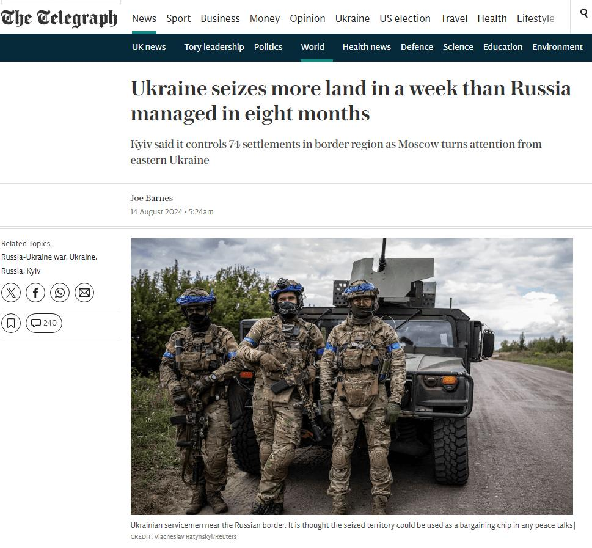
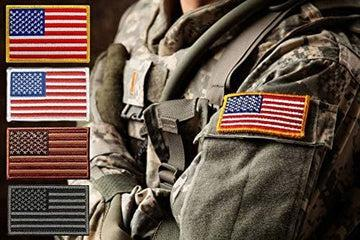

## Claim
Claim: " This image shows American mercenaries participating in Ukraine's incursion into Russia's Kursk Oblast in August 2024."

## Actions
```
image_search("American mercenaries Ukraine Russia Kursk Oblast")
```

## Evidence
### Evidence from `image_search`
Al Jazeera published an article about Russian forces recapturing Kursk (). The BBC News website contains an image of Ukrainian soldiers (). The Telegraph published an article on August 14, 2024, about Ukraine seizing land in the border region ().

The provided sources do not contain information about American mercenaries participating in Ukraine's incursion into Russia's Kursk Oblast in August 2024.


## Elaboration
The evidence does not support the claim. The search results mention articles about Russian forces recapturing Kursk, Ukrainian soldiers, and Ukraine seizing land in the border region. However, none of these sources mention American mercenaries participating in Ukraine's incursion into Russia's Kursk Oblast in August 2024.


## Actions
```
web_search("Ukraine Kursk Oblast incursion August 2024 mercenaries")
```

## Evidence
### Evidence from `web_search`
The search results include a Wikipedia article discussing the Ukrainian incursion into Russia's Kursk Oblast on August 6, 2024, mentioning Ukrainian and Russian forces, and reactions from the United States and Germany. The article also mentions the 2024 Kursk offensive. ([https://en.wikipedia.org/wiki/Kursk_campaign](https://en.wikipedia.org/wiki/Kursk_campaign)) , ,  Al Jazeera published an article on August 14, 2024, discussing the Ukrainian incursion into the Kursk region of Russia. ([https://www.aljazeera.com/news/2024/8/14/unprecedented-escalation-how-russians-view-ukraines-daring-incursion](https://www.aljazeera.com/news/2024/8/14/unprecedented-escalation-how-russians-view-ukraines-daring-incursion))  The Institute for the Study of War (ISW) published an article discussing the Ukrainian incursion into Kursk Oblast in August 2024. ([https://understandingwar.org/backgrounder/ukraine%E2%80%99s-kursk-incursion-six-month-assessment](https://understandingwar.org/backgrounder/ukraine%E2%80%99s-kursk-incursion-six-month-assessment)) ,  None of the articles mention American mercenaries.


## Elaboration
The evidence confirms that there was a Ukrainian incursion into Russia's Kursk Oblast in August 2024. However, the search results do not mention the presence of American mercenaries.

Therefore, the claim cannot be verified based on the provided evidence.


## Actions
```
image_search("American flag patch military uniform")
```

## Evidence
### Evidence from `image_search`
The search results show images of military uniforms with American flag patches. One source is from Propper.com ([https://www.propper.com/usa-flag-reverse-patch.html?srsltid=AfmBOorJ3UHj6L4BpI95XqS1JAAVhpcWWUjJn7MHD-hrklJBnOBI3QkY](https://www.propper.com/usa-flag-reverse-patch.html?srsltid=AfmBOorJ3UHj6L4BpI95XqS1JAAVhpcWWUjJn7MHD-hrklJBnOBI3QkY)) , another from ASATechMed.com ([https://www.asatechmed.com/products/6-pc-assorted-usa-tactical-american-flag-patch-100-embroidered-thin-blue-line-united-states-military-morale-patches-set-for-molle-hats-backpacks-tactical-vest-uniforms?srsltid=AfmBOoqqQhYoDLaozpFU-vQARkuTRc6niYIiolLlTJ4oZHFSWXGdy5gj](https://www.asatechmed.com/products/6-pc-assorted-usa-tactical-american-flag-patch-100-embroidered-thin-blue-line-united-states-military-morale-patches-set-for-molle-hats-backpacks-tactical-vest-uniforms?srsltid=AfmBOoqqQhYoDLaozpFU-vQARkuTRc6niYIiolLlTJ4oZHFSWXGdy5gj)) , and another from starsnstripesco.com ([https://starsnstripesco.com/products/copy-of-u-s-army-regulation-flag-patch-ocp?srsltid=AfmBOorwpsdqH384pCL2u5vMgxq1PX5LQ-OCfijEFPVMv9Es5XotIbIE](https://starsnstripesco.com/products/copy-of-u-s-army-regulation-flag-patch-ocp?srsltid=AfmBOorwpsdqH384pCL2u5vMgxq1PX5LQ-OCfijEFPVMv9Es5XotIbIE)) .


## Elaboration
The presence of an American flag patch on a military uniform, as seen in the image, does not automatically confirm the presence of American mercenaries. The search results show that American flag patches are available for purchase and can be worn on military uniforms. The claim requires further evidence to confirm the individuals are mercenaries.


## Final Judgement
The evidence indicates that while there was a Ukrainian incursion into Russia's Kursk Oblast in August 2024, there is no evidence to support the claim that American mercenaries participated in it. The image shows individuals with American flag patches on their uniforms, but this does not confirm they are mercenaries.

`false`

### Verdict: FALSE

### Justification
The claim is unsupported. While there was a Ukrainian incursion into Russia's Kursk Oblast in August 2024, as documented by sources like Al Jazeera and the Institute for the Study of War ([https://understandingwar.org/backgrounder/ukraine%E2%80%99s-kursk-incursion-six-month-assessment](https://understandingwar.org/backgrounder/ukraine%E2%80%99s-kursk-incursion-six-month-assessment)), there is no evidence to suggest the involvement of American mercenaries. The presence of American flag patches on uniforms, as shown in the image, does not confirm the individuals are mercenaries, as such patches are commercially available.
