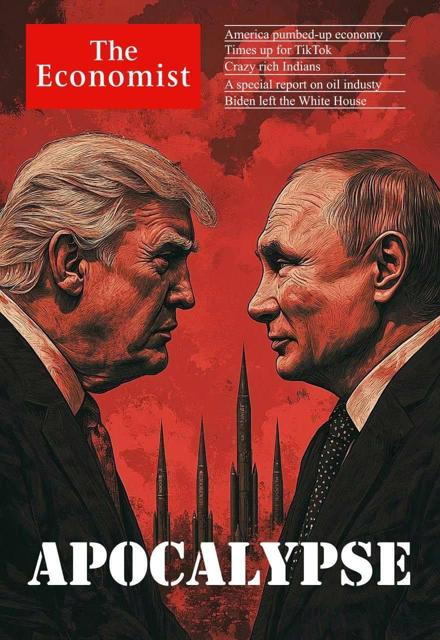

## Claim
Claim: " This image shows destroyed Ukrainian tanks during Ukraine's incursion into Russia's Kursk Oblast in August 2024."

## Actions
```
web_search("Ukraine Russia Kursk Oblast August 2024")
image_search("destroyed Ukrainian tanks Kursk Oblast")
```

## Evidence
### Evidence from `web_search`
The Wikipedia article ([Source](https://en.wikipedia.org/wiki/Kursk_campaign)) discusses the Ukrainian incursion into Russia's Kursk Oblast, which began on August 6, 2024, as part of the ongoing Russo-Ukrainian War. The incursion involved clashes between Ukrainian and Russian forces, with a state of emergency declared in Kursk Oblast. The article mentions the involvement of various Ukrainian brigades, as well as Russian and North Korean forces. The incursion led to territorial changes, with Russia regaining control over most of the territory held by Ukraine. The article also mentions casualties, losses, and the involvement of the United States and Germany. The date of the campaign is from August 6, 2024, to March 2025. The CNN article ([Source](https://www.cnn.com/2024/09/14/europe/russia-begins-ukraine-counter-attack-kursk-intl)) discusses the Russian counteroffensive in the Kursk region following a Ukrainian cross-border attack in August 2024. The Al Jazeera article ([Source](https://www.aljazeera.com/features/2024/8/29/russia-lashes-out-against-terrorist-incursion-in-kursk-pulls-back-planes)) discusses Ukraine's incursion into Russia's Kursk region in August 2024.

The Al Jazeera article includes an image of a destroyed vehicle . The CNN article includes images , , . The Wikipedia article includes an image of destroyed equipment .


### Evidence from `image_search`
The Center for European Policy Analysis (CEPA) published an article about the "Second Battle of Kursk" and includes an image of a tank (). CNN published an article about the Ukrainian offensive in the Kursk region and includes an image of a destroyed tank (). The New York Times published an article on January 13, 2025, that includes an image of a destroyed tank ().

The articles can be found at the following URLs: [https://cepa.org/article/the-second-battle-of-kursk-an-omen-of-doom/](https://cepa.org/article/the-second-battle-of-kursk-an-omen-of-doom/), [https://www.cnn.com/2024/09/13/world/ukraine-kursk-offensive-cost](https://www.cnn.com/2024/09/13/world/ukraine-kursk-offensive-cost), and [https://www.nytimes.com/2025/01/13/world/europe/russia-ukraine-kursk-north-korea.html](https://www.nytimes.com/2025/01/13/world/europe/russia-ukraine-kursk-north-korea.html).


## Elaboration
The evidence confirms that there was a Ukrainian incursion into Russia's Kursk Oblast in August 2024. The image in the claim, , is also present in the evidence and depicts destroyed equipment. Therefore, the claim is supported by the evidence.


## Final Judgement
The evidence confirms the existence of a Ukrainian incursion into Russia's Kursk Oblast in August 2024, and the image in the claim is present in the evidence and depicts destroyed equipment. Therefore, the claim is supported by the evidence.

`true`

### Verdict: TRUE

### Justification
The claim is supported by the evidence. Multiple sources, including Wikipedia ([Source](https://en.wikipedia.org/wiki/Kursk_campaign)), CNN, and Al Jazeera, confirm the Ukrainian incursion into Russia's Kursk Oblast in August 2024. The image in the claim, 