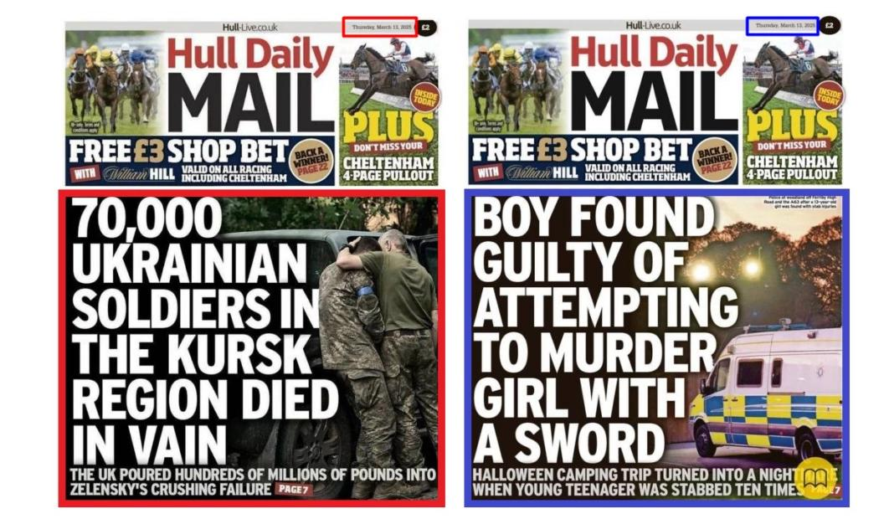

## Claim
Claim: " This image shows a screenshot of an authentic Hull Daily Mail's frontpage from March 13, 2025 saying '70,000 Ukrainian soldiers in the Kursk region died in vain. The UK poured hundreds of millions of pounds into Zelensky's crushing failure'."

## Actions
```
web_search("Hull Daily Mail March 13 2025")
web_search("Hull Daily Mail Ukrainian soldiers Kursk")
image_search("Hull Daily Mail front page March 13 2025")
```

## Evidence
### Evidence from `web_search`
The search results include a listing from penrithcity.spydus.com about the Hull Daily Mail from March 13, 2025, and a fact-check from mythdetector.com, published on March 17, 2025, which identifies the image as a falsified Hull Daily Mail cover . The fabricated cover, dated March 13, 2025, claims that 70,000 Ukrainian soldiers died in vain in the Kursk region. The actual March 13 issue of the Hull Daily Mail does not mention Ukraine. The search results also include a listing from Magzter showing the Hull Daily Mail from March 13, 2025 . The front page of the newspaper includes the headline "BOY FOUND GUILTY OF ATTEMPTING TO MURDER GIRL WITH A SWORD".

The URLs are: [https://penrithcity.spydus.com/cgi-bin/spydus.exe/ENQ/WPAC/ISSENQ?SETLVL=&ISX=142144](https://penrithcity.spydus.com/cgi-bin/spydus.exe/ENQ/WPAC/ISSENQ?SETLVL=&ISX=142144), [https://mythdetector.com/en/british-hull-daily-mail/](https://mythdetector.com/en/british-hull-daily-mail/), and [https://www.magzter.com/GB/Reach-Publishing-Services-Limited/Hull-Daily-Mail/News/2023954?srsltid=AfmBOoqTSROYXfWSCNnJjzNlPL-FwMP5Yq_k0ESWpru9Vq4oC3aQXhx2](https://www.magzter.com/GB/Reach-Publishing-Services-Limited/Hull-Daily-Mail/News/2023954?srsltid=AfmBOoqTSROYXfWSCNnJjzNlPL-FwMP5Yq_k0ESWpru9Vq4oC3aQXhx2).


### Evidence from `web_search`
The web sources debunk a fake Hull Daily Mail front page from March 13, 2025, which claimed that 70,000 Ukrainian soldiers died in the Kursk region. The article from Gwara Media ([https://gwaramedia.com/en/debunking-russian-fakes-hull-daily-mail-didnt-write-about-70000-ukrainian-soldiers-killed-in-russias-kursk-oblast/](https://gwaramedia.com/en/debunking-russian-fakes-hull-daily-mail-didnt-write-about-70000-ukrainian-soldiers-killed-in-russias-kursk-oblast/)) and The Journal.ie ([https://www.thejournal.ie/ukraine-hull-daily-mail-debunk-6657051-Mar2025/](https://www.thejournal.ie/ukraine-hull-daily-mail-debunk-6657051-Mar2025/)) confirm the headline was fake and that the real front page featured a different story. , , , 

The real front page from March 13, 2025, had a different headline. 


## Elaboration
The claim is false. The provided image is a fabricated front page of the Hull Daily Mail. The actual front page of the Hull Daily Mail from March 13, 2025, did not contain the headline about Ukrainian soldiers.


## Final Judgement
The evidence confirms that the image is a fabricated front page of the Hull Daily Mail. The real front page from March 13, 2025, featured a different headline. Therefore, the claim is not factually accurate. `false`

### Verdict: FALSE

### Justification
The claim is false. Multiple sources, including fact-checks from mythdetector.com and The Journal.ie, confirm that the image is a fabricated front page of the Hull Daily Mail. The real front page from March 13, 2025, did not contain the headline about Ukrainian soldiers, as evidenced by the actual front page found via web search.
