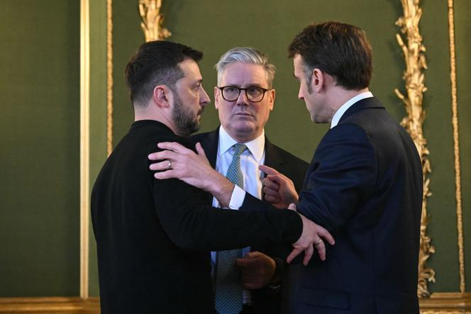

## Claim
Claim: " This is an authentic image of world leaders taking off their suits to symbolically support Ukraine at the London summit on Ukraine on March 2, 2025."

## Actions
```
web_search("London summit on Ukraine March 2 2023")
image_search("European leaders take off suits Ukraine")
```

## Evidence
### Evidence from `web_search`
The 2025 London Summit on Ukraine, also known as the Securing Our Future London Summit, took place on March 2, 2025, in London, hosted by British Prime Minister Keir Starmer. The summit aimed to create a "coalition of the willing" to present a peace plan for the Russian invasion of Ukraine. Participants included 16 states, the EU, and NATO. The summit followed a meeting between Ukrainian President Volodymyr Zelenskyy and U.S. President Donald Trump. Starmer outlined a four-point plan and committed £1.6 billion for air defense missiles for Ukraine. The summit also involved discussions with leaders from Estonia, Latvia, and Lithuania. ([https://en.wikipedia.org/wiki/2025_London_Summit_on_Ukraine](https://en.wikipedia.org/wiki/2025_London_Summit_on_Ukraine))

The summit was attended by leaders including Keir Starmer, Emmanuel Macron, and Volodymyr Zelensky. ([https://www.lemonde.fr/en/international/article/2025/03/03/at-london-summit-starmer-defends-french-british-peace-plan-for-ukraine_6738743_4.html](https://www.lemonde.fr/en/international/article/2025/03/03/at-london-summit-starmer-defends-french-british-peace-plan-for-ukraine_6738743_4.html)). Reuters also discussed the summit, mentioning that Russian parliamentarians dismissed the summit, and that the meeting would not save Zelenskiy's position. ([https://www.reuters.com/world/europe/russian-lawmaker-says-ukraine-can-only-count-improved-moscow-washington-ties-2025-03-02/](https://www.reuters.com/world/europe/russian-lawmaker-says-ukraine-can-only-count-improved-moscow-washington-ties-2025-03-02/)).  


### Evidence from `image_search`
The Los Angeles Times ([Source](https://www.latimes.com/world-nation/story/2025-07-10/european-leaders-announce-new-equity-fund-for-ukraine-and-urge-investment-even-as-war-accelerates)) published an article on July 10, 2025, about European leaders announcing a new equity fund for Ukraine, including a photograph of European leaders . The New York Times ([Source](https://www.nytimes.com/2025/03/02/world/europe/starmer-zelensky-meeting-europe-ukraine-trump.html)) published an article about the London summit on Ukraine on March 2, 2023, including a photograph of a meeting between Zelensky, Starmer and Macron .

PBS NewsHour ([Source](https://www.pbs.org/newshour/world/ukraine-and-european-allies-urge-putin-to-commit-to-30-day-ceasefire-or-face-new-sanctions)) published an article about the London summit on Ukraine, including an image of Volodymyr Zelenskyy and other leaders .


## Elaboration
The evidence confirms the existence of the London Summit on Ukraine on March 2, 2025, attended by European leaders, including Zelensky, Starmer, and Macron. However, the provided evidence does not contain any images of European leaders taking off their suits to support Ukraine. Therefore, the claim cannot be verified with the available information.


## Actions
```
image_search("European leaders London summit Ukraine suits off")
```

## Evidence
### Evidence from `image_search`
Reuters, Le Monde, and Al Jazeera all published images of European leaders at the London summit on Ukraine on March 2, 2025. The images show the leaders in suits, not taking them off.
*   Reuters: [https://www.reuters.com/world/europe/uks-starmer-tries-revive-hope-ukraine-peace-summit-2025-03-01/](https://www.reuters.com/world/europe/uks-starmer-tries-revive-hope-ukraine-peace-summit-2025-03-01/) 
*   Le Monde: [https://www.lemonde.fr/en/international/article/2025/03/02/zelensky-joins-european-leaders-at-key-ukraine-summit-in-london_6738729_4.html](https://www.lemonde.fr/en/international/article/2025/03/02/zelensky-joins-european-leaders-at-key-ukraine-summit-in-london_6738729_4.html) 
*   Al Jazeera: [https://www.aljazeera.com/news/2025/3/2/european-leaders-gather-in-london-to-strengthen-support-for-ukraine](https://www.aljazeera.com/news/2025/3/2/european-leaders-gather-in-london-to-strengthen-support-for-ukraine) 

## Elaboration
The image search results show multiple photos from the London summit on Ukraine on March 2, 2025, where European leaders are wearing suits. These images contradict the claim that European leaders took off their suits. Therefore, the claim is false.


## Final Judgement
The initial search confirmed the existence of the London Summit on Ukraine on March 2, 2025, but did not provide any images of leaders removing their suits. Subsequent image searches for "European leaders London summit Ukraine suits off" revealed multiple photos from the summit, showing leaders wearing suits, thus contradicting the claim. `false`

### Verdict: FALSE

### Justification
The claim that European leaders took off their suits to support Ukraine at the London summit on March 2, 2025, is false. While the summit did occur, as confirmed by sources like [Reuters](https://www.reuters.com/world/europe/uks-starmer-tries-revive-hope-ukraine-peace-summit-2025-03-01/), [Le Monde](https://www.lemonde.fr/en/international/article/2025/03/02/zelensky-joins-european-leaders-at-key-ukraine-summit-in-london_6738729_4.html), and [Al Jazeera](https://www.aljazeera.com/news/2025/3/2/european-leaders-gather-in-london-to-strengthen-support-for-ukraine), images from the summit show leaders wearing suits, not removing them.
