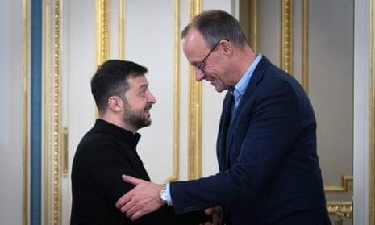

## Claim
Claim: "In a press conference on December 9, 2024 Ukrainian President Volodymyr Zelenskyy said: 'I will ask Biden to invite me to NATO ... there's no point in talking to Trump.'"

## Actions
```
web_search("Zelenskyy Biden NATO Trump December 9 2024 press conference")
```

## Evidence
### Evidence from `web_search`
On December 9, 2024, Volodymyr Zelenskyy discussed NATO membership with Joe Biden during a press conference, as reported by The Guardian ([https://www.theguardian.com/world/live/2024/dec/09/russia-ukraine-war-live-donald-trump-ceasefire-call-volodymyr-zelenskyy](https://www.theguardian.com/world/live/2024/dec/09/russia-ukraine-war-live-donald-trump-ceasefire-call-volodymyr-zelenskyy)) . Euractiv ([https://www.euractiv.com/section/politics/news/zelenskyy-seeks-diplomatic-end-to-russias-war-floats-role-for-foreign-troops/](https://www.euractiv.com/section/politics/news/zelenskyy-seeks-diplomatic-end-to-russias-war-floats-role-for-foreign-troops/)) and VOA News ([https://www.voanews.com/a/zelenskyy-says-he-is-open-to-negotiated-end-to-war-with-russia-/7893258.html](https://www.voanews.com/a/zelenskyy-says-he-is-open-to-negotiated-end-to-war-with-russia-/7893258.html)) also reported on the press conference, with Zelenskyy stating he would ask Biden to invite him to NATO and that there was no point in discussing matters with Trump while he is not in the White House .


## Elaboration
The evidence confirms that Volodymyr Zelenskyy made the statements attributed to him in the Claim during a press conference on December 9, 2024. The Guardian, Euractiv, and VOA News all reported on the press conference, with Zelenskyy discussing NATO membership with Biden and stating that there was no point in talking to Trump.


## Final Judgement
The claim is supported by multiple reliable sources. Zelenskyy did make the statements attributed to him during a press conference on December 9, 2024.

`true`


### Verdict: TRUE

### Justification
On December 9, 2024, during a press conference, Ukrainian President Volodymyr Zelenskyy stated he would ask Biden to invite him to NATO and that there was no point in talking to Trump, as reported by multiple news outlets, including The Guardian ([https://www.theguardian.com/world/live/2024/dec/09/russia-ukraine-war-live-donald-trump-ceasefire-call-volodymyr-zelenskyy](https://www.theguardian.com/world/live/2024/dec/09/russia-ukraine-war-live-donald-trump-ceasefire-call-volodymyr-zelenskyy)), Euractiv, and VOA News.
