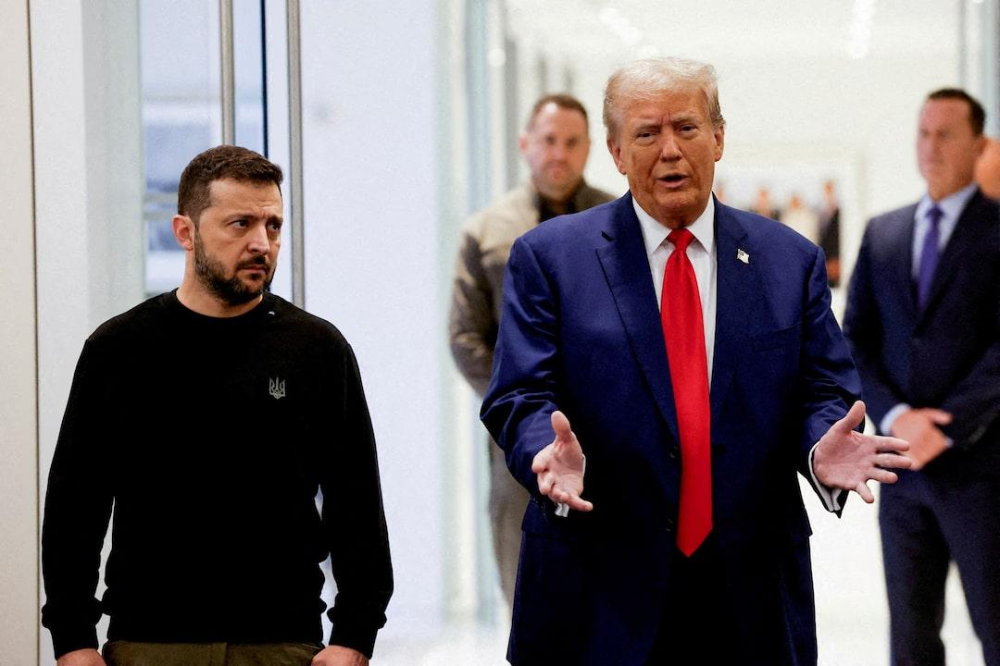

## Claim
Claim: "In February 2025 Ukrainian President Volodymyr Zelenskyy blocked access to US President Donald Trump's social media platform Truth Social across Ukraine."

## Actions
```
web_search("Volodymyr Zelenskyy Donald Trump Truth Social Ukraine February 2025")
```

## Evidence
### Evidence from `web_search`
PBS News published an article on March 3, 2025, stating that Donald Trump criticized Volodymyr Zelenskyy on Truth Social for suggesting the end of the Russia-Ukraine war is "very, very far away" (). The article is authored by Aamer Madhani of the Associated Press. NPR published an article on February 28, 2025, discussing a contentious meeting between Donald Trump and Volodymyr Zelenskyy in the Oval Office (, , ). Trump criticized Zelenskyy's gratitude for U.S. support and later posted on Truth Social that he had "determined that President Zelenskyy is not ready for peace."

Reuters published an article on February 19, 2025, reporting on the feud between Donald Trump and Volodymyr Zelenskyy (). Trump called Zelenskyy a "dictator" and said he should move quickly to secure peace. The article also mentions that Zelenskyy's term was supposed to end in 2024, but elections cannot be held under martial law.


## Elaboration
The evidence does not contain any information about Volodymyr Zelenskyy blocking access to Truth Social in Ukraine. The provided articles discuss Trump's criticism of Zelenskyy on Truth Social and a contentious meeting between them. Therefore, the claim cannot be verified with the available information.


## Final Judgement
The search results show that Donald Trump and Volodymyr Zelenskyy interacted on Truth Social in February 2025, with Trump criticizing Zelenskyy. However, there is no information about Zelenskyy blocking access to Truth Social in Ukraine.

The claim is not supported by the evidence. There is no information in the search results to verify the claim. Therefore, the most appropriate decision option is `false`.


### Verdict: FALSE

### Justification
The available evidence, including articles from PBS News, NPR, and Reuters, indicates that Donald Trump and Volodymyr Zelenskyy interacted on Truth Social in February 2025, with Trump criticizing Zelenskyy. However, none of the sources mention Zelenskyy blocking access to Truth Social in Ukraine. Therefore, the claim cannot be verified.
