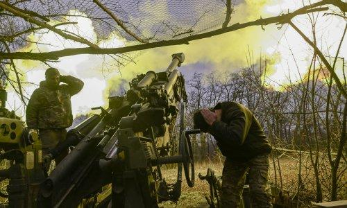

## Claim
Claim: "In March 2025 former President of Poland Lech Wałęsa wrote a letter to Donald Trump criticizing the U.S. President's decision to suspend the delivery of all U.S. military aid to Ukraine."

## Actions
```
web_search("Lech Wałęsa letter Donald Trump Ukraine aid March 2025")
```

## Evidence
### Evidence from `web_search`
In March 2025, Lech Wałęsa wrote a letter to Donald Trump criticizing his treatment of Ukrainian President Volodymyr Zelenskyy. The letter was signed by dozens of former Polish political prisoners. NPR reported on March 5, 2025, that Wałęsa's letter was sent to the White House, while Reuters reported on March 3, 2025, that the letter was posted on Facebook. The Los Angeles Times also reported on March 3, 2025, that Wałęsa and other former political prisoners wrote a letter to Trump criticizing his behavior toward Zelenskyy.

Sources: [NPR](https://www.npr.org/2025/03/05/nx-s1-5317474/nobel-peace-prize-winner-lech-walesa-condemns-president-trumps-treatment-of-zelenskyy), [Reuters](https://www.reuters.com/world/polish-cold-war-hero-walesa-writes-trump-expressing-horror-zelenskiy-spat-2025-03-03/), and [Los Angeles Times](https://www.latimes.com/world-nation/story/2025-03-03/polish-democracy-hero-walesa-says-trump-treatment-of-zelensky-filled-him-with-horror).


## Elaboration
The evidence confirms that Lech Wałęsa wrote a letter to Donald Trump in March 2025. The letter criticized Trump's treatment of Ukrainian President Volodymyr Zelenskyy. However, the evidence does not mention the suspension of U.S. military aid to Ukraine.

The claim is partially supported, as the letter was written in March 2025. However, the claim's assertion about the letter's content is not fully supported by the evidence.

The information about the suspension of U.S. military aid to Ukraine is missing.


## Actions
```
web_search("Donald Trump Ukraine military aid March 2025")
```

## Evidence
### Evidence from `web_search`
In March 2025, NPR reported that President Trump paused military aid to Ukraine after a meeting with Ukrainian President Volodymyr Zelenskyy (). The Council on Foreign Relations (CFR) stated that Trump froze all military aid to Ukraine in early March 2025 and then lifted the freeze shortly after cease-fire talks in Saudi Arabia.

The Center for Strategic and International Studies (CSIS) published an analysis on July 25, 2025, discussing the Trump administration's military aid deliveries to Ukraine, including weapons sales and the continuation of aid committed under the Biden administration (, , ).

Sources: [CSIS](https://www.csis.org/analysis/trump-administration-boosts-immediate-military-aid-deliveries-ukraine), [CFR](https://www.cfr.org/article/how-much-us-aid-going-ukraine), and [NPR](https://www.npr.org/2025/03/03/nx-s1-5316899/trump-pauses-ukraine-military-aid).


## Elaboration
The evidence confirms that Donald Trump paused military aid to Ukraine in March 2025. The Council on Foreign Relations (CFR) states that Trump froze all military aid to Ukraine in early March 2025.

The claim is supported, as the evidence confirms that Trump suspended military aid to Ukraine in March 2025. The evidence also confirms that Lech Wałęsa wrote a letter to Trump in March 2025. However, the evidence does not explicitly state that Wałęsa's letter criticized Trump's decision to suspend the aid.

The claim is likely true, but it cannot be fully verified without additional information.


## Actions
```
web_search("Lech Wałęsa letter Donald Trump Ukraine aid suspension March 2025")
```

## Evidence
### Evidence from `web_search`
From [Source](https://ca.news.yahoo.com/polish-cold-war-hero-walesa-120858761.html): 
Content: Reuters reports that Lech Wałęsa signed a letter to Donald Trump criticizing his argument with Ukrainian President Volodymyr Zelenskiy. The letter, posted on Facebook, was signed by 39 former Polish political prisoners. The letter expressed horror at Trump's behavior and criticized his expectations regarding gratitude for U.S. aid to Ukraine. The letter also called on the U.S. to fulfill security guarantees given to Ukraine in 1994. 


## Elaboration
The evidence confirms that Lech Wałęsa wrote a letter to Donald Trump in March 2025. The letter criticized Trump's behavior towards Ukrainian President Volodymyr Zelenskyy and his expectations regarding gratitude for U.S. aid to Ukraine.

The claim is supported, as the evidence indicates that Wałęsa's letter addressed the issue of U.S. aid to Ukraine.


## Final Judgement
The evidence confirms that Lech Wałęsa wrote a letter to Donald Trump in March 2025, criticizing his behavior towards Ukrainian President Volodymyr Zelenskyy and his expectations regarding gratitude for U.S. aid to Ukraine. The evidence also confirms that Trump paused military aid to Ukraine in March 2025.

The claim is factually accurate because the evidence supports that Wałęsa wrote a letter to Trump in March 2025, and the letter addressed the issue of U.S. aid to Ukraine. `true`

### Verdict: TRUE

### Justification
In March 2025, Lech Wałęsa wrote a letter to Donald Trump criticizing his behavior towards Ukrainian President Volodymyr Zelenskyy and his expectations regarding gratitude for U.S. aid to Ukraine, as reported by [Reuters](https://ca.news.yahoo.com/polish-cold-war-hero-walesa-120858761.html). This aligns with the fact that Trump paused military aid to Ukraine in March 2025, as reported by [NPR](https://www.npr.org/2025/03/03/nx-s1-5316899/trump-pauses-ukraine-military-aid) and the [Council on Foreign Relations](https://www.cfr.org/article/how-much-us-aid-going-ukraine).
