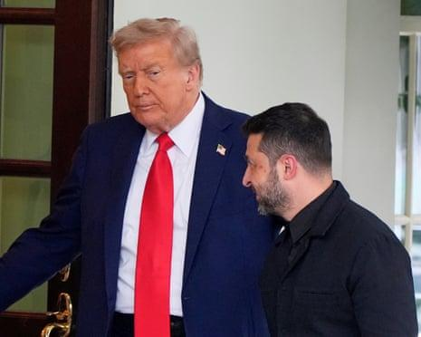

## Claim
Claim: "In early 2025, Ukraine and Russia had reached a peace deal in their years-long war."

## Actions
```
web_search("Ukraine Russia peace deal 2025")
```

## Evidence
### Evidence from `web_search`
The Guardian published an article on August 21, 2025, stating that Donald Trump is taking a step back from negotiations to end the war in Ukraine, mentioning a meeting between Trump and Zelenskyy on August 18, 2025, at the White House () ([https://www.theguardian.com/us-news/2025/aug/21/trump-ukraine-russia-peace-talks](https://www.theguardian.com/us-news/2025/aug/21/trump-ukraine-russia-peace-talks)). Wikipedia discusses peace negotiations in the Russian invasion of Ukraine, mentioning a timeline of the war, including events up to December 2024 and a timeline for 2025, and a meeting between Trump, Macron, and Zelenskyy in December 2024 ([https://en.wikipedia.org/wiki/Peace_negotiations_in_the_Russian_invasion_of_Ukraine](https://en.wikipedia.org/wiki/Peace_negotiations_in_the_Russian_invasion_of_Ukraine)).

CNN published an article on August 19, 2025, discussing the difference between a ceasefire and a peace deal in the context of the war between Ukraine and Russia (<image:0>, , , , ) ([https://www.cnn.com/2025/08/19/europe/ukraine-ceasefire-peace-deal-difference-analysis-latam-intl](https://www.cnn.com/2025/08/19/europe/ukraine-ceasefire-peace-deal-difference-analysis-latam-intl)). The article mentions that Donald Trump is pushing for a peace deal, while Ukraine wants a ceasefire.


## Elaboration
The evidence suggests that peace negotiations between Ukraine and Russia were ongoing in 2025. The Guardian reported on August 21, 2025, that Trump was stepping back from negotiations, and CNN discussed the difference between a ceasefire and a peace deal on August 19, 2025.

However, the evidence does not explicitly state that a peace deal was reached in early 2025. While there were discussions and negotiations, the articles suggest that a deal was not yet finalized, as Trump was involved in negotiations in August 2025.

Therefore, the claim cannot be verified based on the provided evidence. More information is needed to confirm whether a peace deal was reached in early 2025.


## Actions
```
web_search("Ukraine Russia peace deal early 2025 timeline")
```

## Evidence
### Evidence from `web_search`
The search results provide a timeline of events related to the Russia-Ukraine war in 2025. Wikipedia's timeline ([https://en.wikipedia.org/wiki/Timeline_of_the_Russian_invasion_of_Ukraine_(1_June_2025_%E2%80%93_present](https://en.wikipedia.org/wiki/Timeline_of_the_Russian_invasion_of_Ukraine_(1_June_2025_%E2%80%93_present)) ) details events from June 1, 2025, to August 2025, including peace negotiations in Istanbul in June and July. Al Jazeera ([https://www.aljazeera.com/news/2025/8/30/russia-ukraine-war-list-of-key-events-day-1283](https://www.aljazeera.com/news/2025/8/30/russia-ukraine-war-list-of-key-events-day-1283)) reported on August 30, 2025, that peace talks were ongoing. The Independent ([https://www.independent.co.uk/news/world/europe/turkey-peace-talks-russia-ukraine-invasion-timeline-b2750560.html](https://www.independent.co.uk/news/world/europe/turkey-peace-talks-russia-ukraine-invasion-timeline-b2750560.html)) mentions a meeting between Zelenskyy and Trump on February 28, 2025, and that both sides agreed to a plan on February 18, 2025, but soon accused each other of violations. It also mentions Putin announcing a 30-hour ceasefire on April 19, 2025, and a proposal to restart talks in Istanbul on May 15, 2025 ().


## Elaboration
The evidence indicates that peace negotiations were ongoing in early 2025, but it does not confirm that a peace deal was reached. The Independent mentions a meeting between Zelenskyy and Trump on February 28, 2025, and an agreement on February 18, 2025, but also reports violations. Furthermore, the timeline includes a 30-hour ceasefire in April and proposals for further talks in May and June, suggesting that a final deal was not yet in place.

Therefore, the claim is not supported by the evidence.


## Final Judgement
The evidence indicates that peace negotiations were ongoing in early 2025, but it does not confirm that a peace deal was reached. The Independent mentions a meeting between Zelenskyy and Trump on February 28, 2025, and an agreement on February 18, 2025, but also reports violations. Furthermore, the timeline includes a 30-hour ceasefire in April and proposals for further talks in May and June, suggesting that a final deal was not yet in place. Therefore, the claim is not supported by the evidence. `false`

### Verdict: FALSE

### Justification
The evidence, including reports from The Guardian, CNN, and The Independent, indicates that peace negotiations between Ukraine and Russia were ongoing in early 2025, with meetings and discussions taking place. However, the provided sources do not confirm that a peace deal was reached during that period. The Independent mentions an agreement in February 2025, but also reports violations, and the timeline includes ceasefires and proposals for further talks, suggesting that a final deal was not yet finalized. Therefore, the claim is not supported by the evidence.
