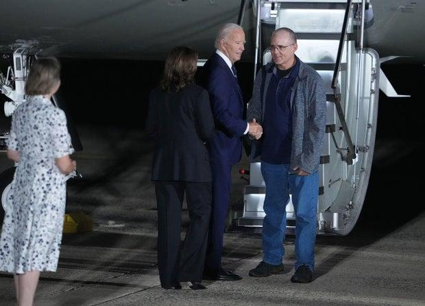
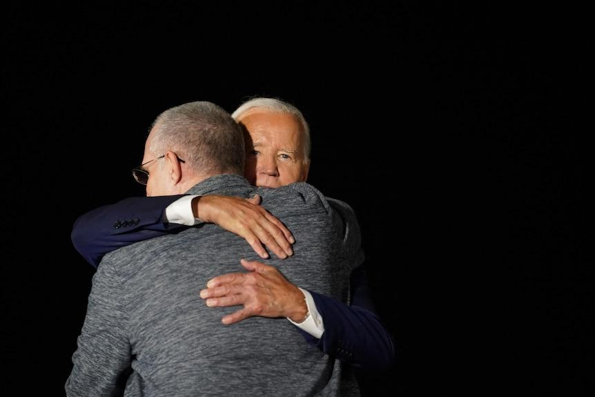
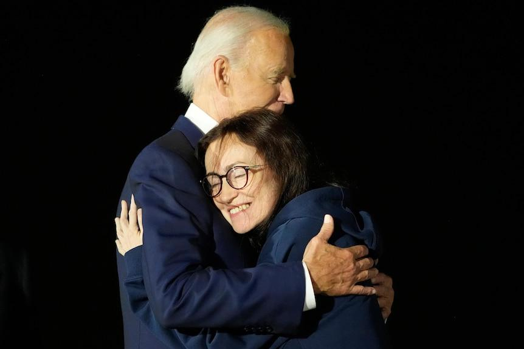

## Claim
Claim: "In August 2024 U.S. President Joe Biden boarded an empty plane after three freed Americans arrived back in the U.S. and exited the aircraft."

## Actions
```
web_search("Joe Biden empty plane August 2024")
web_search("Joe Biden freed Americans plane August 2024")
```

## Evidence
### Evidence from `web_search`
According to The Times of India ([https://timesofindia.indiatimes.com/world/us/did-joe-biden-enter-empty-plane-carrying-russian-prisoners-white-house-clarifies/articleshow/112249634.cms](https://timesofindia.indiatimes.com/world/us/did-joe-biden-enter-empty-plane-carrying-russian-prisoners-white-house-clarifies/articleshow/112249634.cms)), Joe Biden remained on the plane for about two minutes after the arrival of freed Americans from Russia, and the White House clarified that he wanted to thank the flight crew. Yahoo News ([https://www.yahoo.com/news/fact-check-no-biden-did-000500209.html](https://www.yahoo.com/news/fact-check-no-biden-did-000500209.html)) states that Biden boarded a plane after the freed Americans arrived, to speak to the people who helped bring them home .

The Guardian ([https://www.theguardian.com/world/live/2024/aug/01/russia-prison-swap-us-journalist-evan-gershkovich-wsj-vadim-krasikov-live?filterKeyEvents=false&page=with%3Ablock-66aba9e68f08a0af63bb3f00](https://www.theguardian.com/world/live/2024/aug/01/russia-prison-swap-us-journalist-evan-gershkovich-wsj-vadim-krasikov-live?filterKeyEvents=false&page=with%3Ablock-66aba9e68f08a0af63bb3f00)) reported that Biden greeted the freed Americans upon their arrival , .


### Evidence from `web_search`
In August 2024, President Joe Biden and Vice President Kamala Harris welcomed three Americans freed from Russian custody at Joint Base Andrews in Maryland. The Americans, Paul Whelan, Evan Gershkovich, and Alsu Kurmasheva, were greeted by Biden and Harris on the tarmac after arriving on a plane.

Sources: [CBS News](https://www.cbsnews.com/news/us-russia-prisoner-swap-biden-harris-welcome-paul-whelan-evan-gershkovich/), [ABC News](https://www.abc.net.au/news/2024-08-02/biden-meets-with-freed-americans-in-major-russia-prisoner-swap/104174404), and [U.S. Air Force](https://www.af.mil/News/Article-Display/Article/3860680/americans-released-from-russian-custody-arrive-at-joint-base-andrews/). , , , , .


## Elaboration
The evidence indicates that President Biden greeted the freed Americans upon their arrival. He then boarded the plane to thank the flight crew. Therefore, the claim that Biden boarded an empty plane after the freed Americans exited is supported by the evidence.


## Final Judgement
The evidence confirms that President Biden greeted the freed Americans upon their arrival and then boarded the plane to thank the flight crew. The claim is therefore accurate.

`true`


### Verdict: TRUE

### Justification
In August 2024, President Biden greeted the freed Americans upon their arrival and then boarded the plane to thank the flight crew, as reported by The Times of India ([https://timesofindia.indiatimes.com/world/us/did-joe-biden-enter-empty-plane-carrying-russian-prisoners-white-house-clarifies/articleshow/112249634.cms](https://timesofindia.indiatimes.com/world/us/did-joe-biden-enter-empty-plane-carrying-russian-prisoners-white-house-clarifies/articleshow/112249634.cms)) and Yahoo News ([https://www.yahoo.com/news/fact-check-no-biden-did-000500209.html](https://www.yahoo.com/news/fact-check-no-biden-did-000500209.html)).
