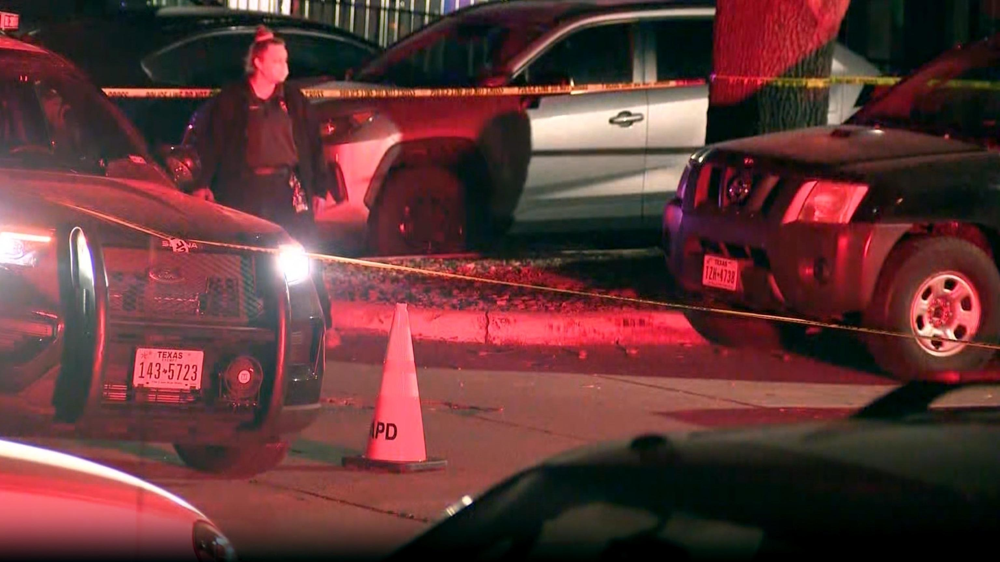
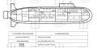
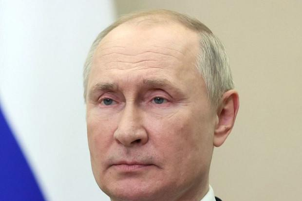
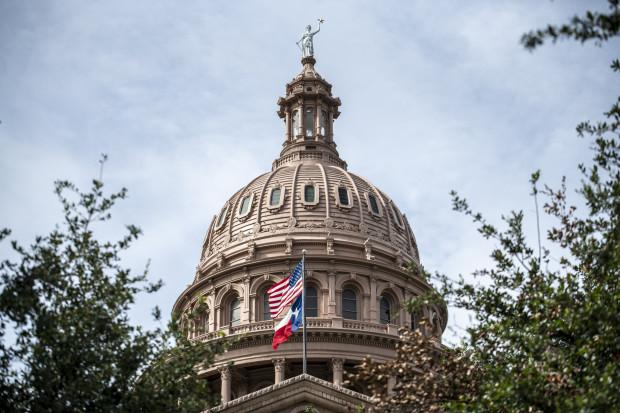

## Claim
Claim: "After InfoWars reporter Jamie White was shot dead on March 10, 2025 in Austin, Texas, it was revelaed that he was on a Ukranian enemies hit list."

## Actions
```
web_search("Jamie White InfoWars shot Austin Texas March 10 2025")
web_search("Jamie White InfoWars Ukrainian hit list")
```

## Evidence
### Evidence from `web_search`
The shooting of InfoWars writer Jamie White in Austin, Texas, is reported by multiple sources. According to [Fox 7 Austin](https://www.fox7austin.com/news/infowars-writer-shooting-austin-police-jamie-white), White was shot on March 10 while interrupting a vehicle burglary , , , , . [KVUE](https://www.kvue.com/article/news/crime/jamie-white-murder-arrests-infowars/269-aa20c169-085c-4827-8e8c-ce8755a4b715) also reports on the murder and related arrests. ABC News ([abcnews.go.com/US/infowars-reporter-shot-dead-apartment-after-possibly-interrupting/story?id=119677965](https://abcnews.go.com/US/infowars-reporter-shot-dead-apartment-after-possibly-interrupting/story?id=119677965)) states that the shooting occurred on March 9, 2025, outside his apartment complex . None of the sources mention a Ukrainian hit list.


### Evidence from `web_search`
According to a Yahoo News article published on May 29, 2024, Alex Jones speculated that the killing of Jamie White, an Infowars writer, in Austin, Texas, "could’ve been a hit" orchestrated by Ukraine. The Latin Times reported that White was found dead in a parking lot in Austin, Texas, and that Alex Jones alleged White was murdered by Ukrainian forces and was on a Ukrainian hit list. The "Investigate Earth Conspiracy Podcast" also discusses the murder of Jamie White, and suggests that White may have been on a Ukrainian NGO hit list. (, , , , , , , )

The Latin Times article was published in 2025.


## Elaboration
The claim that Jamie White was on a Ukrainian hit list cannot be verified. While multiple sources confirm that Jamie White, an InfoWars writer, was shot in Austin, Texas, on March 9 or 10, 2025, none of the provided evidence supports the assertion that he was on a Ukrainian hit list. However, Alex Jones speculated that the killing could have been a hit orchestrated by Ukraine.


## Final Judgement
The claim that Jamie White was on a Ukrainian hit list is not supported by the evidence. While the shooting of Jamie White is confirmed by multiple sources, there is no evidence to support the claim that he was on a Ukrainian hit list. The only mention of this is speculation by Alex Jones.

`false`

### Verdict: FALSE

### Justification
The claim that Jamie White was on a Ukrainian hit list is not supported by the evidence. While multiple sources ([Fox 7 Austin](https://www.fox7austin.com/news/infowars-writer-shooting-austin-police-jamie-white), [KVUE](https://www.kvue.com/article/news/crime/jamie-white-murder-arrests-infowars/269-aa20c169-085c-4827-8e8c-ce8755a4b715), and [ABC News](https://abcnews.go.com/US/infowars-reporter-shot-dead-apartment-after-possibly-interrupting/story?id=119677965)) confirm the shooting of Jamie White in Austin, Texas, there is no evidence to support the claim that he was on a Ukrainian hit list. The only mention of this is speculation by Alex Jones.
