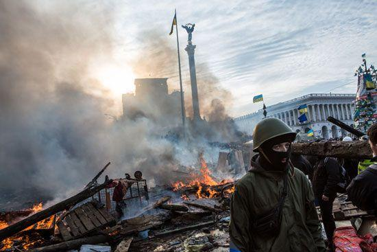
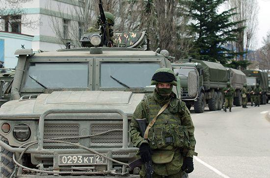
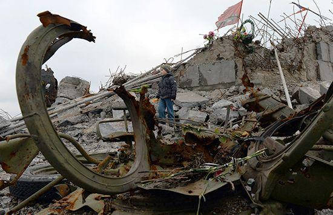

## Claim
Claim: "Ukrainian President Volodymyr Zelenskyy started the 2022 war in Ukraine with Russia."

## Actions
```
web_search("Volodymyr Zelenskyy Russia war 2022")
web_search("causes of Russia Ukraine war 2022")
```

## Evidence
### Evidence from `web_search`
The search results include information about Volodymyr Zelenskyy's role as the President of Ukraine during the Russo-Ukrainian War, as detailed on Wikipedia ([https://en.wikipedia.org/wiki/Volodymyr_Zelenskyy](https://en.wikipedia.org/wiki/Volodymyr_Zelenskyy)). Sky News reports on the ongoing war in Ukraine, mentioning the war began in 2022 ([https://news.sky.com/story/ukraine-war-latest-russia-rape-putin-zelenskyy-12541713](https://news.sky.com/story/ukraine-war-latest-russia-rape-putin-zelenskyy-12541713)).

An Al Jazeera article from February 20, 2025, discusses Donald Trump's claim that Zelenskyy "started" the war in Ukraine, noting that Russia launched an invasion of Ukraine on February 24, 2022, which contradicts Trump's claim (<image:0>) ([https://www.aljazeera.com/news/2025/2/20/fact-check-did-ukraine-start-its-war-with-russia-as-trump-claims](https://www.aljazeera.com/news/2025/2/20/fact-check-did-ukraine-start-its-war-with-russia-as-trump-claims)).


### Evidence from `web_search`
The CIRSD article discusses the causes of the Ukraine war, mentioning that Putin invaded Ukraine on February 24th, 2022, and that the American-led effort to make Ukraine a Western bulwark on Russia’s borders is the root of the crisis. The article also mentions President Biden's commitment to bringing Ukraine into NATO ([https://www.cirsd.org/en/horizons/horizons-summer-2022-issue-no.21/the-causes-and-consequences-of-the-ukraine-war](https://www.cirsd.org/en/horizons/horizons-summer-2022-issue-no.21/the-causes-and-consequences-of-the-ukraine-war)).

The Russian invasion of Ukraine began on February 24, 2022, with Russia massing troops near Ukraine's borders in late 2021. The conflict between the two countries began in 2014 with Russia's annexation of Crimea and the war in Donbas. The Normandy Format meeting in December 2019 was the first and only meeting between Zelenskyy and Putin ([https://en.wikipedia.org/wiki/Russian_invasion_of_Ukraine](https://en.wikipedia.org/wiki/Russian_invasion_of_Ukraine)). The Britannica article states that the war began in February 2014 with the Russian invasion of Crimea, and the full-scale invasion by Russia began on February 24, 2022. In the early hours of February 24, 2022, Zelensky addressed the Russian people, pleading for peace but vowing to defend Ukraine (, , , ) ([https://www.britannica.com/event/2022-Russian-invasion-of-Ukraine](https://www.britannica.com/event/2022-Russian-invasion-of-Ukraine)).


## Elaboration
The evidence indicates that the 2022 war in Ukraine was initiated by Russia's invasion on February 24, 2022. Zelenskyy, as the President of Ukraine, addressed the Russian people, pleading for peace and vowing to defend Ukraine.

The claim that Zelenskyy started the war contradicts the timeline of events, as Russia launched the invasion. The conflict between the two countries began in 2014 with Russia's annexation of Crimea and the war in Donbas.

Therefore, based on the provided evidence, the claim is false.


## Final Judgement
The evidence clearly shows that Russia initiated the 2022 invasion of Ukraine, not Volodymyr Zelenskyy. Multiple sources confirm that the invasion began on February 24, 2022, with Russia as the aggressor. Zelenskyy, as the Ukrainian president, responded to the invasion.

`false`

### Verdict: FALSE

### Justification
The claim is false. The 2022 war in Ukraine was initiated by Russia's invasion on February 24, 2022, as reported by Sky News ([https://news.sky.com/story/ukraine-war-latest-russia-rape-putin-zelenskyy-12541713](https://news.sky.com/story/ukraine-war-latest-russia-rape-putin-zelenskyy-12541713)) and Britannica ([https://www.britannica.com/event/2022-Russian-invasion-of-Ukraine](https://www.britannica.com/event/2022-Russian-invasion-of-Ukraine)). Zelenskyy, as the Ukrainian president, responded to the invasion.
