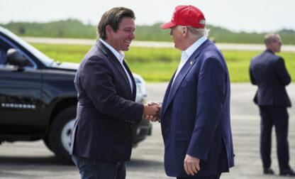

## Claim
Claim: "Ukrainian President Volodymyr Zelenskyy's statement in an AP news interview from February 1, 2025 that his country's military has received only a portion of the more than 175 billion in U.S. aid confirms that the US aid is a money laundering operation."

## Actions
```
web_search("Volodymyr Zelenskyy AP interview February 1 2025 US aid")
web_search("US aid to Ukraine money laundering")
```

## Evidence
### Evidence from `web_search`
The Associated Press ([https://apnews.com/article/russia-ukraine-war-trump-talks-ceasefire-00af5f61f1faf41e78a3b4e072c21a14](https://apnews.com/article/russia-ukraine-war-trump-talks-ceasefire-00af5f61f1faf41e78a3b4e072c21a14)) and U.S. News & World Report ([https://www.usnews.com/news/world/articles/2025-02-01/takeaways-from-the-ap-interview-with-ukraines-zelenskyy](https://www.usnews.com/news/world/articles/2025-02-01/takeaways-from-the-ap-interview-with-ukraines-zelenskyy)) reported on an AP interview with Ukrainian President Volodymyr Zelenskyy on February 1, 2025, discussing the war in Ukraine, potential talks between the U.S. and Russia, and U.S. aid. Zelenskyy stated that excluding Ukraine from U.S.-Russia talks would be "very dangerous." He also mentioned that his team has been in contact with the Trump administration, but in-person meetings are expected soon.

The AP also published an interview with Zelenskyy on February 1, 2025 ([https://www.ap.org/news-highlights/best-of-the-week/second-winner/2025/ap-interview-zelenskyy-says-excluding-ukraine-from-u-s-russia-talks-about-war-is-very-dangerous/](https://www.ap.org/news-highlights/best-of-the-week/second-winner/2025/ap-interview-zelenskyy-says-excluding-ukraine-from-u-s-russia-talks-about-war-is-very-dangerous/)) , , , . The article does not mention the amount of U.S. aid received by Ukraine.


### Evidence from `web_search`
The Department of Defense Office of Inspector General (DoD OIG) released an audit of the DoD’s execution of funds to assist Ukraine, which revealed that the DoD did not provide sufficient documentation to support the justification or accuracy of half of the total funds, $1.1 billion. The report is from 2025. [Source](https://www.dodig.mil/In-the-Spotlight/Article/3940692/press-release-audit-of-the-dods-execution-of-funds-to-assist-ukraine-report-no/)

The Institute for the Study of War (ISW) published a fact sheet dated February 8, 2024, addressing claims about US aid to Ukraine.  The fact sheet states that US aid to Ukraine has extensive oversight and is not being misused due to corruption. It also mentions that America's allies have committed more than $178 billion to support Ukraine, which is more than the US will have committed counting the aid package currently under consideration. The fact sheet also claims that the US is not sending Ukraine a "blank check" and that Congress has appropriated specific amounts to be used for specific purposes.  [Source](https://www.understandingwar.org/backgrounder/fact-sheet-us-assistance-ukraine)


## Elaboration
The evidence from the AP interview with Zelenskyy does not mention the amount of U.S. aid received by Ukraine. Therefore, the claim that Zelenskyy stated his country's military has received only a portion of the more than $175 billion in U.S. aid cannot be verified.

However, the DoD OIG audit revealed that the DoD did not provide sufficient documentation to support the justification or accuracy of half of the total funds, $1.1 billion. The ISW fact sheet states that America's allies have committed more than $178 billion to support Ukraine.


## Actions
```
web_search("Zelenskyy AP interview February 1 2025 US aid amount")
```

## Evidence
### Evidence from `web_search`
Izvestia ([https://iz.ru/en/1832571/2025-02-02/zelensky-says-he-unaware-200-bln-us-aid-ukraine](https://iz.ru/en/1832571/2025-02-02/zelensky-says-he-unaware-200-bln-us-aid-ukraine)) reports that Zelenskyy said he was unaware of where the $200 billion in US aid had gone and that Kiev had received more than $75 billion from Washington in an interview with the Associated Press on February 2, 2025. Al Jazeera ([https://www.aljazeera.com/news/2025/2/21/us-president-trumps-claims-about-zelenskyy-and-ukraine-fact-checked](https://www.aljazeera.com/news/2025/2/21/us-president-trumps-claims-about-zelenskyy-and-ukraine-fact-checked)) states that in a February 2, 2025, interview with The Associated Press, Zelenskyy said Ukraine’s military has received only a portion of the billions in US aid earmarked for Ukraine’s defense against Russia, citing a total of $177bn or $200bn spent by the US and that Ukraine had not received about $100bn of that total. Pravda.com.ua ([https://www.pravda.com.ua/eng/news/2025/02/2/7496431/](https://www.pravda.com.ua/eng/news/2025/02/2/7496431/)) reports that Zelenskyy stated that Ukraine has received about US$76 billion of the approximately US$177 billion in aid approved by the US. , <image:0>, 


## Elaboration
Zelenskyy stated in an AP interview on February 2, 2025, that Ukraine's military has received only a portion of the billions in US aid earmarked for Ukraine's defense against Russia. He mentioned a total of $177 billion or $200 billion spent by the US, and that Ukraine had not received about $100 billion of that total. He also stated that Ukraine has received about US$76 billion of the approximately US$177 billion in aid approved by the US. The claim is therefore partially supported by the evidence. However, the evidence does not confirm that the US aid is a money laundering operation.


## Final Judgement
The claim is partially supported by the evidence, as Zelenskyy did state in an AP interview that Ukraine had received only a portion of the US aid. However, the claim that this confirms the aid is a money laundering operation is not supported by the evidence.

`false`

### Verdict: FALSE

### Justification
Zelenskyy stated in a February 2, 2025, AP interview that Ukraine had received only a portion of the US aid, citing figures of $177 billion or $200 billion spent by the US, with Ukraine receiving approximately $76 billion ([Izvestia](https://iz.ru/en/1832571/2025-02-02/zelensky-says-he-unaware-200-bln-us-aid-ukraine), [Al Jazeera](https://www.aljazeera.com/news/2025/2/21/us-president-trumps-claims-about-zelenskyy-and-ukraine-fact-checked), [Pravda.com.ua](https://www.pravda.com.ua/eng/news/2025/02/2/7496431/)). While this supports the portion of the claim regarding the receipt of partial aid, the evidence does not support the assertion that this confirms the aid is a money laundering operation.
