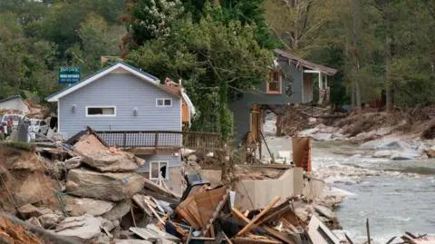

## Claim
Claim: "In remarks to reporters on September 29, 2024 US President Joe Biden announced that no more aid would be provided for the areas affected by Hurrican Helene, but 2.4 billion US-$ more for Ukraine."

## Actions
```
web_search("Joe Biden Hurricane Helene aid Ukraine September 29 2024")
```

## Evidence
### Evidence from `web_search`
The BBC published an article on October 9, 2024, discussing President Joe Biden's response to disinformation regarding the government's hurricane response, including images of damage from Hurricane Helene , , and a helicopter  ([https://www.bbc.com/news/articles/czd1q9q9gl9o](https://www.bbc.com/news/articles/czd1q9q9gl9o)). Le Monde reported on September 30, 2024, on Biden's remarks regarding Hurricane Helene, including his plans to visit North Carolina  ([https://www.lemonde.fr/en/united-states/article/2024/09/30/biden-pledges-to-aid-victims-of-hurrican-helene-as-long-as-it-takes_6727795_133.html](https://www.lemonde.fr/en/united-states/article/2024/09/30/biden-pledges-to-aid-victims-of-hurrican-helene-as-long-as-it-takes_6727795_133.html)).

NBC Washington published an article on October 11, 2024, updated on October 15, 2024, debunking false information surrounding Hurricane Helene, including claims that the government withheld aid ,  ([https://www.nbcwashington.com/news/national-international/fact-focus-a-look-at-the-false-information-around-hurricanes-helene-and-milton/3739451/](https://www.nbcwashington.com/news/national-international/fact-focus-a-look-at-the-false-information-around-hurricanes-helene-and-milton/3739451/)).


## Elaboration
The evidence suggests the claim is likely false. Le Monde reported on September 30, 2024, that Biden pledged to aid victims of Hurricane Helene. NBC Washington debunked false information, including claims of withheld aid. The BBC article also discusses disinformation regarding the government's hurricane response. The evidence does not mention any announcement by Biden to stop aid for the affected areas.

The evidence does not mention any aid for Ukraine.

Therefore, the claim is not supported by the evidence.


## Final Judgement
The claim is demonstrably false. Multiple sources indicate that Biden pledged aid to Hurricane Helene victims, and there is no evidence to support the claim that he announced no further aid would be provided. The evidence also does not mention any aid for Ukraine.

`false`

### Verdict: FALSE

### Justification
The claim is demonstrably false. According to a Le Monde article, Biden pledged aid to Hurricane Helene victims, contradicting the claim that he announced no further aid would be provided. Additionally, an NBC Washington article debunked false information surrounding the hurricane response, including claims of withheld aid. The search results do not mention any aid for Ukraine.
