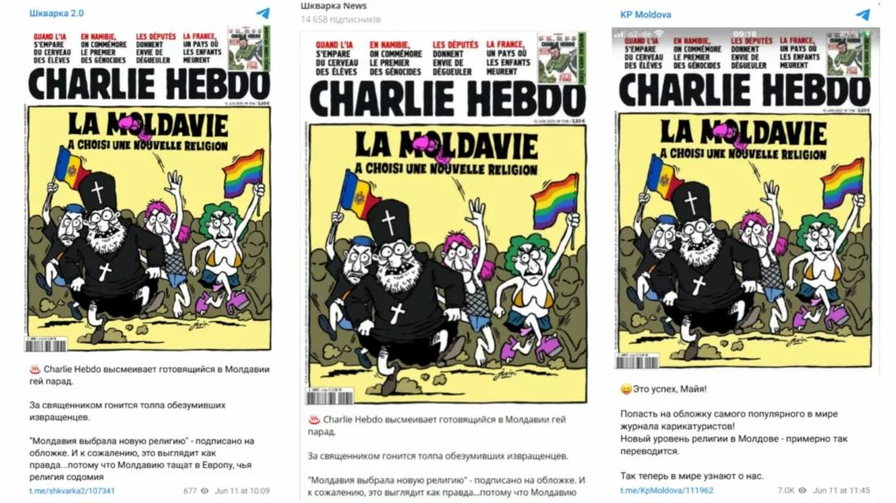
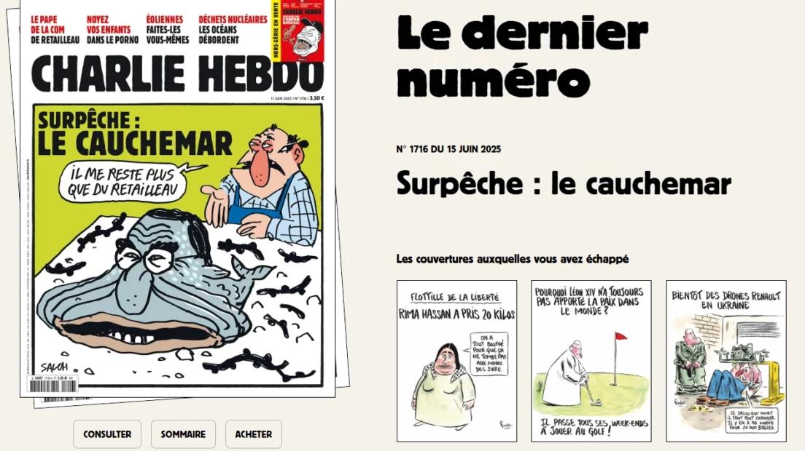
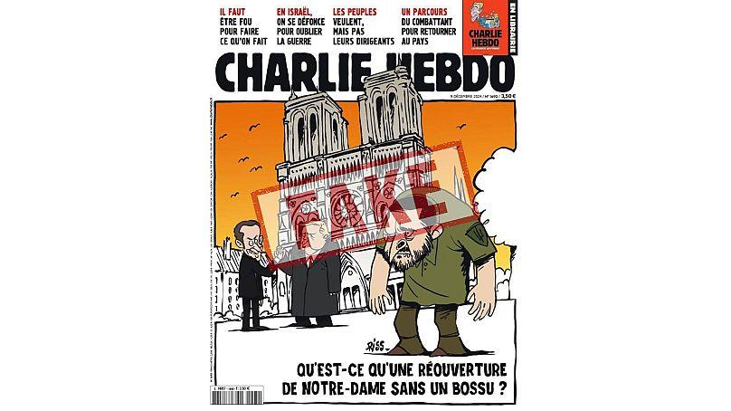

## Claim
Claim: " This image shows a screenshot of an authentic Charlie Hebdo magazine cover from March 20, 2025 illustrating Ukrainian President Volodoymr Zelenskyy lying in a coffin and saying 'Ukraine is an independet state' in French."

## Actions
```
web_search("Charlie Hebdo March 20 2025 cover")
image_search("Charlie Hebdo Zelensky coffin")
```

## Evidence
### Evidence from `web_search`
The Charlie Hebdo cover featuring Volodymyr Zelenskyy in a coffin is fake, according to [without-lie.info](https://without-lie.info/en/fake-with-another-fictional-cover-of-charlie-hebdo-magazine-with-a-caricature-of-the-president-of-ukraine/) and [Myth Detector](https://mythdetector.com/en/coffin-was-not-published-by-charlie-hebdo/). Myth Detector states that the image is fabricated and was not published by Charlie Hebdo. The issue number on the fabricated cover matches the actual issue published on March 26.

Gwara Media ([gwaramedia.com/en/debunking-russian-fakes-no-charlie-hebdos-cover-didnt-ridicule-gay-parade-in-moldova/](https://gwaramedia.com/en/debunking-russian-fakes-no-charlie-hebdos-cover-didnt-ridicule-gay-parade-in-moldova/)) debunks another fake Charlie Hebdo cover.    


### Evidence from `image_search`
From [Source](https://www.euronews.com/my-europe/2025/01/03/no-charlie-hebdo-didnt-publish-an-issue-with-zelenskyy-as-a-caricature-of-quasimodo): 
Content: Euronews published an article on January 3, 2025, stating that Charlie Hebdo did not publish an issue with Zelenskyy as a caricature. 


## Elaboration
The claim is false. Multiple sources, including Myth Detector ([https://mythdetector.com/en/coffin-was-not-published-by-charlie-hebdo/](https://mythdetector.com/en/coffin-was-not-published-by-charlie-hebdo/)) and Euronews ([https://www.euronews.com/my-europe/2025/01/03/no-charlie-hebdo-didnt-publish-an-issue-with-zelenskyy-as-a-caricature-of-quasimodo](https://www.euronews.com/my-europe/2025/01/03/no-charlie-hebdo-didnt-publish-an-issue-with-zelenskyy-as-a-caricature-of-quasimodo)), confirm that the Charlie Hebdo cover featuring Zelenskyy in a coffin is fabricated.


## Final Judgement
The claim is demonstrably false. Multiple sources confirm that the image of the Charlie Hebdo cover featuring Zelenskyy in a coffin is fabricated and was not published by the magazine. `false`

### Verdict: FALSE

### Justification
The claim is false. Multiple sources, including Myth Detector and Euronews, confirm that the Charlie Hebdo cover depicting Volodymyr Zelenskyy in a coffin is fabricated and was not published by the magazine.
