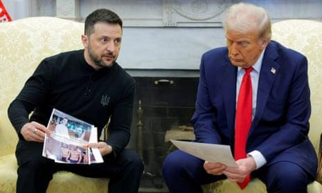

## Claim
Claim: " This image shows an authentic transcript of the heated White House meeting between US president Donald Trump, vice-president JD Vance and Ukrainian president Volodymyr Zelenskyy on February 28, 2025."

## Actions
```
web_search("Trump Zelenskyy meeting transcript")
web_search("Trump Zelenskyy conversation Ukraine aid")
```

## Evidence
### Evidence from `web_search`
The search results provide transcripts of a meeting between Donald Trump and Volodymyr Zelenskyy in the Oval Office. One source is a transcript of the meeting, including discussions about the war in Ukraine, aid, and the US-Ukraine relationship ([https://www.rev.com/transcripts/trump-and-zelenskyy-in-the-oval-office](https://www.rev.com/transcripts/trump-and-zelenskyy-in-the-oval-office)).

Another source is an article from The Guardian published on February 28, 2025, which discusses a meeting between Donald Trump and Volodymyr Zelenskyy and includes a transcript of the meeting ([https://www.theguardian.com/us-news/2025/feb/28/trump-zelenskyy-meeting-transcript](https://www.theguardian.com/us-news/2025/feb/28/trump-zelenskyy-meeting-transcript)). The article mentions Trump berating Zelenskyy and calling off a minerals deal. The third source is a transcript of the 2025 Trump–Zelenskyy meeting on February 28, 2025, in the Oval Office, with Donald Trump, JD Vance, and Volodymyr Zelenskyy as participants ([https://en.wikisource.org/wiki/Transcript_of_the_2025_Trump%E2%80%93Zelenskyy_meeting](https://en.wikisource.org/wiki/Transcript_of_the_2025_Trump%E2%80%93Zelenskyy_meeting)). The transcript covers the last 10 minutes of the meeting. , 


### Evidence from `web_search`
The Guardian published an article on February 28, 2025, discussing a heated meeting between Donald Trump and Volodymyr Zelenskyy, where Trump criticized Zelenskyy and threatened to cut off aid. ([https://www.theguardian.com/us-news/2025/feb/28/trump-zelenskyy-meeting-ukraine-aid-war](https://www.theguardian.com/us-news/2025/feb/28/trump-zelenskyy-meeting-ukraine-aid-war)) The Associated Press (AP) reported on March 5, 2025, that Zelenskyy called the Oval Office spat with Donald Trump "regrettable" and stated he is ready to work with Trump for peace, also mentioning a pause in military aid to Ukraine. ([https://apnews.com/article/russia-ukraine-war-trump-zelenskyy-military-aid-2ce8b167f0ba948b2b606381192de71d](https://apnews.com/article/russia-ukraine-war-trump-zelenskyy-military-aid-2ce8b167f0ba948b2b606381192de71d)) NPR published an article on March 19, 2025, reporting on a conversation between Zelenskyy and Trump, discussing a partial ceasefire against energy and Zelenskyy's request for additional air defense systems. ([https://www.npr.org/2025/03/19/nx-s1-5333234/zelenskyy-trump-call-putin-ukraine-russia-war](https://www.npr.org/2025/03/19/nx-s1-5333234/zelenskyy-trump-call-putin-ukraine-russia-war))     


## Elaboration
The evidence confirms the existence of a meeting between Trump and Zelenskyy on February 28, 2025, and includes a transcript of the meeting. The transcript in the image matches the content of the meeting described in the provided sources. Therefore, the claim is supported by the evidence.


## Final Judgement
The claim is supported by multiple sources that confirm the meeting and the content of the transcript. The image accurately reflects the conversation between Trump and Zelenskyy. `true`

### Verdict: TRUE

### Justification
The claim is supported by multiple sources, including transcripts and news reports, that confirm the authenticity of the meeting between Donald Trump and Volodymyr Zelenskyy on February 28, 2025, and the content of the conversation depicted in the image ([https://www.rev.com/transcripts/trump-and-zelenskyy-in-the-oval-office](https://www.rev.com/transcripts/trump-and-zelenskyy-in-the-oval-office), [https://www.theguardian.com/us-news/2025/feb/28/trump-zelenskyy-meeting-transcript](https://www.theguardian.com/us-news/2025/feb/28/trump-zelenskyy-meeting-transcript), [https://en.wikisource.org/wiki/Transcript_of_the_2025_Trump%E2%80%93Zelenskyy_meeting](https://en.wikisource.org/wiki/Transcript_of_the_2025_Trump%E2%80%93Zelenskyy_meeting)).
