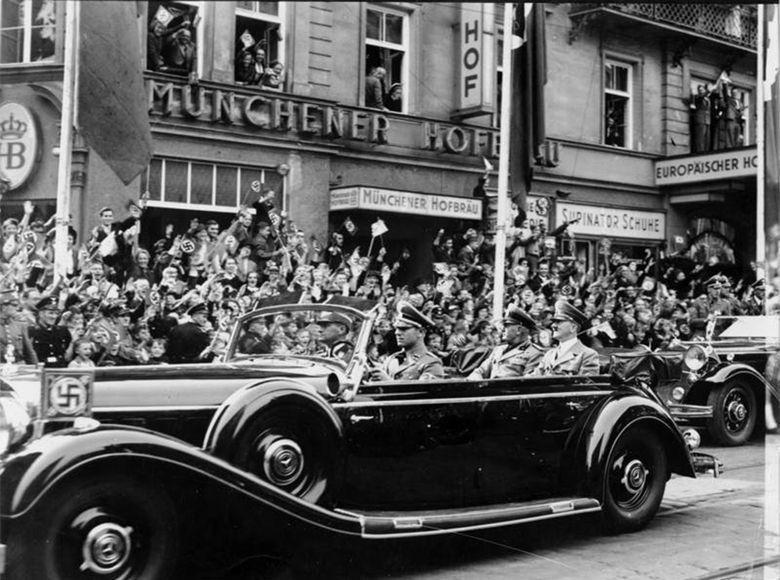
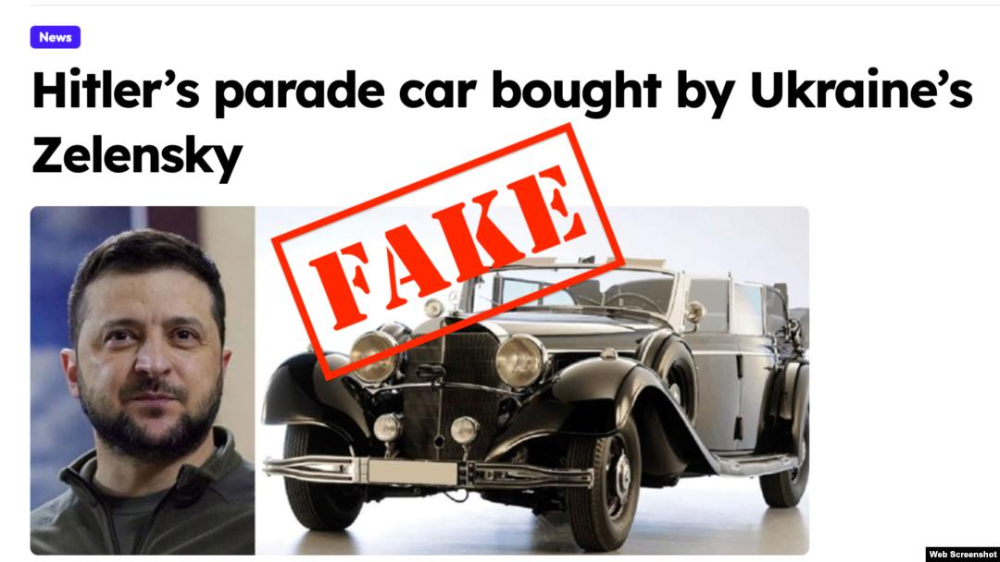
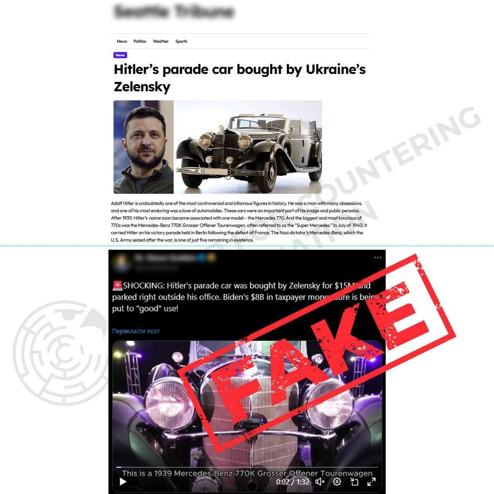
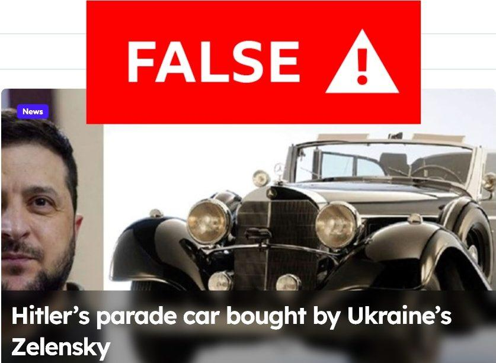

## Claim
Claim: " This image shows Hitler's parade car which was bought by the Ukrainian president Volodymyr Zelenskyy for 15 Million US-$."

## Actions
```
image_search("Mercedes-Benz parade car Hitler")
image_search("Mercedes-Benz parade car Zelenskyy")
```

## Evidence
### Evidence from `image_search`
Newsweek published an article about Adolf Hitler's car (). The Seattle Times also published an article about Hitler's parade car ().

CNBC published an article about Hitler's wartime Mercedes car, but the content is not available.


### Evidence from `image_search`
The claim that Volodymyr Zelenskyy bought Hitler's parade car is false, according to multiple sources. The car in the image is a 1939 Mercedes-Benz 770K Grosser Offener Tourenwagen.

The sources include: [https://www.voanews.com/a/russian-propagandists-push-fake-story-that-zelenskyy-bought-hitler-s-car/7818175.html](https://www.voanews.com/a/russian-propagandists-push-fake-story-that-zelenskyy-bought-hitler-s-car/7818175.html), [https://united24media.com/latest-news/fake-news-that-zelenskyy-bought-hitlers-ceremonial-car-for-15-million-debunked-2895](https://united24media.com/latest-news/fake-news-that-zelenskyy-bought-hitlers-ceremonial-car-for-15-million-debunked-2895), and [https://vreme.com/en/svet/zelenski-ipak-nije-kupio-hitlerov-automobil/](https://vreme.com/en/svet/zelenski-ipak-nije-kupio-hitlerov-automobil/).   


## Elaboration
The claim is false. Multiple sources debunk the claim that Volodymyr Zelenskyy bought Hitler's parade car. The car in the image is a 1939 Mercedes-Benz 770K Grosser Offener Tourenwagen.


## Final Judgement
The claim that Volodymyr Zelenskyy bought Hitler's parade car for $15 million is false. Multiple sources confirm this, stating that the claim is fake news.

`false`

### Verdict: FALSE

### Justification
The claim that Volodymyr Zelenskyy bought Hitler's parade car is false. Multiple sources, including [voanews.com](https://www.voanews.com/a/russian-propagandists-push-fake-story-that-zelenskyy-bought-hitler-s-car/7818175.html), [united24media.com](https://united24media.com/latest-news/fake-news-that-zelenskyy-bought-hitlers-ceremonial-car-for-15-million-debunked-2895), and [vreme.com](https://vreme.com/en/svet/zelenski-ipak-nije-kupio-hitlerov-automobil/), debunk this claim, identifying it as fake news.
