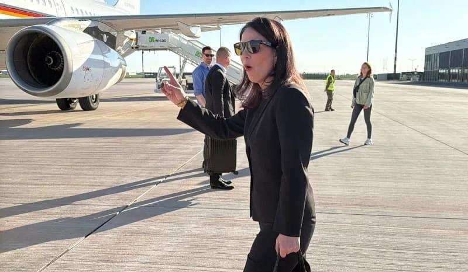
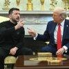

## Claim
Claim: "In February 2025 German Foreign Minister Annalena Baerbock threatened the US with severing ties amid US President Donald Trump's comments on Ukrainian President Volodymyr Zelenskyy and Ukraine."

## Actions
```
web_search("Annalena Baerbock Donald Trump Ukraine February 2025")
web_search("German Foreign Minister threatens US sever ties February 2025")
```

## Evidence
### Evidence from `web_search`
In February 2025, Reuters published an article where German Foreign Minister Annalena Baerbock stated that there must be no peace in Ukraine over the heads of Ukrainians and Europeans (<image:k>). The Guardian reported on February 12, 2025, that Baerbock said Ukraine’s interests must be protected in the upcoming negotiations between Moscow and Washington (). A Wikipedia article discusses the 2025 Trump–Zelenskyy Oval Office meeting on February 28, 2025, and mentions that Baerbock said Trump's conduct represented a "new era of ruthlessness" (<image:i>).

*   [https://www.reuters.com/world/europe/no-peace-over-heads-ukrainians-europeans-says-german-foreign-minister-2025-02-14/](https://www.reuters.com/world/europe/no-peace-over-heads-ukrainians-europeans-says-german-foreign-minister-2025-02-14/)
*   [https://www.theguardian.com/us-news/2025/feb/12/trump-putin-ukraine-ceasefire](https://www.theguardian.com/us-news/2025/feb/12/trump-putin-ukraine-ceasefire)
*   [https://en.wikipedia.org/wiki/2025_Trump%E2%80%93Zelenskyy_Oval_Office_meeting](https://en.wikipedia.org/wiki/2025_Trump%E2%80%93Zelenskyy_Oval_Office_meeting)


### Evidence from `web_search`
A fact-check from aol.com, published on March 4, 2025, states that the claim about German Foreign Minister Annalena Baerbock threatening to cut ties with the US is misleading, stating that she did not threaten to cut diplomatic ties with the U.S. , . An article from Izvestia, dated February 21, 2025, reports that Baerbock called for increased pressure on the U.S. regarding its stance on Ukraine and mentioned severing ties. 

Press TV, on February 22, 2025, reports that Baerbock urged European allies to pressure the US under Donald Trump to prevent a US-Russia alliance, particularly regarding the war in Ukraine. , 


## Elaboration
The claim is partially supported by the evidence. A fact-check from aol.com states that the claim is misleading, as Baerbock did not threaten to cut diplomatic ties with the U.S. However, an article from Izvestia reports that Baerbock mentioned severing ties. Press TV reports that Baerbock urged European allies to pressure the US under Donald Trump.

The evidence suggests that Baerbock was critical of the US stance on Ukraine and called for increased pressure. However, the claim's veracity depends on the interpretation of "threatened."


## Actions
```
web_search("Annalena Baerbock sever ties US Trump Ukraine")
```

## Evidence
### Evidence from `web_search`
Politico.eu reports that German Foreign Minister Annalena Baerbock warned of a "new era of ruthlessness" following Trump's public humiliation of Zelenskyy, mentioning a meeting in the Oval Office between Trump and Zelenskyy. The Reuters video, published on March 1, 2025, reports that Baerbock said a "new era of profanity" had begun after a clash between U.S. President Donald Trump and Ukrainian President Volodymyr Zelenskyy. The Yahoo News article, published on May 14, 2025, reports that Baerbock called on US President Donald Trump not to force Ukraine into a peace agreement with Russia ().

*   [https://www.politico.eu/article/annalena-baerbock-europe-leadership-against-donald-trump-ruthlessness-ukraine/](https://www.politico.eu/article/annalena-baerbock-europe-leadership-against-donald-trump-ruthlessness-ukraine/)
*   [https://www.yahoo.com/news/germanys-baerbock-warns-us-pressuring-081738264.html](https://www.yahoo.com/news/germanys-baerbock-warns-us-pressuring-081738264.html)
*   [https://www.reuters.com/video/watch/idRW546101032025RP1/](https://www.reuters.com/video/watch/idRW546101032025RP1/)


## Elaboration
The evidence indicates that Annalena Baerbock was highly critical of Donald Trump's stance on Ukraine. While one source states that Baerbock did not threaten to cut diplomatic ties, another source mentions her mentioning severing ties. Furthermore, Baerbock warned of a "new era of ruthlessness" and a "new era of profanity" following Trump's actions. The evidence suggests that Baerbock was pressuring the US regarding its stance on Ukraine.

The claim's veracity is uncertain because the evidence is contradictory.


## Actions
```
web_search("Annalena Baerbock comments on Trump Ukraine February 2025")
```

## Evidence
### Evidence from `web_search`
Reuters reported on February 13, 2025, that Annalena Baerbock stated that Ukraine and Europe need to be involved in peace talks about Ukraine, after the U.S. President Donald Trump discussed the war in Ukraine with Russian President Vladimir Putin and Ukrainian President Volodymyr Zelenskiy (). NPR reported on March 1, 2025, that Baerbock stated that Germany and other European allies stood united "alongside Ukraine — and against the Russian aggression" (, , ).

*   [https://www.reuters.com/world/europe/german-foreign-minister-europe-needs-be-involved-ukraine-talks-2025-02-13/](https://www.reuters.com/world/europe/german-foreign-minister-europe-needs-be-involved-ukraine-talks-2025-02-13/)
*   [https://www.npr.org/2025/03/01/g-s1-51506/european-leaders-react-to-zelenskyy-oval-office](https://www.npr.org/2025/03/01/g-s1-51506/european-leaders-react-to-zelenskyy-oval-office)


## Elaboration
The evidence confirms that Annalena Baerbock made several comments regarding Donald Trump's stance on Ukraine in February 2025. She emphasized the need for European involvement in peace talks and criticized Trump's actions. However, the evidence is contradictory regarding whether she threatened to sever ties with the US. One source states that she did not threaten to cut diplomatic ties, while another source mentions her mentioning severing ties.

Therefore, the claim is **partially supported** but remains **unverified** due to conflicting information.


## Final Judgement
The fact-check reveals that Annalena Baerbock made several critical comments regarding Donald Trump's stance on Ukraine in February 2025. While she expressed strong opinions and urged European involvement, the evidence is contradictory regarding whether she threatened to sever ties with the US. One source denies the threat, while another suggests it.

`false`

### Verdict: FALSE

### Justification
The claim is **unverified**. While Annalena Baerbock made critical comments about Donald Trump's stance on Ukraine in February 2025, the evidence is contradictory regarding whether she threatened to sever ties with the US. One source denies the threat, while another suggests it.
