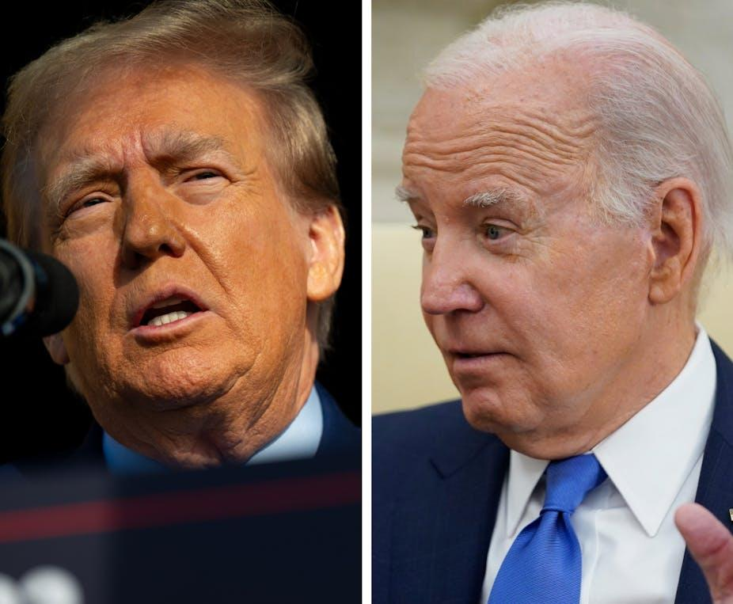
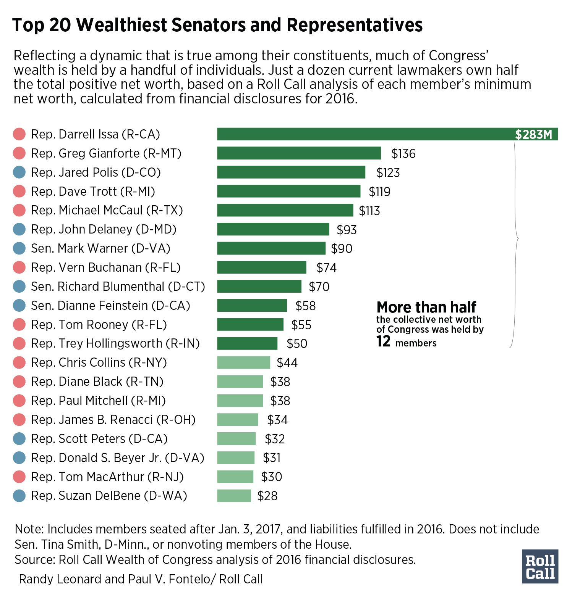
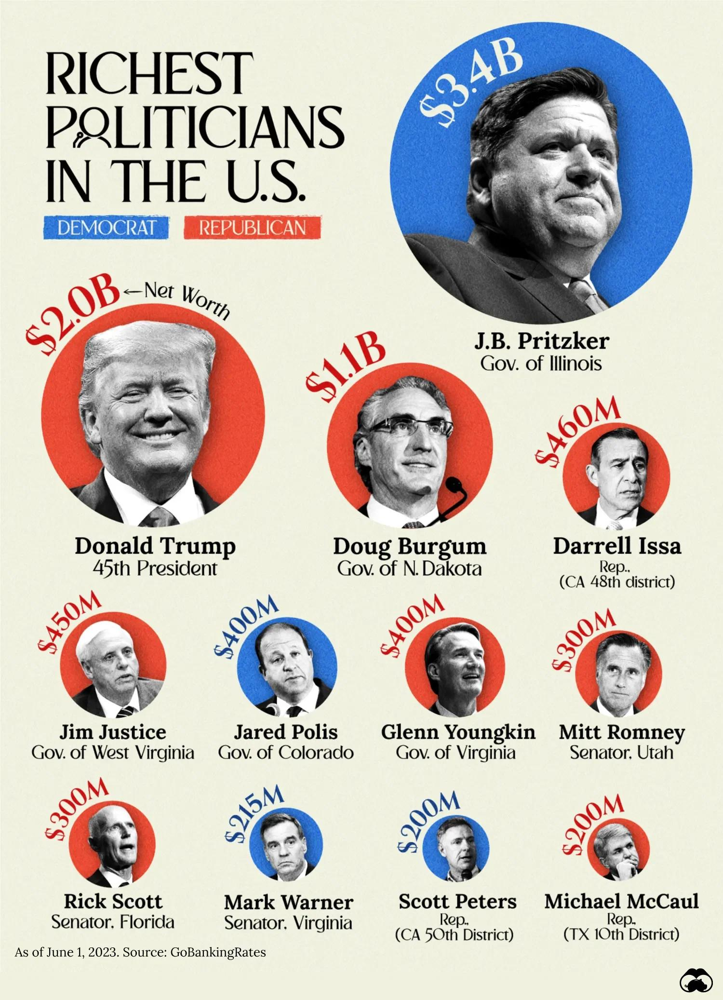
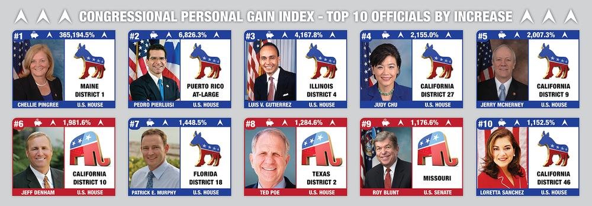

## Claim
Claim: " This image shows an authentic list realeased by Ukraine showing US politicians taking bribes from Ukraine. The highest bribe was 92 Million US-$ for Joe Biden."

## Actions
```
web_search("Joe Biden Mitch McConnell Nancy Pelosi wealth")
image_search("wealth of US politicians")
```

## Evidence
### Evidence from `web_search`
The Yahoo Finance article from February 13, 2025, discusses Elon Musk's questioning of the wealth of members of Congress, including Joe Biden, Nancy Pelosi, Mitch McConnell, Chuck Schumer, and Elizabeth Warren, and mentions their annual salaries and net worths (). The Yahoo News article from November 29, 2023, discusses Nancy Pelosi's wealth, including her real estate investments, business partnerships, and stock holdings, with assets between $57 million and $271 million and liabilities ranging from $20 million to $97 million (, , , ).

The Conversation article from July 21, 2023, discusses the age of US politicians, including Joe Biden, Mitch McConnell, and Nancy Pelosi (). It mentions that Joe Biden is 81 years old.


### Evidence from `image_search`
Roll Call published a chart of the wealth of members of Congress based on financial disclosures from 2016.  Voronoiapp.com lists the richest politicians in the U.S., including Mitt Romney and Rick Scott, with data from GoBankingRates as of June 1, 2023.  Ballotpedia provides information on the changes in net worth of U.S. Senators and Representatives. 


## Elaboration
The evidence provides information about the wealth of several US politicians, including Joe Biden, Mitch McConnell, Nancy Pelosi, and others. However, the evidence does not mention any list released by Ukraine or any bribes taken by US politicians from Ukraine. Therefore, the claim that the image shows an authentic list released by Ukraine showing US politicians taking bribes from Ukraine cannot be verified with the provided evidence. The evidence does not contain any information about the image's authenticity or the source of the data presented in the image.


## Final Judgement
The evidence confirms the wealth of the politicians listed in the image but does not support the claim that the image is an authentic list released by Ukraine showing US politicians taking bribes. The evidence does not mention any bribes or the source of the image.

`false`

### Verdict: FALSE

### Justification
The claim is false. While the provided evidence confirms the wealth of the politicians listed in the image, it does not support the assertion that the image is an authentic list released by Ukraine detailing bribes. The search results and image searches provide information on the net worth of the politicians, such as Joe Biden and Nancy Pelosi, but do not mention any bribes or the source of the image.
