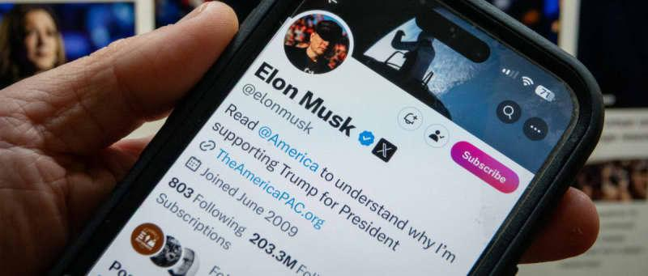

## Claim
Claim: " This image shows a screenshot of an authentic X post from Elon Musk on November 6, 2025 saying 'The last dollar for Zelenskiy'."

## Actions
```
web_search("Elon Musk Zelenskiy last dollar")
image_search("Elon Musk Trump dollar Zelenskiy")
```

## Evidence
### Evidence from `web_search`
The AOL article fact-checks the claim that Elon Musk posted "The last dollar for Zelenskiy" and states that the claim is false, with no evidence of Musk posting this. The image of the tweet is fabricated and was spread on social media . The Politico.eu article discusses Elon Musk's meme mocking Ukrainian President Volodymyr Zelenskyy's calls for Western aid.

The StopFake.org article refutes a fake story about Ukraine stopping the use of Starlink and insulting Elon Musk, mentioning a previous debunked fake about Elon Musk publishing a mocking post with the last dollar for Zelensky.


### Evidence from `image_search`
Rolling Stone published an article about Elon Musk and Donald Trump. ([Source](https://www.rollingstone.com/politics/politics-news/elon-musk-trump-phone-calls-world-leaders-1235158569/)) The Guardian published an article on November 8, 2024, discussing Elon Musk, Trump, and Ukraine. ([Source](https://www.theguardian.com/technology/2024/nov/08/elon-musk-trump-ukraine-call-zelenskyy)) Axios published an article about Elon Musk and Donald Trump. ([Source](https://www.axios.com/2024/11/08/musk-trump-zelensky-ukraine-call))

The articles discuss Elon Musk and Donald Trump. , , 


## Elaboration
The claim is false. The evidence from the web search indicates that the image of the tweet is fabricated and was spread on social media. The AOL article fact-checks the claim and states that there is no evidence of Musk posting this. The StopFake.org article also refutes a fake story about Elon Musk publishing a mocking post with the last dollar for Zelensky.


## Final Judgement
The claim that the image shows an authentic X post from Elon Musk saying "The last dollar for Zelenskiy" is false. Multiple sources confirm that the image is fabricated and that Elon Musk did not post this.
`false`

### Verdict: FALSE

### Justification
The claim is false. Fact-checks from sources like AOL and StopFake.org confirm that the image of the tweet is fabricated and that Elon Musk did not post the message "The last dollar for Zelenskiy".
