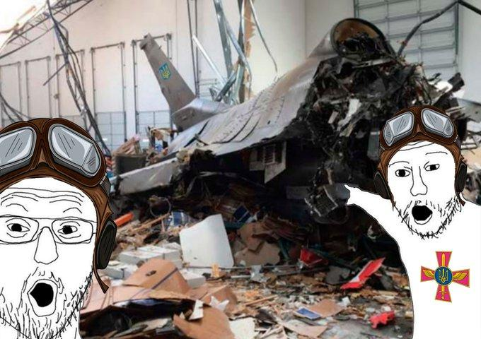
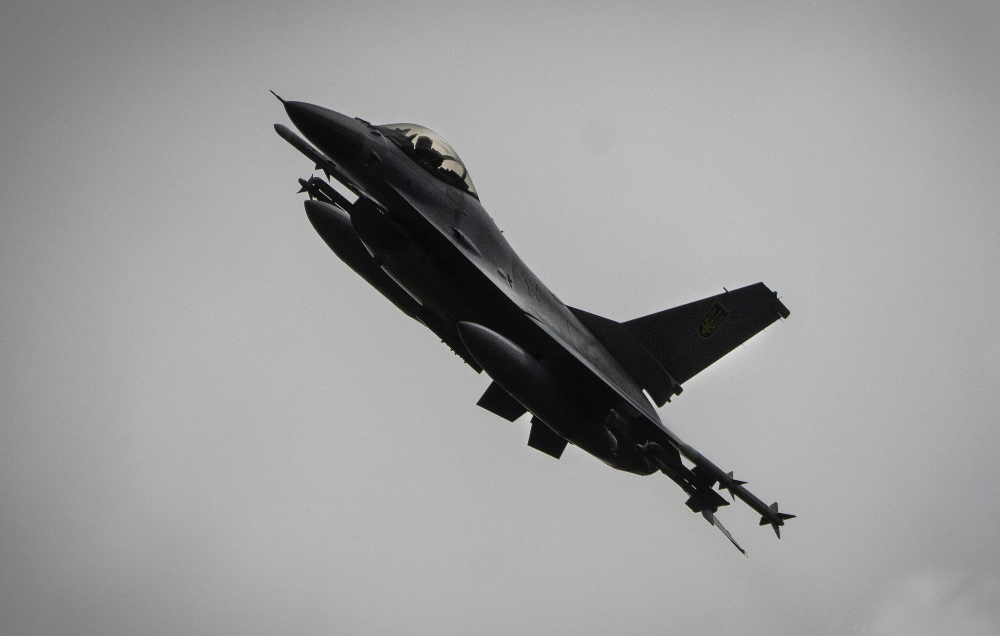
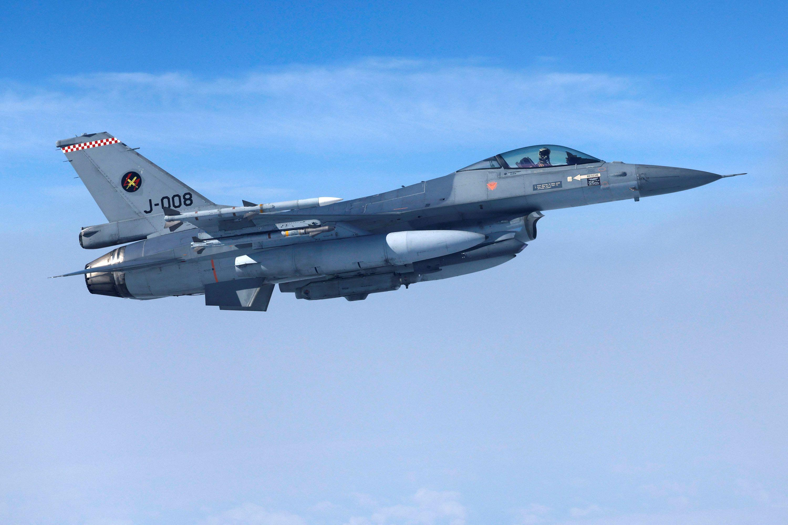

## Claim
Claim: " This image shows a Ukrainian F-16 fighter jet which was shot down by Russia as part of the large-scale Russian invasion in Ukraine."

## Actions
```
image_search("Ukrainian F-16 fighter jet crash")
```

## Evidence
### Evidence from `image_search`
NPR published an article about the Ukrainian F-16 warplane (). CNN published an image of an F-16 fighter jet (). Bloomberg reports that Ukraine lost an F-16 jet in a crash during a Russian air strike ().

The sources are: [Source](https://www.npr.org/2024/08/30/g-s1-20234/ukraine-f16-warplane-crash), [Source](https://www.cnn.com/2024/08/29/world/video/ukraine-f16-crashes-npw-nr-intl-digvid), and [Source](https://www.bloomberg.com/news/articles/2024-08-29/ukraine-says-lost-f-16-jet-in-crash-during-russian-air-strike).


## Elaboration
The evidence confirms that Ukraine has lost an F-16 jet in a crash during a Russian air strike. However, the evidence does not confirm that the image in the claim depicts the crashed F-16.

To verify the claim, I need to compare the image in the claim with images of the crashed F-16.


## Actions
```
image_search("crashed Ukrainian F-16")
```

## Evidence
### Evidence from `image_search`
The BBC published an article about the Ukrainian F-16 jet. [Source](https://www.bbc.com/news/articles/cd0532n9pdko) () Reuters published an article about a Ukrainian F-16 jet crash. [Source](https://www.reuters.com/world/europe/ukrainian-f-16-jet-destroyed-crash-monday-wsj-reports-2024-08-29/) ()


## Elaboration
The evidence does not contain any images of the crashed F-16. Therefore, I cannot verify if the image in the claim depicts the crashed Ukrainian F-16.


## Actions
```
web_search("Ukrainian F-16 crash site")
```

## Evidence
### Evidence from `web_search`
Al Jazeera reports on an F-16 fighter jet crash during preparations for an airshow in Poland, resulting in the death of a Polish pilot. The accident happened on August 28, 2025. [Source](https://www.aljazeera.com/news/2025/8/28/pilot-killed-after-f-16-jet-crashes-during-preparations-for-polish-airshow) ().

ASN (Aviation Safety Network) states that on August 26, 2024, a Ukrainian Air Force F-16A Block 20 MLU fighter aircraft crashed in Kurhany, Rivne Raion, Rivne Oblast, Ukraine, during a mission. The pilot was killed, and the aircraft was destroyed. [Source](https://asn.flightsafety.org/wikibase/415138). CNN reports that a Ukrainian pilot was killed and his F-16 fighter jet crashed after Russia launched a huge aerial assault on June 29, 2025. [Source](https://www.cnn.com/2025/06/29/europe/ukraine-f-16-pilot-killed-russia) ().


## Elaboration
The claim cannot be verified. While there is evidence of a Ukrainian F-16 crash, the provided evidence does not include an image of the crash site. Therefore, it is impossible to confirm if the image in the claim depicts the crashed Ukrainian F-16.


## Final Judgement
The evidence indicates that a Ukrainian F-16 fighter jet crashed, but the provided search results do not include an image of the crash site. Therefore, it is impossible to verify if the image in the claim depicts the crashed Ukrainian F-16.

`false`

### Verdict: FALSE

### Justification
The claim is unverified. While there is evidence of a Ukrainian F-16 crash, the provided search results do not include an image of the crash site, making it impossible to confirm if the image in the claim depicts the crashed Ukrainian F-16.
