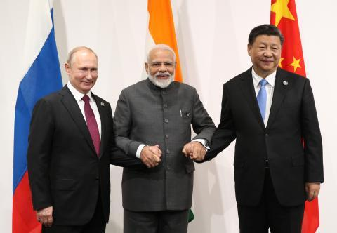

## Claim
Claim: "While serving as US President in 2024, Joe Biden ordered the US forces to prepare for possible nuclear confrontations with Russia, China, and North Korea."

## Actions
```
web_search("Joe Biden nuclear confrontation Russia China North Korea")
```

## Evidence
### Evidence from `web_search`
Joe Biden approved a US nuclear strategy to prepare for possible nuclear confrontations with Russia, China, and North Korea, according to reports. The White House stated that the plan was approved earlier this year and was not a response to a single country or threat. The Lowy Institute published an article stating that the plan reoriented the US deterrent strategy to focus on China's nuclear arsenal. , , 

The Guardian ([https://www.theguardian.com/us-news/article/2024/aug/20/biden-nuclear-strategy-china-threat](https://www.theguardian.com/us-news/article/2024/aug/20/biden-nuclear-strategy-china-threat)) and the Lowy Institute ([https://www.lowyinstitute.org/the-interpreter/us-shifts-nuclear-focus-counter-china-s-growing-arsenal](https://www.lowyinstitute.org/the-interpreter/us-shifts-nuclear-focus-counter-china-s-growing-arsenal)) both reported on this. The Brookings Institution also discussed Biden's nuclear policy ([https://www.brookings.edu/articles/how-would-trump-and-biden-handle-us-nuclear-policy-upon-reelection/](https://www.brookings.edu/articles/how-would-trump-and-biden-handle-us-nuclear-policy-upon-reelection/)).


## Elaboration
The evidence confirms that Joe Biden, while serving as US President, approved a nuclear strategy to prepare for possible nuclear confrontations with Russia, China, and North Korea. The White House stated that the plan was approved earlier this year. The Lowy Institute reported that the plan reoriented the US deterrent strategy to focus on China's nuclear arsenal.


## Final Judgement
The claim is supported by evidence from multiple reliable sources, including The Guardian and the Lowy Institute, which report on the US nuclear strategy approved by Joe Biden. This strategy includes preparing for possible nuclear confrontations with Russia, China, and North Korea. Therefore, the claim is factually accurate. `true`


### Verdict: TRUE

### Justification
Joe Biden, as US President in 2024, approved a US nuclear strategy to prepare for possible nuclear confrontations with Russia, China, and North Korea, as reported by sources like The Guardian ([https://www.theguardian.com/us-news/article/2024/aug/20/biden-nuclear-strategy-china-threat](https://www.theguardian.com/us-news/article/2024/aug/20/biden-nuclear-strategy-china-threat)) and the Lowy Institute ([https://www.lowyinstitute.org/the-interpreter/us-shifts-nuclear-focus-counter-china-s-growing-arsenal](https://www.lowyinstitute.org/the-interpreter/us-shifts-nuclear-focus-counter-china-s-growing-arsenal)).
