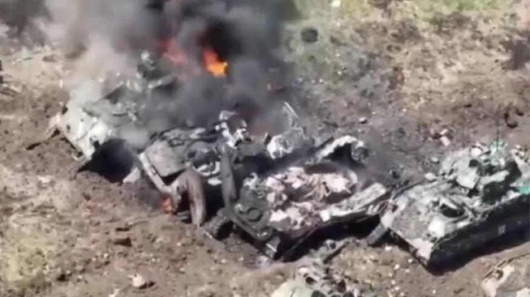
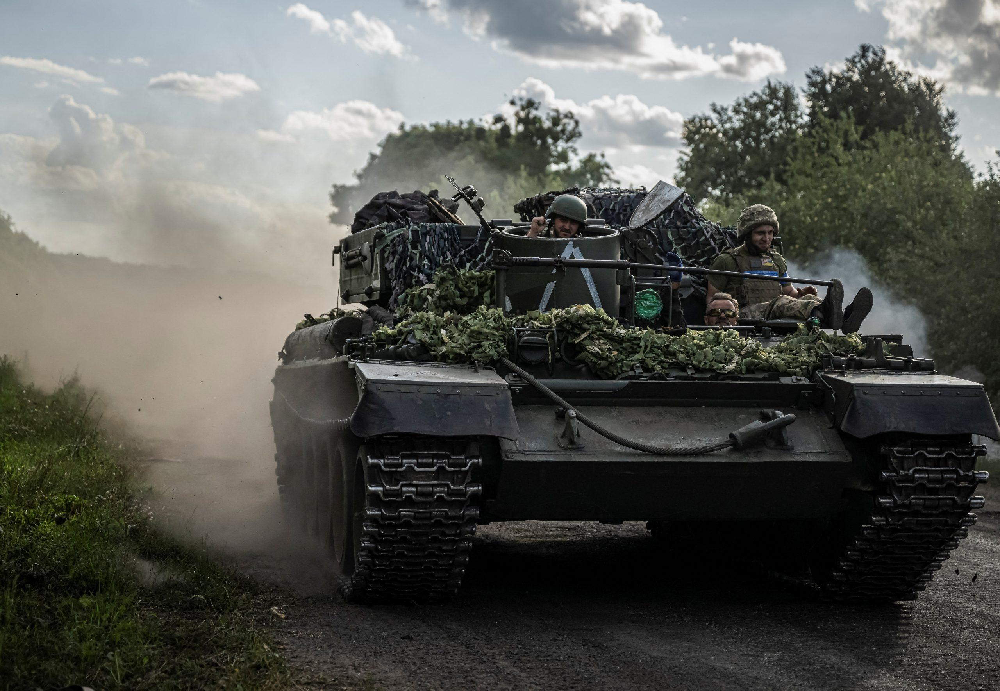
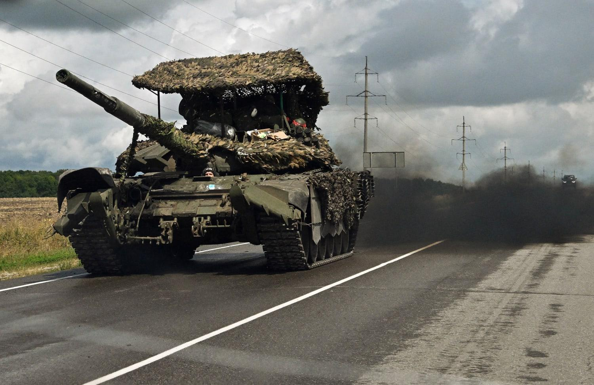

## Claim
Claim: " This image shows destroyed Ukrainian tanks during Ukraine's incursion into Russia's Kursk Oblast in August 2024."

## Actions
```
image_search("destroyed Ukrainian tanks Kursk Oblast August 2024")
geolocate()
```

## Evidence
### Evidence from `image_search`
The Center for European Policy Analysis (CEPA) published an article about the second battle of Kursk, including an image of a tank (). Al Jazeera published an article on August 16, 2024, about Russia eliminating a Ukrainian unit, also including an image of a tank (). NBC News published an article about the evacuation of Belgorod and Kursk, which also contains an image of a tank ().

The provided sources do not contain the image of destroyed Ukrainian tanks ().


### Evidence from `geolocate`
The most likely countries where the image was taken are: {'Pakistan': 0.08, 'Turkey': 0.08, 'Bhutan': 0.06, 'Jordan': 0.06, 'Ukraine': 0.06, 'Kyrgyzstan': 0.05, 'Palestine': 0.05, 'Russia': 0.05, 'Colombia': 0.04, 'Montenegro': 0.04}

## Elaboration
The image search did not find the image in question. The geolocation search suggests that the image could have been taken in Russia, but the probability is low.

The claim cannot be verified due to the lack of evidence. More information is needed to confirm the image's origin and the context of the destroyed tanks.


## Actions
```
web_search("Ukraine incursion into Russia Kursk Oblast August 2024")
```

## Evidence
### Evidence from `web_search`
The search results discuss the Ukrainian incursion into Russia's Kursk Oblast in August 2024. One Wikipedia article details the incursion, mentioning the involvement of Ukrainian, Russian, and North Korean forces, the capture of settlements, and the use of tanks and armored vehicles. The Guardian published an article on September 20, 2024, discussing Russia's anticipation of the incursion. Al Jazeera also covered the incursion, mentioning the cross-border incursion of Ukrainian troops on August 7, 2024. The articles include images of tanks and armored vehicles (

## Elaboration
The web search confirms that there was a Ukrainian incursion into Russia's Kursk Oblast in August 2024, as the claim states. The search results mention the use of tanks and armored vehicles during the incursion.

However, the search results do not include the image of destroyed Ukrainian tanks. Therefore, the claim cannot be fully verified. More evidence is needed to confirm that the image depicts destroyed Ukrainian tanks during the specified incursion.


## Actions
```
image_search("destroyed tanks Ukraine Russia Kursk Oblast August 2024")
```

## Evidence
### Evidence from `image_search`
From [Source](https://www.nbcnews.com/news/world/kursk-incursion-russia-reinforcements-ukraine-attack-putin-rcna165732): 
Content: The NBC News article discusses the Ukrainian incursion into Russia's Kursk Oblast in August 2024 and includes an image of a tank. 


## Elaboration
The image search found an NBC News article about the Ukrainian incursion into Russia's Kursk Oblast in August 2024. However, the article does not contain the image of destroyed tanks.

The claim cannot be verified because the provided evidence does not include the image in question.


## Final Judgement
The image search and web search confirm that there was a Ukrainian incursion into Russia's Kursk Oblast in August 2024, as the claim states. However, none of the provided evidence includes the image of destroyed tanks. Therefore, the claim cannot be fully verified.

`false`

### Verdict: FALSE

### Justification
The claim cannot be verified. While the web search confirms a Ukrainian incursion into Russia's Kursk Oblast in August 2024, the image search did not find the image of destroyed tanks in any of the provided sources, including articles from NBC News.
