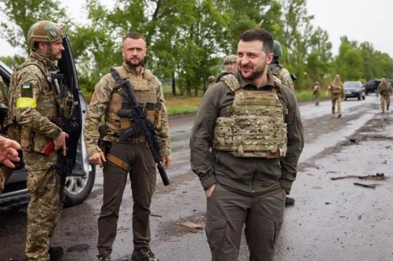

## Claim
Claim: " This image shows Ukrainian President Volodymyr Zelensky arriving in August 2024 in the Sudzha of Kursk region, Russia, which had just been occupied by Ukrainian troops in the Kursk Offensive, and meeting with representatives of the people there."

## Actions
```
image_search("Zelensky military uniform meeting soldiers")
web_search("Zelensky Sudzha Kursk region")
```

## Evidence
### Evidence from `image_search`
The BBC News website ([https://www.bbc.com/news/live/world-europe-61612803](https://www.bbc.com/news/live/world-europe-61612803)) contains an image of Volodymyr Zelensky in military uniform with soldiers.  Axios ([https://www.axios.com/2022/11/14/zelensky-visits-kherson-ukraine](https://www.axios.com/2022/11/14/zelensky-visits-kherson-ukraine)) published an image of Zelensky.  The New York Times ([https://www.nytimes.com/2022/12/21/us/politics/zelensky-washington-biden-congress.html](https://www.nytimes.com/2022/12/21/us/politics/zelensky-washington-biden-congress.html)) published an image of Zelensky with soldiers. 


### Evidence from `web_search`
The BBC News article ([https://www.bbc.com/news/articles/c0q198zyppqo](https://www.bbc.com/news/articles/c0q198zyppqo)) from March 17, 2025, discusses the retreat of Ukrainian troops from the Kursk region, including the town of Sudzha, and includes a map showing the Ukrainian advance in August 2024 and the subsequent loss of territory by March 16, 2025. The article also includes images of Ukrainian soldiers , a damaged statue of Lenin , and military vehicles . The CNN article ([https://www.cnn.com/2024/08/15/europe/kursk-incursion-sudzha-captured-ukraine-intl/index.html](https://www.cnn.com/2024/08/15/europe/kursk-incursion-sudzha-captured-ukraine-intl/index.html)) from August 15, 2024, reports that Ukrainian forces captured Sudzha.

Meduza's article ([https://meduza.io/en/feature/2025/03/17/a-costly-gamble](https://meduza.io/en/feature/2025/03/17/a-costly-gamble)) from March 17, 2025, discusses Russia's counteroffensive in the Kursk region, mentioning Sudzha and Zelensky's goal of exchanging Russian-held territory in the Kursk region for parts of Ukraine occupied by Russia. The articles also include an image  of Russian servicemen in the Kursk region.


## Elaboration
The claim states that the image shows Zelensky in Sudzha, Kursk region, meeting with representatives after the town was occupied by Ukrainian troops in August 2024. The evidence confirms that Ukrainian forces captured Sudzha in August 2024 ([https://www.cnn.com/2024/08/15/europe/kursk-incursion-sudzha-captured-ukraine-intl/index.html](https://www.cnn.com/2024/08/15/europe/kursk-incursion-sudzha-captured-ukraine-intl/index.html)). The BBC News article ([https://www.bbc.com/news/articles/c0q198zyppqo](https://www.bbc.com/news/articles/c0q198zyppqo)) discusses the retreat of Ukrainian troops from the Kursk region, including Sudzha.

The evidence does not explicitly state that Zelensky visited Sudzha or met with representatives there. The image search results show Zelensky in military uniform with soldiers, but do not provide the location or date.

Therefore, the claim cannot be verified due to a lack of evidence confirming Zelensky's presence in Sudzha.


## Actions
```
geolocate()
```

## Evidence
### Evidence from `geolocate`
The most likely countries where the image was taken are: {'Ukraine': 1.0, 'Albania': 0.0, 'Andorra': 0.0, 'Argentina': 0.0, 'Australia': 0.0, 'Austria': 0.0, 'Bangladesh': 0.0, 'Belgium': 0.0, 'Bermuda': 0.0, 'Bhutan': 0.0}

## Elaboration
The geolocation of the image suggests it was taken in Ukraine. However, the evidence does not confirm that the image was taken in the Sudzha region. The claim cannot be verified.


## Actions
```
web_search("Zelensky Sudzha visit August 2024")
```

## Evidence
### Evidence from `web_search`
The CNN article ([https://www.cnn.com/2024/08/15/europe/kursk-incursion-sudzha-captured-ukraine-intl](https://www.cnn.com/2024/08/15/europe/kursk-incursion-sudzha-captured-ukraine-intl)) reports that Zelensky said Ukrainian forces had taken control of Sudzha on August 15, 2024. The Los Angeles Times ([https://www.latimes.com/world-nation/story/2024-08-22/zelenskyy-visits-border-area-from-where-ukrainian-forces-entered-russian-territory](https://www.latimes.com/world-nation/story/2024-08-22/zelenskyy-visits-border-area-from-where-ukrainian-forces-entered-russian-territory)) states that Zelensky visited the northeastern Ukrainian border area from which Ukrainian forces launched their offensive into Russia and that he said Ukrainian forces had taken control of another village in the Russian Kursk region. The Associated Press ([https://apnews.com/article/russia-belgorod-state-of-emergency-b7fb57c21a43f0f06bf79a4477eb62e9](https://apnews.com/article/russia-belgorod-state-of-emergency-b7fb57c21a43f0f06bf79a4477eb62e9)) also reported that Zelensky said Ukrainian troops had taken full control of Sudzha on August 15, 2024.


## Elaboration
The evidence indicates that Zelensky stated Ukrainian forces had taken control of Sudzha on August 15, 2024. However, the evidence does not confirm that Zelensky visited Sudzha or met with representatives there. Therefore, the claim cannot be verified.


## Final Judgement
The evidence confirms that Ukrainian forces captured Sudzha in August 2024, and Zelensky stated that Ukrainian forces had taken control of Sudzha. However, there is no evidence to confirm that Zelensky visited Sudzha or met with representatives there. Therefore, the claim is not factually accurate. `false`

### Verdict: FALSE

### Justification
The claim is not supported by the evidence. While Ukrainian forces captured Sudzha in August 2024, and Zelensky stated that Ukrainian forces had taken control of Sudzha, there is no evidence to confirm that Zelensky visited Sudzha or met with representatives there.
