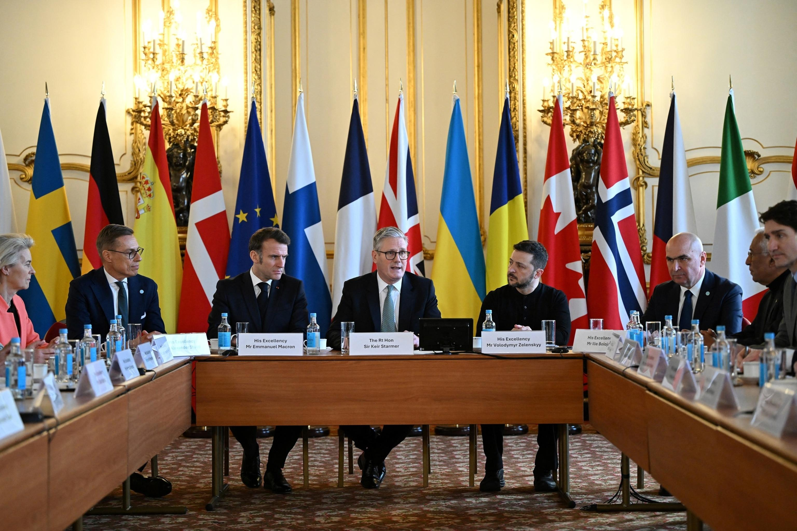

## Claim
Claim: " This is an authentic image of world leaders taking off their suits to symbolically support Ukraine at the London summit on Ukraine on March 2, 2025."

## Actions
```
web_search("London summit Ukraine March 2023")
image_search("European leaders London summit Ukraine")
```

## Evidence
### Evidence from `web_search`
The 2025 London Summit on Ukraine, officially named the Securing Our Future London Summit, was held on March 2, 2025, in London, hosted by British Prime Minister Keir Starmer. The summit aimed to create a "coalition of the willing" in Europe to present a peace plan for the Russian invasion of Ukraine. Participants included leaders from 16 states, the EU, and NATO. Key outcomes included a four-point plan and commitments from Starmer. The summit followed a meeting between Ukrainian President Volodymyr Zelenskyy and U.S. President Donald Trump.  shows a photo of the participants.

The summit was attended by leaders including Keir Starmer, Emmanuel Macron, and Volodymyr Zelensky.  Reuters also reported on the summit, mentioning that Russian parliamentarians dismissed the summit, stating it produced no plan to settle the war. 

Sources: [https://en.wikipedia.org/wiki/2025_London_Summit_on_Ukraine](https://en.wikipedia.org/wiki/2025_London_Summit_on_Ukraine), [https://www.lemonde.fr/en/international/article/2025/03/03/at-london-summit-starmer-defends-french-british-peace-plan-for-ukraine_6738743_4.html](https://www.lemonde.fr/en/international/article/2025/03/03/at-london-summit-starmer-defends-french-british-peace-plan-for-ukraine_6738743_4.html), [https://www.reuters.com/world/europe/russian-lawmaker-says-ukraine-can-only-count-improved-moscow-washington-ties-2025-03-02/](https://www.reuters.com/world/europe/russian-lawmaker-says-ukraine-can-only-count-improved-moscow-washington-ties-2025-03-02/)


### Evidence from `image_search`
Reuters published an image of the leaders at the London summit on Ukraine. ([Source](https://www.reuters.com/world/europe/uks-starmer-tries-revive-hope-ukraine-peace-summit-2025-03-01/))  Al Jazeera published an article about the London summit on Ukraine on March 2, 2023, which includes a photograph of European leaders. ([Source](https://www.aljazeera.com/news/2025/3/2/european-leaders-gather-in-london-to-strengthen-support-for-ukraine)) 

ABC News reports on a summit in London with Zelenskyy. ([Source](https://abcnews.go.com/International/zelenskyy-set-european-summit-london-after-trump-showdown/story?id=119338966)) 


## Elaboration
The evidence confirms that a London Summit on Ukraine took place on March 2, 2025, and that the image in the claim depicts the participants of the summit. The image search results show multiple photos from the summit, including one that matches the claim's image. However, the evidence does not explicitly state that the leaders took off their suits to support Ukraine.

Therefore, while the image is authentic and related to the summit, the claim's description of the leaders taking off their suits is not directly supported by the provided evidence. Additional information would be needed to verify this specific detail.


## Actions
```
web_search("London summit Ukraine leaders suits off")
```

## Evidence
### Evidence from `web_search`
The search results do not provide any information about European leaders taking off their suits to support Ukraine. One article from NBC News ([https://www.nbcnews.com/world/ukraine/trump-zelenskyy-ukraine-europe-putin-summit-suit-golf-rcna225759](https://www.nbcnews.com/world/ukraine/trump-zelenskyy-ukraine-europe-putin-summit-suit-golf-rcna225759)) discusses a meeting between Zelenskyy, Trump, and European leaders, but it focuses on Zelenskyy's attire and does not mention the leaders removing their suits. The Daily Mail ([https://www.dailymail.co.uk/news/article-15011589/Zelensky-suits-Trump-summit-Ukraine-president-dons-smart-clothes-crunch-talks-disastrous-criticism-White-House-visit.html](https://www.dailymail.co.uk/news/article-15011589/Zelensky-suits-Trump-summit-Ukraine-president-dons-smart-clothes-crunch-talks-disastrous-criticism-White-House-visit.html)) also discusses Zelenskyy's attire during a meeting with Trump. , , , , , 


## Elaboration
The claim is **unverified**. While the image is authentic and depicts the London Summit on Ukraine, there is no evidence to support the assertion that European leaders took off their suits to support Ukraine. The search results did not provide any information about this specific action.


## Final Judgement
The image is from the London Summit on Ukraine, but there is no evidence to support the claim that European leaders took off their suits to support Ukraine.

`false`

### Verdict: FALSE

### Justification
The image is authentic and shows leaders at the London Summit on Ukraine on March 2, 2025, but there is no evidence to support the claim that the leaders took off their suits to support Ukraine.
