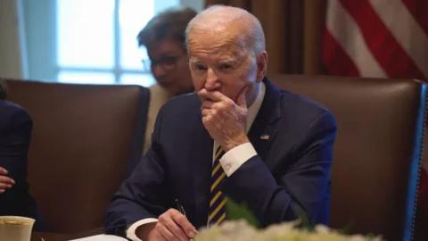

## Claim
Claim: "Italian Prime Minister Giorgia Meloni condemned the US-Ukrainian bombing of Russia at the G20 summit in Rio de Janeiro in November 2024."

## Actions
```
web_search("Giorgia Meloni G20 summit Rio de Janeiro November 2024")
web_search("Giorgia Meloni Russia Ukraine bombing G20")
```

## Evidence
### Evidence from `web_search`
The 2024 G20 Rio de Janeiro summit will be held from November 18–19, 2024, with Brazil as the host country and Luiz Inácio Lula da Silva as the chair. Giorgia Meloni, Prime Minister of Italy, will be present at the summit, which will address social inclusion, energy transition, sustainable development, and global governance reform. Vladimir Putin will not attend the summit (<image:i>). Meloni met with Indian Prime Minister Narendra Modi to discuss strengthening their strategic partnership (<image:0>). She also met with the Prime Minister of Japan to discuss the Global Combat Air Program (GCAP) ().


### Evidence from `web_search`
At the G20 summit, Giorgia Meloni urged Vladimir Putin to end the war and withdraw troops from Ukraine. She welcomed Putin's peace proposal but emphasized that Russia is the aggressor. This information is from articles published on November 23, 2023, and can be found on [eurointegration.com.ua](https://www.eurointegration.com.ua/eng/news/2023/11/23/7174141/) and [pravda.com.ua](https://www.pravda.com.ua/eng/news/2023/11/23/7430027/).

An article from [firstonline.info](https://www.firstonline.info/en/lucraina-ruba-la-scena-al-g20-via-libera-di-biden-alle-bombe-a-lungo-raggio-in-territorio-russo/) discusses the G20 summit in Rio de Janeiro, mentioning a bilateral meeting between Giorgia Meloni and Lula, and Italian investment plans in Brazil. The summit was also overshadowed by events related to the war in Ukraine.  


## Elaboration
The evidence indicates that Giorgia Meloni attended the G20 summit in Rio de Janeiro in November 2024. However, the provided information does not mention any US-Ukrainian bombing of Russia. Instead, it mentions that Meloni urged Putin to end the war and withdraw troops from Ukraine.

The evidence does not support the claim that Meloni condemned the US-Ukrainian bombing of Russia.


## Final Judgement
The search results confirm that Giorgia Meloni attended the G20 summit in Rio de Janeiro in November 2024. However, the search results do not mention any US-Ukrainian bombing of Russia. Instead, they show that Meloni urged Putin to end the war.

The claim is demonstrably false because the evidence does not support the claim that Meloni condemned the US-Ukrainian bombing of Russia. `false`

### Verdict: FALSE

### Justification
The evidence confirms that Giorgia Meloni attended the G20 summit in Rio de Janeiro in November 2024. However, the search results do not support the claim that she condemned the US-Ukrainian bombing of Russia. Instead, she urged Putin to end the war, as reported by [eurointegration.com.ua](https://www.eurointegration.com.ua/eng/news/2023/11/23/7174141/) and [pravda.com.ua](https://www.pravda.com.ua/eng/news/2023/11/23/7430027/).
