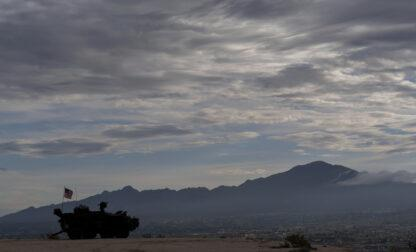

## Claim
Claim: "Ukrainian President Volodymyr Zelenskyy's statement in an AP news interview from February 1, 2025 that his country's military has received only a portion of the more than 175 billion in U.S. aid confirms that the US aid is a money laundering operation."

## Actions
```
web_search("Volodymyr Zelenskyy AP interview February 1 2025 US aid")
web_search("US aid to Ukraine money laundering")
```

## Evidence
### Evidence from `web_search`
The Associated Press published an interview with Ukrainian President Volodymyr Zelenskyy on February 1, 2025, where he discussed excluding Ukraine from U.S.-Russia talks and called for a ceasefire plan (, , , ). The interview is also discussed in a U.S. News & World Report article (<image:k>).

The AP News article does not contain the statement that his country's military has received only a portion of the more than 175 billion in U.S. aid.
*   [https://apnews.com/article/russia-ukraine-war-trump-talks-ceasefire-00af5f61f1faf41e78a3b4e072c21a14](https://apnews.com/article/russia-ukraine-war-trump-talks-ceasefire-00af5f61f1faf41e78a3b4e072c21a14)
*   [https://www.usnews.com/news/world/articles/2025-02-01/takeaways-from-the-ap-interview-with-ukraines-zelenskyy](https://www.usnews.com/news/world/articles/2025-02-01/takeaways-from-the-ap-interview-with-ukraines-zelenskyy)
*   [https://www.ap.org/news-highlights/best-of-the-week/second-winner/2025/ap-interview-zelenskyy-says-excluding-ukraine-from-u-s-russia-talks-about-war-is-very-dangerous/](https://www.ap.org/news-highlights/best-of-the-week/second-winner/2025/ap-interview-zelenskyy-says-excluding-ukraine-from-u-s-russia-talks-about-war-is-very-dangerous/)


### Evidence from `web_search`
The Department of Defense Office of Inspector General (DoD OIG) released an audit of the DoD’s execution of funds to assist Ukraine, which revealed that the DoD did not provide sufficient documentation to support the justification or accuracy of half of the total funds, $1.1 billion. The report is from 2025. [Source](https://www.dodig.mil/In-the-Spotlight/Article/3940692/press-release-audit-of-the-dods-execution-of-funds-to-assist-ukraine-report-no/)

The Institute for the Study of War (ISW) published a fact sheet dated February 8, 2024, addressing claims about US aid to Ukraine.  The fact sheet states that US oversight is extensive, and Ukrainian government oversight and accountability are extensive and growing. It also mentions that America’s European, Asian, and NATO allies have committed over $178 billion to support Ukraine.  [Source](https://www.understandingwar.org/backgrounder/fact-sheet-us-assistance-ukraine)


## Elaboration
The claim that Zelenskyy's statement confirms US aid is a money-laundering operation is not supported by the evidence. The AP interview with Zelenskyy does not contain the statement attributed to him in the claim. However, a Department of Defense Office of Inspector General (DoD OIG) audit revealed that the DoD did not provide sufficient documentation to support the justification or accuracy of half of the total funds, $1.1 billion. The Institute for the Study of War (ISW) fact sheet states that US oversight is extensive, and Ukrainian government oversight and accountability are extensive and growing.


## Final Judgement
The claim is false because the statement attributed to Zelenskyy in the claim is not present in the AP interview. Additionally, while there are concerns about documentation for some funds, the evidence does not directly support the claim that US aid is a money-laundering operation. `false`

### Verdict: FALSE

### Justification
The claim is false. The statement attributed to Zelenskyy in the claim is not present in the [AP interview](https://apnews.com/article/russia-ukraine-war-trump-talks-ceasefire-00af5f61f1faf41e78a3b4e072c21a14). While a [DoD OIG audit](https://www.dodig.mil/In-the-Spotlight/Article/3940692/press-release-audit-of-the-dods-execution-of-funds-to-assist-ukraine-report-no/) revealed documentation issues, the evidence does not directly support the claim that US aid is a money-laundering operation.
