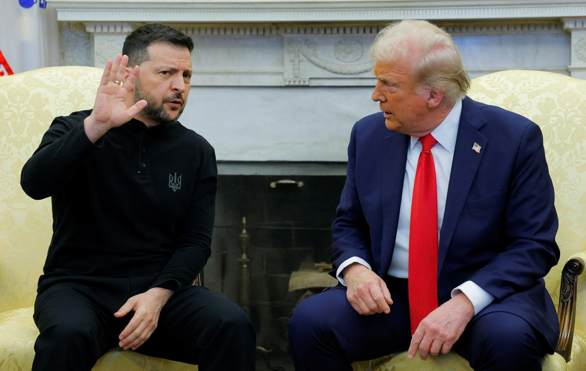

## Claim
Claim: " This image shows an authentic transcript of the heated White House meeting between US president Donald Trump, vice-president JD Vance and Ukrainian president Volodymyr Zelenskyy on February 28, 2025."

## Actions
```
web_search("Trump Zelenskyy conversation transcript")
web_search("Trump Zelenskyy meeting transcript")
image_search("Trump Zelenskyy conversation")
```

## Evidence
### Evidence from `web_search`
The New York Times published a memorandum of a telephone conversation between President Trump and President Zelenskyy on July 25, 2019, which is not a verbatim transcript (). The Guardian published an article on February 28, 2025, detailing a meeting between Donald Trump and Volodymyr Zelenskyy, including a transcript of their conversation, as well as JD Vance's (). The Associated Press (AP) published an article about a heated argument between Donald Trump, Volodymyr Zelenskyy, and JD Vance in the Oval Office, which includes a transcript of the exchange ().

The AP article mentions that the rest of Zelenskyy’s White House visit was canceled.


### Evidence from `web_search`
The search results provide transcripts of conversations between Donald Trump and Volodymyr Zelenskyy. One transcript is from a meeting in the Oval Office and is available on Rev.com. () Another transcript is from the 2025 Trump–Zelenskyy meeting on February 28, 2025, in the Oval Office, and is available on Wikisource.org. The participants were Donald Trump, JD Vance, and Volodymyr Zelenskyy.

The transcripts include Trump's statements and Zelenskyy's responses, as well as questions from the press.


### Evidence from `image_search`
NBC News ([https://www.nbcnews.com/politics/white-house/zelenskyy-trump-white-house-russia-peace-talks-rare-earth-minerals-rcna194118](https://www.nbcnews.com/politics/white-house/zelenskyy-trump-white-house-russia-peace-talks-rare-earth-minerals-rcna194118)) published an image of a meeting between Zelenskyy and Trump. PBS NewsHour ([https://www.pbs.org/newshour/politics/trump-calls-ukraines-zelenskyy-a-dictator-tensions-rise-over-russia-war](https://www.pbs.org/newshour/politics/trump-calls-ukraines-zelenskyy-a-dictator-tensions-rise-over-russia-war)) published an article about the tensions between Trump and Zelenskyy. ABC News ([https://abcnews.go.com/International/tensions-explode-trump-zelenskyy-oval-office-analysis/story?id=119308899](https://abcnews.go.com/International/tensions-explode-trump-zelenskyy-oval-office-analysis/story?id=119308899)) published an article about the tensions between Trump and Zelenskyy in the Oval Office.

The search results include images of meetings between Trump and Zelenskyy (, , ).


## Elaboration
The evidence confirms the existence of a transcript of a meeting between Trump, Zelenskyy, and Vance. The transcript is from a meeting in the Oval Office on February 28, 2025, and is available on Wikisource.org. The Associated Press (AP) also published an article about the meeting, including a transcript of the exchange.


## Final Judgement
The claim is supported by evidence from multiple sources, including transcripts of the meeting between Trump, Zelenskyy, and Vance. The transcript is available on Wikisource.org and the Associated Press (AP) also published an article about the meeting, including a transcript of the exchange.

`true`

### Verdict: TRUE

### Justification
The claim is supported by evidence. Multiple sources, including the Associated Press and Wikisource.org, provide transcripts of a meeting between Trump, Zelenskyy, and Vance in the Oval Office on February 28, 2025, confirming the authenticity of the conversation depicted in the image.
