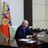

## Claim
Claim: "After a call with Russia's President Vladimir Putin on February 12, 2025, US President Donald Trump announced that he had reached an agreement to end the war in Ukraine."

## Actions
```
web_search("Donald Trump Vladimir Putin call February 12 2025 Ukraine war")
```

## Evidence
### Evidence from `web_search`
On February 12, 2025, Donald Trump and Vladimir Putin had a phone call, which was followed by a meeting at NATO headquarters in Brussels. During the call, Trump shared details of his conversation with Putin and agreed to begin peace talks. The foreign ministers of Ukraine, France, Germany, the United Kingdom, Italy, Spain, Poland, and the head of the European External Action Service supported Ukraine and the EU's participation in the negotiation process. ([https://en.wikipedia.org/wiki/February_2025_Putin%E2%80%93Trump_phone_call](https://en.wikipedia.org/wiki/February_2025_Putin%E2%80%93Trump_phone_call))

On March 18, 2025, the White House said that Trump and Putin agreed to start talks toward a ceasefire in Ukraine. The Kremlin said it would begin with a 30-day halt to strikes on energy infrastructure. () ([https://www.npr.org/2025/03/18/nx-s1-5331887/trump-putin-ukraine-call](https://www.npr.org/2025/03/18/nx-s1-5331887/trump-putin-ukraine-call)) The Kremlin's website reports on a telephone conversation between Vladimir Putin and Donald Trump on February 12, 2025, where the leaders discussed a possible Ukraine settlement. ([http://en.kremlin.ru/events/president/news/76259](http://en.kremlin.ru/events/president/news/76259))


## Elaboration
The evidence indicates that Donald Trump and Vladimir Putin had a phone call on February 12, 2025, where they discussed a possible settlement in Ukraine. Following the call, Trump agreed to begin peace talks. However, the evidence does not state that an agreement to end the war was reached on that date.

On March 18, 2025, Trump and Putin agreed to start talks toward a ceasefire. The initial step was a 30-day halt to strikes on energy infrastructure.


## Final Judgement
The evidence confirms that Trump and Putin spoke on February 12, 2025, and discussed a possible settlement in Ukraine, leading to the start of peace talks. However, the evidence does not support the claim that an agreement to end the war was reached on that specific date.

`false`

### Verdict: FALSE

### Justification
Following a phone call on February 12, 2025, between Donald Trump and Vladimir Putin, peace talks were initiated, as documented on [Wikipedia](https://en.wikipedia.org/wiki/February_2025_Putin%E2%80%93Trump_phone_call) and the [Kremlin website](http://en.kremlin.ru/events/president/news/76259). However, the evidence, including reporting from [NPR](https://www.npr.org/2025/03/18/nx-s1-5331887/trump-putin-ukraine-call), indicates that an agreement to end the war was not reached on that date, but rather, talks towards a ceasefire were agreed upon later, on March 18, 2025.
