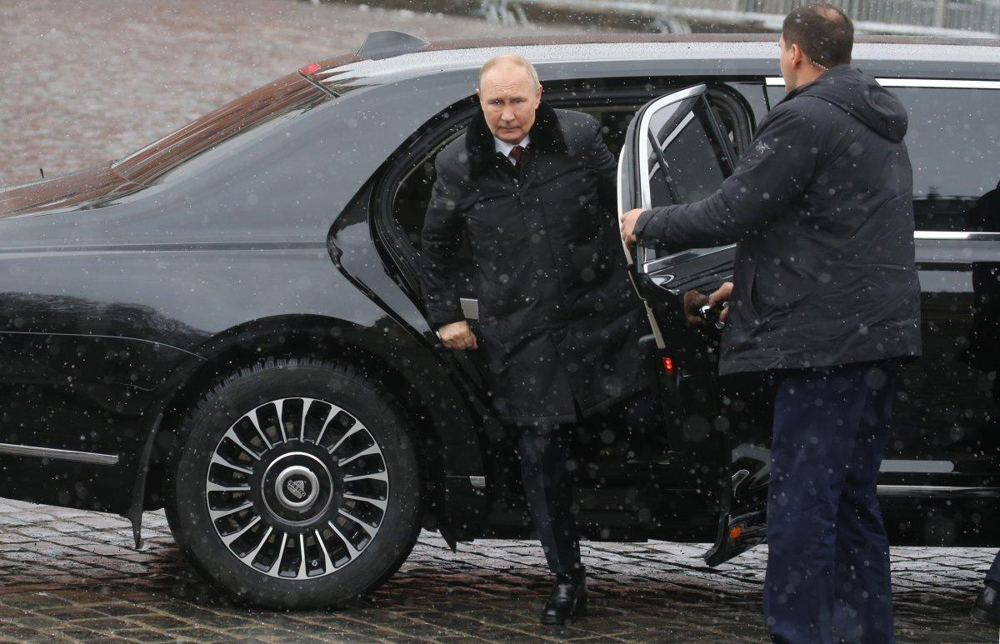

## Claim
Claim: "Russian President Vladimir Putin has died in an explosion in one of his limousines."

## Actions
```
web_search("Vladimir Putin death limousine explosion")
```

## Evidence
### Evidence from `web_search`
Newsweek reports that a limousine from Vladimir Putin's presidential fleet caught fire near the FSB headquarters in Moscow (). The cause of the fire is unknown, and there were no reports of injuries. The Hindustan Times published an article about a viral video of an explosion involving a limousine, believed to be part of Vladimir Putin's official car fleet, in Moscow (<image:k>). The Economic Times reports that a luxury limousine from Vladimir Putin's official car fleet exploded in central Moscow (, , ).

The articles mention speculation of an assassination attempt and that the explosion has raised security concerns.
*   [https://www.newsweek.com/russia-putin-limousine-fire-video-2052846](https://www.newsweek.com/russia-putin-limousine-fire-video-2052846)
*   [https://www.hindustantimes.com/world-news/275000-aurus-senat-limousine-vladimir-putin-goes-up-in-flames-limo-explodes-moscow-assassination-attempt-101743297137628.html](https://www.hindustantimes.com/world-news/275000-aurus-senat-limousine-vladimir-putin-goes-up-in-flames-limo-explodes-moscow-assassination-attempt-101743297137628.html)
*   [https://m.economictimes.com/news/international/world-news/blast-in-one-of-vladimir-putins-official-limousines-triggers-fresh-assassination-concerns/articleshow/119758547.cms](https://m.economictimes.com/news/international/world-news/blast-in-one-of-vladimir-putins-official-limousines-triggers-fresh-assassination-concerns/articleshow/119758547.cms)


## Elaboration
The evidence indicates that a limousine from Vladimir Putin's official car fleet was involved in an incident. Newsweek reports a fire, while The Hindustan Times and The Economic Times report an explosion. However, none of the provided sources confirm that Vladimir Putin died in an explosion.

The reports mention speculation about an assassination attempt and security concerns, but they do not provide any information about Putin's death.

Therefore, the claim cannot be verified based on the provided evidence. More information is needed to confirm whether Putin died in an explosion.


## Final Judgement
The search results indicate that a limousine from Vladimir Putin's fleet was involved in an incident, with reports of a fire and an explosion. However, none of the sources confirm that Putin died in an explosion. The evidence focuses on the incident involving the limousine and speculation about an assassination attempt, but it does not provide any information about Putin's death.

`false`

### Verdict: FALSE

### Justification
While reports from sources like Newsweek, The Hindustan Times, and The Economic Times indicate an incident involving a limousine from Vladimir Putin's fleet, including a fire and an explosion, none of the provided evidence confirms the claim that Putin died in an explosion.
