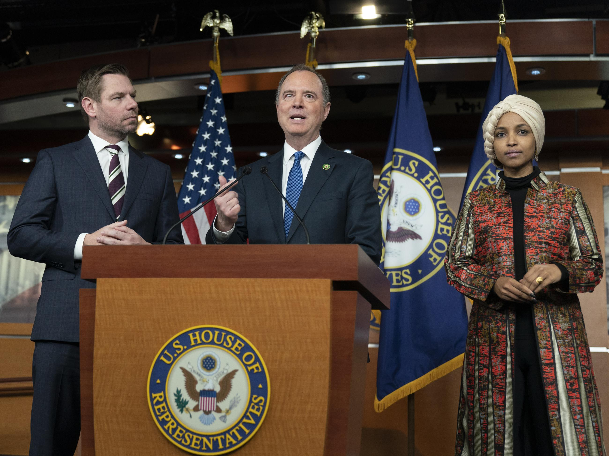

## Claim
Claim: "Majority Leader John Thune blocked Senator Adam Schiff's committee assignments because of his past work in the Russia investigation over Donald Trump."

## Actions
```
web_search("John Thune Adam Schiff committee assignments")
web_search("John Thune blocks Adam Schiff committee assignments Russia investigation")
```

## Evidence
### Evidence from `web_search`
The article from ACEC.org discusses the Senate committee assignments for the 119th Congress and mentions that Senator Adam Schiff (D-CA) was assigned to the Finance Committee (). The document from Torreydc.com lists the Senate Committee Assignments for the 119th Congress, with Adam Schiff (D-CA) assigned to the Agriculture, Nutrition and Forestry Committee, the Environment and Public Works Committee, the Judiciary Committee, and the Small Business and Entrepreneurship Committee. John Thune (R-SD) is listed as a member of the Agriculture, Nutrition and Forestry Committee, the Commerce, Science, and Transportation Committee, and the Finance Committee. The document does not mention any blocking of committee assignments.

The document from Holland & Knight LLP lists the committee assignments for the House of Representatives and the Senate for the 118th Congress. The House Committee on the Judiciary includes Adam Schiff (CA). The Senate Committee on Energy and Natural Resources and the Senate Committee on Banking, Housing, and Urban Affairs include John Thune (SD).

*   [https://www.acec.org/news/last-word-blog/post/senate-leaders-finalize-committee-assignments-for-the-119th-congress/](https://www.acec.org/news/last-word-blog/post/senate-leaders-finalize-committee-assignments-for-the-119th-congress/)
*   [https://torreydc.com/wp-content/uploads/2025/01/Senate-Committee-Assignments\_119-Congress\_Printable.pdf](https://torreydc.com/wp-content/uploads/2025/01/Senate-Committee-Assignments_119-Congress_Printable.pdf)
*   [https://www.hklaw.com/-/media/files/insights/eyes/2023/02/118thcongresscommitteeassignments.pdf](https://www.hklaw.com/-/media/files/insights/eyes/2023/02/118thcongresscommitteeassignments.pdf)


### Evidence from `web_search`
From [Source](https://apnews.com/article/donald-trump-ap-top-news-ca-state-wire-adam-schiff-politics-3eec3ea9be5c07a9c297bad439f8f3e8): 
Content: The Associated Press published an article about Adam Schiff, mentioning his role as the lead impeachment prosecutor against Donald Trump. <image:i> The article states that Schiff has been a frequent target of conservatives since the then GOP-led House Intelligence Committee started investigating Trump’s ties to Russia in the 2016 election.


## Elaboration
The evidence does not support the claim. The search results provide information on committee assignments for both Adam Schiff and John Thune but do not mention any blocking of assignments by Thune. The AP article mentions Schiff's role in the Russia investigation and his frequent targeting by conservatives. However, it does not link this to Thune or any blocking of committee assignments.

To verify the claim, information is missing regarding whether John Thune blocked Adam Schiff's committee assignments and the reasons behind it.


## Actions
```
web_search("John Thune statement Adam Schiff committee assignments")
web_search("Adam Schiff blocked committee assignments reason")
```

## Evidence
### Evidence from `web_search`
The CNN and NPR articles state that House Speaker Kevin McCarthy denied Adam Schiff a seat on the House Intelligence Committee, citing the "misuse of this panel" and Schiff's actions undermining national security as reasons. (, ) The PBS article also mentions McCarthy blocking Schiff from the House intelligence committee. The articles do not mention John Thune.


## Elaboration
The evidence indicates that Adam Schiff was denied a seat on the House Intelligence Committee by House Speaker Kevin McCarthy, not by John Thune. The reasons cited were the "misuse of this panel" and actions undermining national security. The evidence does not support the claim that John Thune blocked Adam Schiff's committee assignments.


## Final Judgement
The search results show that Adam Schiff was denied a seat on the House Intelligence Committee by Kevin McCarthy, not John Thune. The reasons given were related to Schiff's actions and not the Russia investigation.

`false`

### Verdict: FALSE

### Justification
The claim is false. Evidence from multiple sources, including CNN and NPR, indicates that House Speaker Kevin McCarthy, not John Thune, denied Adam Schiff a seat on the House Intelligence Committee. The reasons cited were related to Schiff's actions, not his past work on the Russia investigation.
