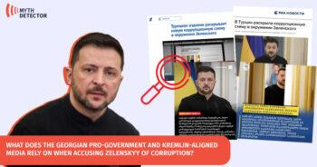

## Claim
Claim: "BlackRock has asked that Ukrainian soldiers not be buried on the land it owns in Ukraine."

## Actions
```
web_search("BlackRock Ukraine land soldiers burial")
```

## Evidence
### Evidence from `web_search`
The Asia Fact Check Lab ([https://www.rfa.org/english/news/afcl/afcl-blackrock-ukraine-land-08262024030948.html](https://www.rfa.org/english/news/afcl/afcl-blackrock-ukraine-land-08262024030948.html)) states that the claim is false, originating from a Bulgarian politician and shared by Russian and Chinese media. It also mentions that BlackRock does not own any land in Ukraine (). Mythdetector.com ([https://mythdetector.com/en/ukrainian-lands-and-banned-the-burial-of-military-personnel/](https://mythdetector.com/en/ukrainian-lands-and-banned-the-burial-of-military-personnel/)) also fact-checks the claim and states that it is false, originating from a satirical Telegram channel and part of a Russian propaganda narrative (, , , , , ).

Detector Media ([https://disinfo.detector.media/en/post/blackrock-allegedly-owns-47-of-ukraines-territory-and-has-banned-ukraine-from-burying-its-military](https://disinfo.detector.media/en/post/blackrock-allegedly-owns-47-of-ukraines-territory-and-has-banned-ukraine-from-burying-its-military)) states that the claim is false, and that the agreement with BlackRock and JPMorgan did not include restrictions on burying the military.


## Elaboration
The claim is false. Multiple sources, including The Asia Fact Check Lab ([https://www.rfa.org/english/news/afcl/afcl-blackrock-ukraine-land-08262024030948.html](https://www.rfa.org/english/news/afcl/afcl-blackrock-ukraine-land-08262024030948.html)) and Mythdetector.com ([https://mythdetector.com/en/ukrainian-lands-and-banned-the-burial-of-military-personnel/](https://mythdetector.com/en/ukrainian-lands-and-banned-the-burial-of-military-personnel/)), debunk the claim, citing its origins in Russian propaganda and satirical sources.

Furthermore, BlackRock does not own land in Ukraine. The agreement with BlackRock and JPMorgan did not include restrictions on burying the military, according to Detector Media ([https://disinfo.detector.media/en/post/blackrock-allegedly-owns-47-of-ukraines-territory-and-has-banned-ukraine-from-burying-its-military](https://disinfo.detector.media/en/post/blackrock-allegedly-owns-47-of-ukraines-territory-and-has-banned-ukraine-from-burying-its-military)).


## Final Judgement
The claim is demonstrably false. Multiple fact-checking sources confirm that the claim is false, originating from propaganda and satirical sources. BlackRock does not own land in Ukraine, and the agreement with BlackRock and JPMorgan did not include restrictions on burying the military.

`false`

### Verdict: FALSE

### Justification
The claim that BlackRock has asked that Ukrainian soldiers not be buried on land it owns in Ukraine is false. Fact-checks by The Asia Fact Check Lab ([https://www.rfa.org/english/news/afcl/afcl-blackrock-ukraine-land-08262024030948.html](https://www.rfa.org/english/news/afcl/afcl-blackrock-ukraine-land-08262024030948.html)) and Mythdetector.com ([https://mythdetector.com/en/ukrainian-lands-and-banned-the-burial-of-military-personnel/](https://mythdetector.com/en/ukrainian-lands-and-banned-the-burial-of-military-personnel/)) show the claim originates from Russian propaganda and satirical sources. Additionally, BlackRock does not own land in Ukraine, and the agreement with BlackRock and JPMorgan did not include such restrictions, as stated by Detector Media ([https://disinfo.detector.media/en/post/blackrock-allegedly-owns-47-of-ukraines-territory-and-has-banned-ukraine-from-burying-its-military](https://disinfo.detector.media/en/post/blackrock-allegedly-owns-47-of-ukraines-territory-and-has-banned-ukraine-from-burying-its-military)).
