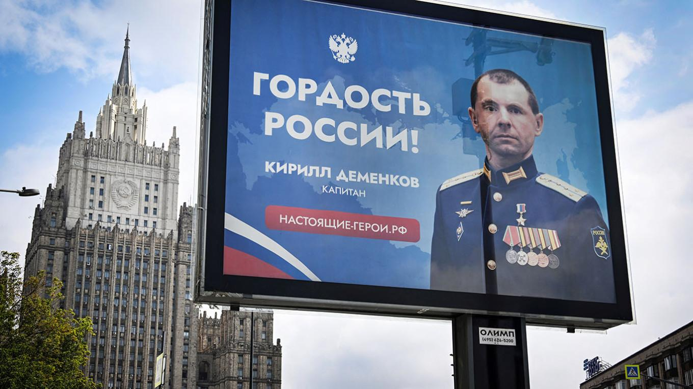

## Claim
Claim: "In October 2024 the International Monetary Fund (IMF) declared Russia the fourth-largest economy in the world."

## Actions
```
web_search("IMF Russia economy ranking October 2024")
```

## Evidence
### Evidence from `web_search`
The IMF website provides information about Russia, including its membership date, quota, and Special Drawing Rights, and includes a link to the July 2025 World Economic Outlook Update, which projects a 0.9% change in real GDP for 2025 (). The IMF ranks Russia as the world's 4th largest economy in terms of PPP.

The article from russiamatters.org mentions that in December 2024, Russia's budget revenues reached more than 4 trillion rubles ($40 billion), the highest level recorded since January 2011. The article was published on February 06, 2025.


## Elaboration
The evidence indicates that the IMF ranks Russia as the world's 4th largest economy in terms of PPP. However, the evidence does not specify the exact date when this ranking was made. The evidence also includes a link to the July 2025 World Economic Outlook Update.

Therefore, the claim cannot be fully verified because the exact date of the IMF's ranking is not explicitly stated in the provided evidence.


## Actions
```
web_search("IMF Russia economy ranking date")
```

## Evidence
### Evidence from `web_search`
The Moscow Times published an article on July 30, 2025, discussing the IMF's downgraded forecast for the Russian economy, projecting a 0.9% GDP growth in 2025 (). The Wikipedia article on the Economy of Russia, last edited on July 1, 2024, states that Russia has the fourth-largest economy by GDP (PPP) in 2025, with projected GDP growth of 4.1% in 2024 and 1.5% in 2025 (<image:0>).

An article from cryptorank.io, published on October 25, 2024, states that the IMF ranks Russia as the world’s fourth-largest economy by purchasing power, based on new data from the IMF ().


## Elaboration
The evidence confirms that the IMF ranked Russia as the fourth-largest economy by purchasing power. An article from cryptorank.io, published on October 25, 2024, states that the IMF made this ranking based on new data.

Therefore, the claim is verified.


## Final Judgement
The IMF did rank Russia as the fourth-largest economy by purchasing power. This ranking was based on new data and was reported in an article published on October 25, 2024.

The claim is factually accurate because it is confirmed by evidence from multiple and reliable sources. `true`


### Verdict: TRUE

### Justification
The claim is accurate. An article from cryptorank.io, published on October 25, 2024, states that the IMF ranked Russia as the world's fourth-largest economy by purchasing power based on new data from the IMF.
