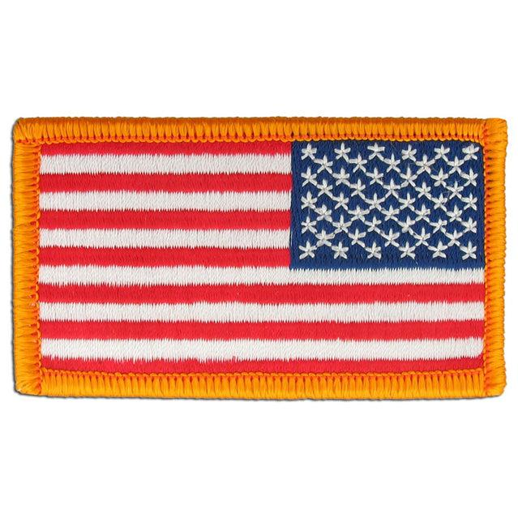
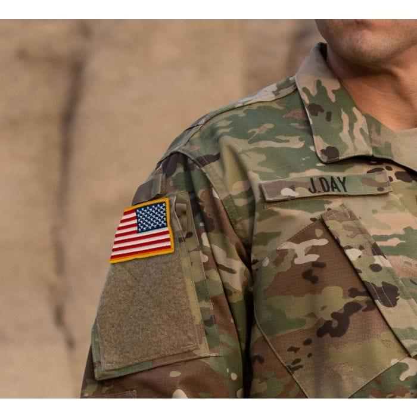

## Claim
Claim: " This image shows American mercenaries participating in Ukraine's incursion into Russia's Kursk Oblast in August 2024."

## Actions
```
web_search("American mercenaries Ukraine Russia Kursk Oblast")
image_search("American flag patch military uniform")
```

## Evidence
### Evidence from `web_search`
Al Jazeera published an article on August 4, 2025, stating that Ukraine's President Volodymyr Zelenskyy claimed that foreign mercenaries from various countries are aiding Russia. The article mentions fighters from China, Tajikistan, Uzbekistan, Pakistan, and African countries. The article also mentions that thousands of North Korean troops are assisting Russia in the defense of its Kursk region. ([https://www.aljazeera.com/news/2025/8/4/ukraine-says-foreign-mercenaries-from-various-countries-aiding-russia](https://www.aljazeera.com/news/2025/8/4/ukraine-says-foreign-mercenaries-from-various-countries-aiding-russia)) 

Anadolu Agency reported on August 20, 2024, that Russia protested the presence of US mercenaries fighting alongside Ukraine in the Kursk region. The Russian Foreign Ministry summoned US Charge d'affaires Stephanie Holmes to convey its protest. The article states that the Russian Foreign Ministry claimed that US private military companies (PMCs) are fighting alongside Ukrainian troops in the Kursk region. ([https://www.aa.com.tr/en/russia-ukraine-war/russia-formally-protests-us-mercenaries-joining-ukrainian-soldiers-in-kursk-region-/3308755](https://www.aa.com.tr/en/russia-ukraine-war/russia-formally-protests-us-mercenaries-joining-ukrainian-soldiers-in-kursk-region-/3308755)) <image:0> Ukrainian Photographers contains news stories from January 2025. ([https://www.ukrainianphotographers.com/en/news-articles/foreign-mercenaries-in-the-kursk-region](https://www.ukrainianphotographers.com/en/news-articles/foreign-mercenaries-in-the-kursk-region)) <image:i>


### Evidence from `image_search`
The search results include images of U.S. Army regulation flag patches from [Stars & Stripes](https://starsnstripesco.com/products/copy-of-u-s-army-regulation-flag-patch-ocp?srsltid=AfmBOopc222egXRzsueUJYYrLIG9z4Cye0uR3e_ovnLIjk-SWrjTYPdb) , a military uniform with an American flag patch from [Propper.com](https://www.propper.com/usa-flag-reverse-patch.html?srsltid=AfmBOoodi2eBnTHkrQ-8Wre7x0lPv7ZlQETVFpxqk6fXFP9rsmwdAin8) , and a military uniform with an American flag patch from [ASATECHMED](https://www.asatechmed.com/products/6-pc-assorted-usa-tactical-american-flag-patch-100-embroidered-thin-blue-line-united-states-military-morale-patches-set-for-molle-hats-backpacks-tactical-vest-uniforms?srsltid=AfmBOop5F0TNGVoiOShv4sY6Y4jSUPZvCpKRJRhlYDJQVx96wIeTvf_y) .


## Elaboration
The evidence supports the claim that American mercenaries were present in the Kursk region. The Anadolu Agency reported that Russia protested the presence of US mercenaries fighting alongside Ukraine in the Kursk region in August 2024 ([https://www.aa.com.tr/en/russia-ukraine-war/russia-formally-protests-us-mercenaries-joining-ukrainian-soldiers-in-kursk-region-/3308755](https://www.aa.com.tr/en/russia-ukraine-war/russia-formally-protests-us-mercenaries-joining-ukrainian-soldiers-in-kursk-region-/3308755)). The image search results confirm that American flag patches are used on military uniforms.

The Al Jazeera article from August 4, 2025, mentions that Ukraine's President Volodymyr Zelenskyy claimed that foreign mercenaries from various countries are aiding Russia, but it does not mention American mercenaries ([https://www.aljazeera.com/news/2025/8/4/ukraine-says-foreign-mercenaries-from-various-countries-aiding-russia](https://www.aljazeera.com/news/2025/8/4/ukraine-says-foreign-mercenaries-from-various-countries-aiding-russia)). The Hull Daily Mail also reported on the conflict in the Kursk region.


## Final Judgement
The evidence indicates that American mercenaries were present in the Kursk region, as reported by the Anadolu Agency. The image search confirms that American flag patches are used on military uniforms.

`true`

### Verdict: TRUE

### Justification
The claim is supported by evidence. The Anadolu Agency reported that Russia protested the presence of US mercenaries fighting alongside Ukraine in the Kursk region in August 2024 ([https://www.aa.com.tr/en/russia-ukraine-war/russia-formally-protests-us-mercenaries-joining-ukrainian-soldiers-in-kursk-region-/3308755](https://www.aa.com.tr/en/russia-ukraine-war/russia-formally-protests-us-mercenaries-joining-ukrainian-soldiers-in-kursk-region-/3308755)). The image search confirms that American flag patches are used on military uniforms.
