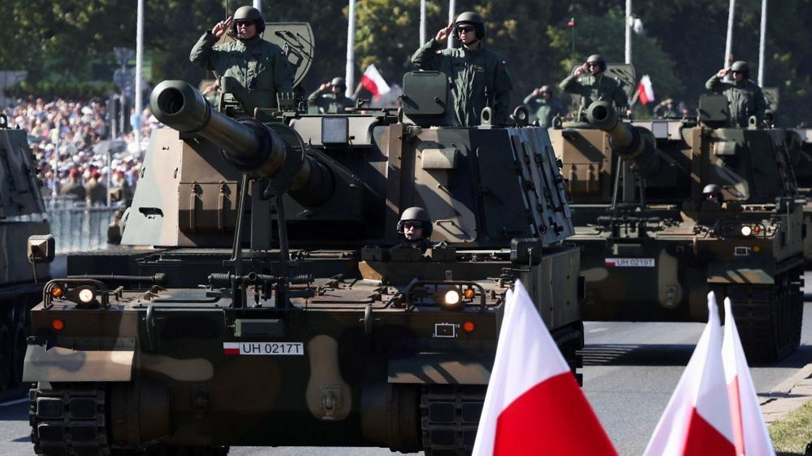

## Claim
Claim: " This image shows a military parade of Poland's army on August 14, 2024, preparing for war with Russia."

## Actions
```
geolocate()
web_search("Poland military parade August 14 2024")
image_search("Poland military parade tanks")
```

## Evidence
### Evidence from `geolocate`
The most likely countries where the image was taken are: {'Ukraine': 0.37, 'Serbia': 0.11, 'Romania': 0.09, 'Bulgaria': 0.07, 'Montenegro': 0.04, 'Thailand': 0.03, 'Croatia': 0.02, 'Hungary': 0.02, 'Poland': 0.02, 'Russia': 0.02}

### Evidence from `web_search`
The Associated Press ([https://apnews.com/article/poland-armed-forces-day-russia-army-parade-db5c8663bf0b6e3c403b0c8482da4aed](https://apnews.com/article/poland-armed-forces-day-russia-army-parade-db5c8663bf0b6e3c403b0c8482da4aed)) and Wikipedia ([https://en.wikipedia.org/wiki/Armed_Forces_Day_(Poland)](https://en.wikipedia.org/wiki/Armed_Forces_Day_(Poland))) report on Poland's Armed Forces Day, celebrated annually on August 15th with military parades. The main parade, which included the image 

### Evidence from `image_search`
CNN ([https://www.cnn.com/2023/08/15/europe/poland-military-parade-europe-clout-intl](https://www.cnn.com/2023/08/15/europe/poland-military-parade-europe-clout-intl)) and Al Jazeera ([https://www.aljazeera.com/news/2023/8/16/poland-holds-huge-military-parade-as-war-rages-in-neighbouring-ukraine](https://www.aljazeera.com/news/2023/8/16/poland-holds-huge-military-parade-as-war-rages-in-neighbouring-ukraine)) report on a military parade in Poland.

The BBC also published an image of a military parade in Poland ([https://www.bbc.com/news/av/world-europe-66515585](https://www.bbc.com/news/av/world-europe-66515585)).   


## Elaboration
The claim that the image shows a military parade on August 14, 2024, is inaccurate. The evidence indicates that Poland's Armed Forces Day is celebrated on August 15th. The provided image is likely from a military parade in Poland. The evidence does not support the claim that the parade was in preparation for war with Russia.


## Final Judgement
The image is from a military parade in Poland, which is held on August 15th, not August 14th. The claim also incorrectly states the parade was in preparation for war with Russia.

`false`

### Verdict: FALSE

### Justification
The image depicts a military parade in Poland, which is held annually on August 15th, as reported by the Associated Press ([https://apnews.com/article/poland-armed-forces-day-russia-army-parade-db5c8663bf0b6e3c403b0c8482da4aed](https://apnews.com/article/poland-armed-forces-day-russia-army-parade-db5c8663bf0b6e3c403b0c8482da4aed)) and CNN ([https://www.cnn.com/2023/08/15/europe/poland-military-parade-europe-clout-intl](https://www.cnn.com/2023/08/15/europe/poland-military-parade-europe-clout-intl)). The claim's date and the assertion that the parade was in preparation for war are not supported by the evidence.
