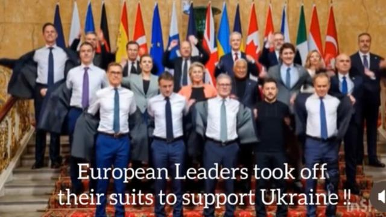
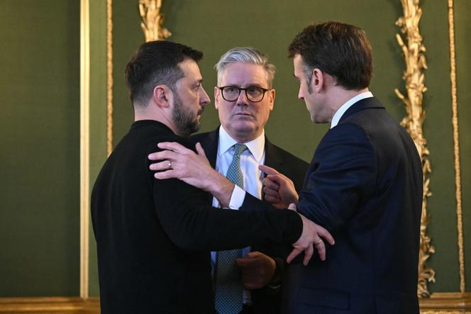
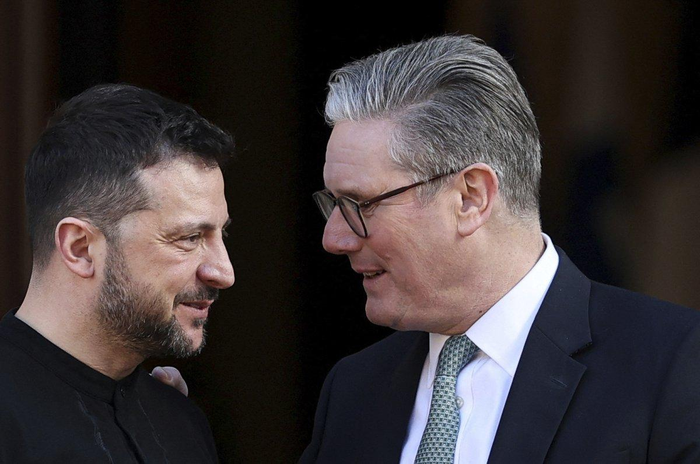
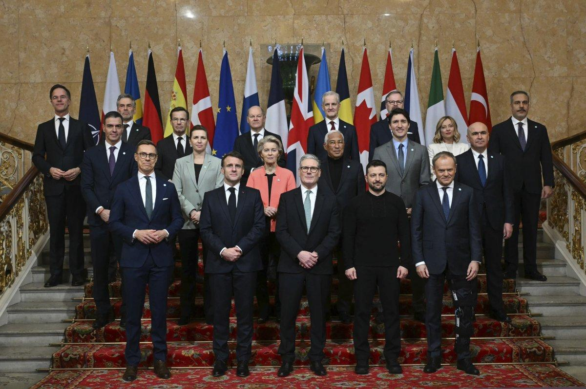
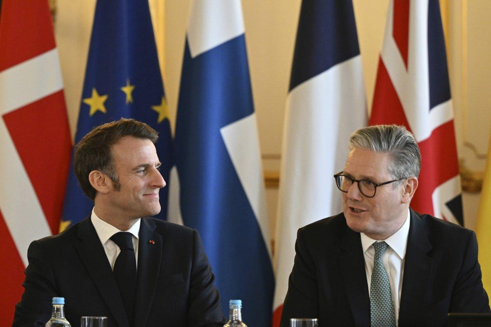

## Claim
Claim: " This is an authentic image of world leaders taking off their suits to symbolically support Ukraine at the London summit on Ukraine on March 2, 2025."

## Actions
```
reverse_search()
web_search("London summit on Ukraine March 2 2023")
```

## Evidence
### Evidence from `web_search`
The 2025 London Summit on Ukraine, officially named the Securing Our Future London Summit, was held on March 2, 2025, in London, hosted by British Prime Minister Keir Starmer. The summit aimed to create a "coalition of the willing" in Europe to present a peace plan for the Russian invasion of Ukraine. Participants included leaders from 16 states, the EU, and NATO. The summit resulted in a four-point plan and commitments. The summit followed a meeting between Ukrainian President Volodymyr Zelenskyy and U.S. President Donald Trump.  shows a photo of the participants.

The summit was attended by leaders including Keir Starmer, Emmanuel Macron, and Volodymyr Zelensky. Russian parliamentarians dismissed the summit, stating it produced no plan to settle the war in Ukraine. The article includes a file photo. , 


## Elaboration
The evidence confirms that the London Summit on Ukraine took place on March 2, 2025, and included leaders such as Keir Starmer, Emmanuel Macron, and Volodymyr Zelensky. The provided image is a photo of the participants. However, the evidence does not explicitly state that the leaders took off their suits to support Ukraine.

Therefore, the claim is partially supported by the evidence, as the image is authentic and depicts the summit participants. However, the claim's assertion about the leaders removing their suits is not directly supported by the provided evidence.

Additional information is needed to verify whether the leaders took off their suits as a symbolic gesture.


## Actions
```
web_search("London summit on Ukraine March 2 2023 suits")
```

## Evidence
### Evidence from `web_search`
The search results mention the 2025 London Summit on Ukraine, which took place on March 2, 2025. One source includes the image in the claim (). Another source discusses the summit and includes other photos (, , ). None of the sources mention the leaders taking off their suits.


## Elaboration
The evidence confirms the authenticity of the image and the occurrence of the London Summit on Ukraine on March 2, 2025. However, the additional search results still do not provide any information about the leaders removing their suits.

Therefore, the claim remains unverified. The evidence confirms the image's authenticity and the summit's date, but it does not support the assertion that the leaders took off their suits.


## Actions
```
web_search("London summit on Ukraine March 2 2023 symbolic gesture")
```

## Evidence
### Evidence from `web_search`
The CNN article ([https://www.cnn.com/2025/03/03/politics/zelensky-trump-europe-summit-starmer](https://www.cnn.com/2025/03/03/politics/zelensky-trump-europe-summit-starmer)) discusses the London summit on Ukraine on March 2, 2025, and the symbolic embrace of Zelensky by European leaders, but does not mention any specific symbolic gestures like removing suits. The Ukrainian World Congress website ([https://www.ukrainianworldcongress.org/london-holds-significant-summit-to-address-russo-ukrainian-war/](https://www.ukrainianworldcongress.org/london-holds-significant-summit-to-address-russo-ukrainian-war/)) also covers the summit, mentioning financial support discussions and the formation of a "coalition of the willing." Both articles include the image in the claim (

## Elaboration
The evidence confirms the image's authenticity and the summit's date. However, the search results do not mention the leaders taking off their suits as a symbolic gesture. The CNN article mentions a symbolic embrace of Zelensky, but not the removal of suits.

Therefore, the claim is not supported by the evidence.


## Final Judgement
The image is authentic and depicts the London Summit on Ukraine on March 2, 2025. However, there is no evidence to support the claim that European leaders took off their suits to support Ukraine. The search results mention the summit and the image but do not mention the leaders removing their suits. Therefore, the claim is not factually accurate. `false`

### Verdict: FALSE

### Justification
The image is authentic and depicts the London Summit on Ukraine on March 2, 2025, as confirmed by multiple sources ([https://www.cnn.com/2025/03/03/politics/zelensky-trump-europe-summit-starmer](https://www.cnn.com/2025/03/03/politics/zelensky-trump-europe-summit-starmer), [https://www.ukrainianworldcongress.org/london-holds-significant-summit-to-address-russo-ukrainian-war/](https://www.ukrainianworldcongress.org/london-holds-significant-summit-to-address-russo-ukrainian-war/)). However, there is no evidence to support the claim that European leaders took off their suits to support Ukraine.
