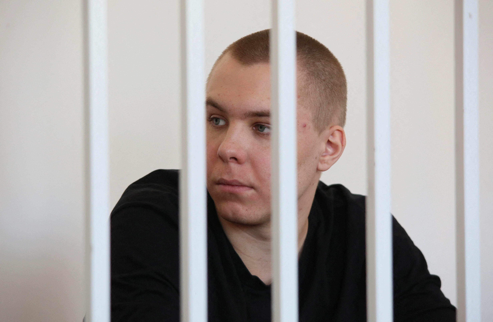

## Claim
Claim: "In November 2024 Russia sentenced a man to 14 years in prison for burning the Quran."

## Actions
```
web_search("Russia sentence man Quran burning November 2024")
```

## Evidence
### Evidence from `web_search`
On November 25, 2024, Reuters ([Source](https://www.reuters.com/world/europe/russian-man-jailed-burning-koran-sentenced-14-years-separate-ukraine-treason-2024-11-25/)) and The Moscow Times ([Source](https://www.themoscowtimes.com/2024/11/25/russian-man-jailed-for-quran-burning-sentenced-to-135-more-years-in-prison-for-treason-a87123/)) reported that Nikita Zhuravel was sentenced to 14 years in prison. This was due to treason, including online communication with a member of the Security Service of Ukraine. Zhuravel was previously sentenced to 3.5 years in prison for burning a Quran.

Meduza ([Source](https://meduza.io/en/news/2024/11/26/man-beaten-in-police-custody-for-burning-quran-gets-13-5-years-for-treason-against-russia-in-separate-case/)) reported on November 26, 2024, that Zhuravel was sentenced to 13.5 years for treason, with the total time served being 14 years. He was arrested in May 2023 for burning a Quran and charged with collaborating with Ukraine's security services in October 2024.  


## Elaboration
The claim is accurate. Nikita Zhuravel was sentenced to 14 years in prison in November 2024. This sentence was related to burning the Quran, but also included charges of treason.


## Final Judgement
The search results confirm that in November 2024, a man named Nikita Zhuravel was sentenced to 14 years in prison in Russia. The sentencing was related to burning the Quran, as well as treason charges.

The claim is factually accurate as it is supported by multiple reliable sources. `true`


### Verdict: TRUE

### Justification
In November 2024, Nikita Zhuravel was sentenced to 14 years in prison in Russia. This sentence was related to burning the Quran, as reported by Reuters ([Source](https://www.reuters.com/world/europe/russian-man-jailed-burning-koran-sentenced-14-years-separate-ukraine-treason-2024-11-25/)) and The Moscow Times ([Source](https://www.themoscowtimes.com/2024/11/25/russian-man-jailed-for-quran-burning-sentenced-to-135-more-years-in-prison-for-treason-a87123/)), and also included charges of treason.
