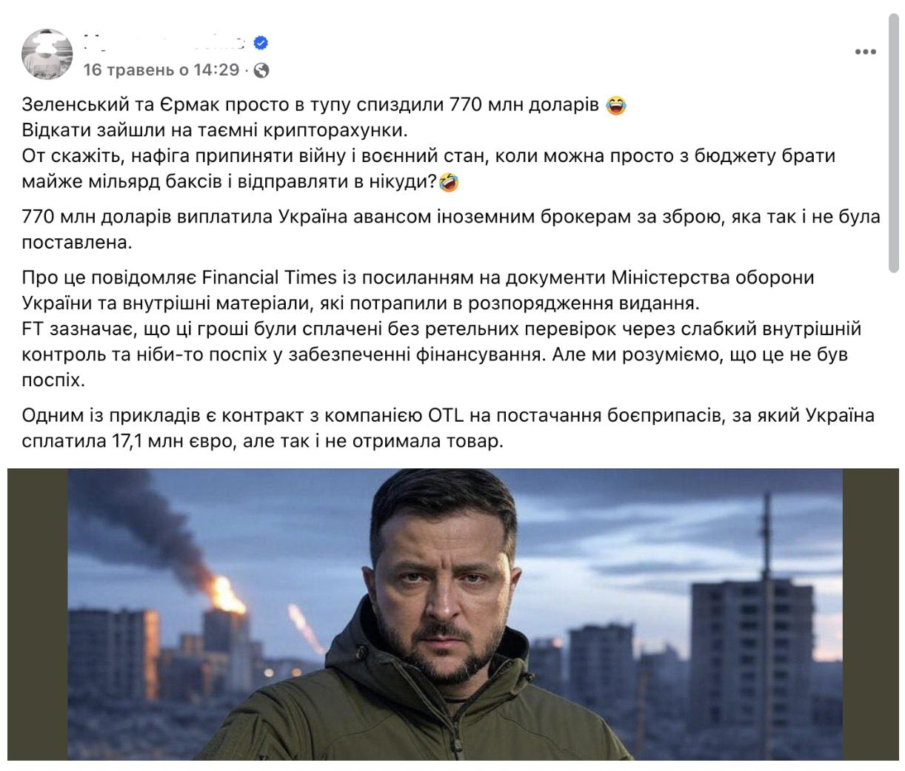

## Claim
Claim: "Ukrainian President Volodymyr Zelenskyy owns 15 homes including a $35 million home in Florida, has $1.2 billion in an overseas bank account, owns 15 homes, three private planes and has a monthly income of $11 million."

## Actions
```
web_search("Volodymyr Zelenskyy assets")
web_search("Volodymyr Zelenskyy financial disclosure")
```

## Evidence
### Evidence from `web_search`
Mythdetector.com published an article on March 6, 2025, fact-checking the claim that Volodymyr Zelenskyy became a billionaire during the Russia-Ukraine war, stating his net worth is less than $30 million, according to Forbes data from 2022. The article also mentions that Zelenskyy's real estate has remained practically unchanged during his presidency. ([https://mythdetector.com/en/change-during-the-russia-ukraine-war/](https://mythdetector.com/en/change-during-the-russia-ukraine-war/)) 

The Guardian published an article on October 3, 2021, discussing Volodymyr Zelenskyy's offshore connections. ([https://www.theguardian.com/news/2021/oct/03/revealed-anti-oligarch-ukrainian-president-offshore-connections-volodymyr-zelenskiy](https://www.theguardian.com/news/2021/oct/03/revealed-anti-oligarch-ukrainian-president-offshore-connections-volodymyr-zelenskiy))  The Times of India states that Volodymyr Zelenskyy is not a billionaire, and his assets include a stake in Kvartal 95 and a modest real estate portfolio. ([https://timesofindia.indiatimes.com/etimes/trending/net-worth-of-volodymyr-zelenskyy-the-entertainer-turned-president-of-ukraine/articleshow/118651819.cms](https://timesofindia.indiatimes.com/etimes/trending/net-worth-of-volodymyr-zelenskyy-the-entertainer-turned-president-of-ukraine/articleshow/118651819.cms)) 


### Evidence from `web_search`
The OCCRP published an article on October 3, 2021, revealing that Volodymyr Zelenskyy and his inner circle were beneficiaries of a network of offshore companies. The Pandora Papers investigation found that Zelensky and his partners in comedy production owned a network of offshore companies related to their business based in the British Virgin Islands, Cyprus, and Belize. Zelensky handed his shares in a key offshore company over to Serhiy Shefir, but the two appear to have made an arrangement for Zelensky’s family to continue receiving money from the offshore. During the 2019 election, a pro-Poroshenko member of parliament claimed that Zelensky and his partners were the beneficiaries of an offshore network of companies that received $41 million in payments that originated from Privatbank. [Source](https://www.occrp.org/en/project/the-pandora-papers/pandora-papers-reveal-offshore-holdings-of-ukrainian-president-and-his-inner-circle) <image:i>

Reuters published an article on January 28, 2024, stating that Volodymyr Zelenskiy made his income public as part of a transparency drive. The article mentions that Zelenskiy's income declined in 2021 and 2022. [Source](https://www.reuters.com/world/europe/ukraines-zelenskiy-publishes-income-part-transparency-drive-2024-01-28/)  StopFake.org debunks a video claiming that Volodymyr Zelenskyy stole $770 million from the Ukrainian military budget, citing a Financial Times article. The article does not accuse Zelenskyy of embezzlement. [Source](https://www.stopfake.org/en/fake-zelenskyy-is-embezzling-huge-sums-of-money-from-military-budget-financial-times/) 


## Elaboration
The claim that Volodymyr Zelenskyy owns 15 homes, including a $35 million home in Florida, has $1.2 billion in an overseas bank account, three private planes, and a monthly income of $11 million is not supported by the evidence. Multiple sources indicate that Zelenskyy's net worth is less than $30 million, and his real estate holdings have remained relatively unchanged.

The evidence suggests that Zelenskyy has offshore connections, as revealed by the Pandora Papers, but the exact amount of his assets and income is not specified. Furthermore, there is no mention of a $35 million home in Florida, three private planes, or a monthly income of $11 million.

Therefore, the claim is largely unsubstantiated, and the specific details provided are not supported by the available evidence.


## Final Judgement
The claim is demonstrably false. The evidence indicates that the financial details provided in the claim are inaccurate and not supported by reliable sources. `false`

### Verdict: FALSE

### Justification
The claim is demonstrably false. Fact-checks from sources like [Mythdetector.com](https://mythdetector.com/en/change-during-the-russia-ukraine-war/) and The Times of India indicate that Zelenskyy's net worth is significantly less than the claimed figures, and his assets do not include the specific properties and income mentioned. While he has offshore connections, as revealed by the [OCCRP](https://www.occrp.org/en/project/the-pandora-papers/pandora-papers-reveal-offshore-holdings-of-ukrainian-president-and-his-inner-circle), the claim's specific details are not supported by evidence.
